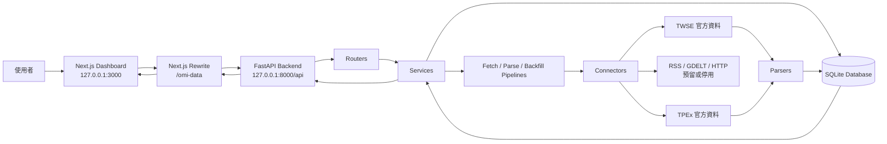
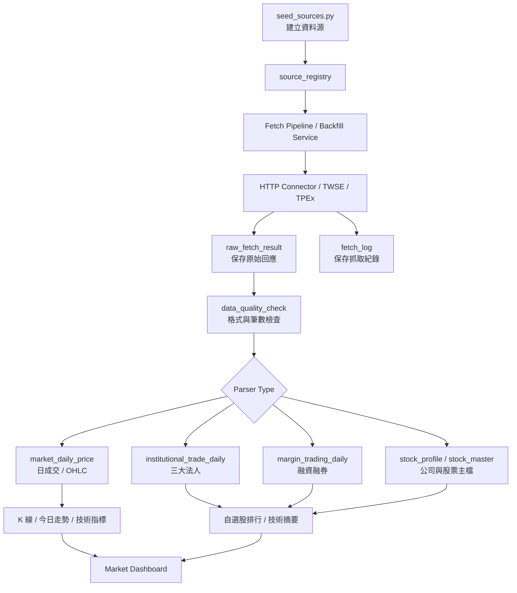
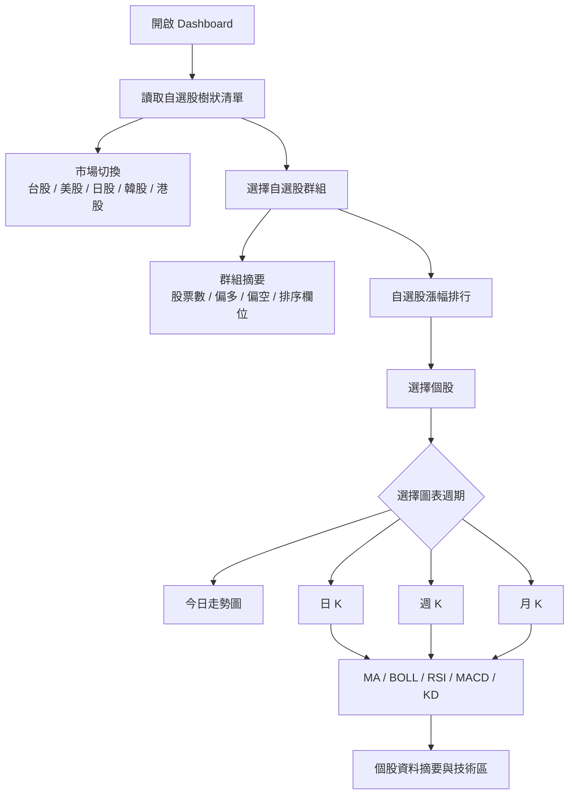
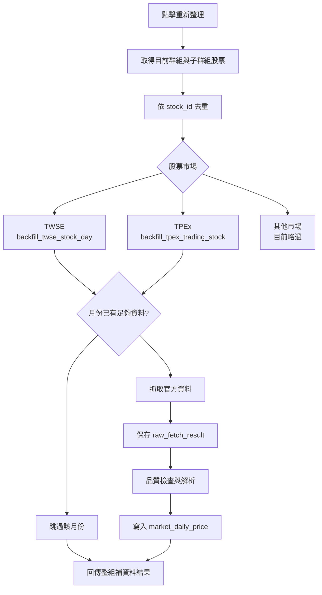

# Open Market Intelligence

Open Market Intelligence 是一套以公開市場資料為基礎的本機化投資研究系統。專案目前聚焦在台股資料整合、自選股管理、K 線圖表、基礎技術指標與自選股排行，後續可再擴充新聞、事件、國際市場與 AI 分析流程。

目前系統採用 FastAPI 作為後端 API，SQLite 作為本機資料庫，Next.js 作為前端操作介面。前端透過 Next.js rewrite 代理請求到後端，讓使用者只需要打開 `http://127.0.0.1:3000` 即可操作儀表板。

## 目前狀態

已完成或已接上主流程的功能：

- 台股上市 TWSE 與上櫃 TPEx 股票主檔、日成交資料、個股 K 線資料。
- 三大法人買賣超與融資融券資料的資料表、parser 與查詢 API。
- 自選股群組、子群組、股票新增、刪除、重新命名與樹狀瀏覽。
- 自選股整組補歷史資料，可依股票市場自動選擇 TWSE 或 TPEx 資料源。
- 補資料時支援 `skip_existing_months`，資料庫已具備足夠資料的月份會跳過，只補缺漏區間。
- 今日走勢圖、日 K、週 K、月 K。
- K 線圖上的 MA、BOLL、成交量、RSI、MACD、KD 基礎技術指標。
- 今日、日 K、週 K、月 K 圖表上的區間最高與最低標示。
- 自選股漲幅排行與簡易多空統計。
- 前端市場切換版面：台股、美股、日股、韓股、港股。目前只有版面，非台股後端資料源尚未接入。

尚未完成或尚未進入主流程的功能：

- 新聞、事件、話題資料尚未接入正式儀表板。
- 非台股市場資料源尚未實作。
- 法人圓餅圖、籌碼圖表與右側進階分析區仍是後續擴充項目。
- 尚未導入正式 migration 工具，目前資料表由 SQLAlchemy model 初始化。

## 系統架構



## 資料流程

系統資料流程分成「資料源註冊」、「抓取原始資料」、「品質檢查」、「解析入表」、「前端查詢」五個階段。



## 前端流程



## 後端架構

後端位於 `backend/`，核心目錄如下：

```text
backend/
  app/
    connectors/      # HTTP、TWSE、RSS、GDELT 等資料連線層
    db/              # SQLAlchemy models 與 session 初始化
    market/          # 行情查詢、K 線聚合、即時走勢、補資料、技術資料服務
    parsers/         # TWSE / TPEx / MOPS 類資料 parser
    pipelines/       # fetch 與 parse pipeline
    quality/         # 資料品質檢查
    routers/         # FastAPI route 定義
    scripts/         # 初始化資料源等腳本
    sources/         # 資料源管理
    stocks/          # 股票主檔查詢
    watchlists/      # 自選股、排行、訊號、整組補資料
```

主要 router：

| Router | Prefix | 功能 |
| --- | --- | --- |
| System | `/api/system` | 健康檢查 |
| Sources | `/api/sources` | 資料源管理、刷新與紀錄 |
| Raw Results | `/api/raw-results` | 原始抓取結果查詢 |
| Market | `/api/market` | 日成交、K 線、今日走勢、法人、融資融券、補資料 |
| Indicators | `/api/market/indicators` | 個股技術指標 |
| Stocks | `/api/stocks` | 股票主檔查詢 |
| Watchlists | `/api/watchlists` | 自選股群組、項目、排行、訊號、整組補資料 |
| Reports | `/api/reports` | 報告輸出預留 |

重要資料表：

| Table | 說明 |
| --- | --- |
| `source_registry` | 資料源註冊表 |
| `fetch_log` | 每次抓取任務紀錄 |
| `raw_fetch_result` | 原始 API 回應保存 |
| `data_quality_check` | 資料品質檢查結果 |
| `stock_master` | 股票主檔 |
| `stock_profile` | 公司基本資料 |
| `market_daily_price` | 日成交與 OHLC |
| `institutional_trade_daily` | 三大法人買賣超 |
| `margin_trading_daily` | 融資融券 |
| `watchlist_group` | 自選股群組 |
| `watchlist_item` | 自選股項目 |

## 前端架構

前端位於 `frontend/`，採用 Next.js App Router、React、TypeScript 與 Tailwind CSS。

```text
frontend/
  src/
    app/
      page.tsx       # Dashboard 入口
      layout.tsx     # 全站 layout
      globals.css    # 全域樣式
    components/
      MarketDashboardClient.tsx       # 主儀表板狀態與資料載入
      SidebarWatchlistExplorer.tsx    # 左側自選股樹狀操作
      StockDetailPanel.tsx            # 個股詳情、週期切換、右側技術區
      StockKLineChart.tsx             # 日 K / 週 K / 月 K 與技術指標
      IntradayTrendChart.tsx          # 今日走勢圖
      WatchlistManager.tsx            # 自選股管理舊元件
    lib/
      api.ts         # 前端 API helper
    types/
      market.ts      # API 型別定義
```

目前 Dashboard 的核心版面：

- 左側：品牌、Market Dashboard、市場切換、自選股樹狀清單、群組管理、股票加入。
- 中間左側：個股 K 線圖、今日走勢圖、資料摘要、自選股漲幅排行。
- 右側：技術分析摘要。後續可擴充法人、融資、籌碼或產業分析圖表。

## K 線與技術指標

圖表週期：

| 週期 | 行為 |
| --- | --- |
| 今日 | 從 `/api/market/intraday/{stock_id}` 讀取今日走勢或 fallback 走勢資料 |
| 日 K | 從 `/api/market/ohlc/{stock_id}?timeframe=daily` 讀取，預設 90 根 |
| 週 K | 從日資料聚合為週 K，後端會以 90 × 7 天作為回補查詢範圍 |
| 月 K | 從日資料聚合為月 K，後端會以 90 × 31 天作為回補查詢範圍 |

目前圖表支援：

- K 線與成交量。
- MA5、MA20、MA60。
- BOLL 20MA ± 2SD。
- RSI14。
- MACD 12/26/9。
- KD 9/3。
- 區間最高、最低標示。
- 指標選單，可在前端切換要顯示的技術指標。

## 自選股補資料流程

左側「重新整理」按鈕會對目前選取群組執行整組補資料，包含子群組股票。



對應 API：

```text
POST /api/watchlists/groups/{group_id}/backfill
```

主要參數：

| 參數 | 預設 | 說明 |
| --- | --- | --- |
| `start_date` | 必填 | 補資料起始日 |
| `end_date` | 必填 | 補資料結束日 |
| `include_children` | `true` | 是否包含子群組 |
| `enabled_only` | `true` | 是否只處理啟用股票 |
| `skip_existing_months` | `true` | 是否跳過已有資料的月份 |
| `sleep_seconds` | `0.8` | 每個月份請求之間的等待秒數 |

## API Proxy

前端預設透過 Next.js rewrite 代理後端 API。

```ts
// frontend/next.config.ts
const apiProxyTarget = process.env.API_PROXY_TARGET ?? "http://127.0.0.1:8000";
const apiProxyPath = process.env.API_PROXY_PATH ?? "/omi-data";
```

常用對應：

| 前端呼叫 | Next.js 代理到 |
| --- | --- |
| `/omi-data/wl/tree` | `http://127.0.0.1:8000/api/watchlists/tree` |
| `/omi-data/market/ohlc/2330` | `http://127.0.0.1:8000/api/market/ohlc/2330` |
| `/api/...` | `http://127.0.0.1:8000/api/...` |

建議前端 `.env.local`：

```env
API_PROXY_TARGET=http://127.0.0.1:8000
API_PROXY_PATH=/omi-data
NEXT_PUBLIC_API_PROXY_PATH=/omi-data
NEXT_PUBLIC_API_BASE_URL=
```

## 啟動方式

### 1. 啟動後端

```powershell
cd "C:\Open Market Intelligence"
.\.venv\Scripts\Activate.ps1
cd backend
python -m uvicorn app.main:app --reload --port 8000
```

後端網址：

```text
http://127.0.0.1:8000
http://127.0.0.1:8000/docs
http://127.0.0.1:8000/api/system/health
```

### 2. 啟動前端

```powershell
cd "C:\Open Market Intelligence\frontend"
npm run dev
```

前端網址：

```text
http://127.0.0.1:3000
```

## 初始化資料源

第一次建立資料庫或資料源異動後，可執行：

```powershell
cd "C:\Open Market Intelligence"
.\.venv\Scripts\Activate.ps1
cd backend
python -m app.scripts.seed_sources
```

目前預設資料源包含：

- TWSE daily trading。
- TWSE listed company profile。
- TWSE institutional trading。
- TWSE margin trading。
- TPEx daily quotes。
- TPEx domestic / foreign company profile。
- TPEx institutional trading。
- TPEx margin trading。
- GDELT international event source，預設停用。

## 檢查指令

後端語法檢查：

```powershell
cd "C:\Open Market Intelligence"
.\.venv\Scripts\Activate.ps1
python -m compileall backend\app
```

前端 lint：

```powershell
cd "C:\Open Market Intelligence\frontend"
npm run lint
```

前端 production build：

```powershell
cd "C:\Open Market Intelligence\frontend"
npm run build
```

## 專案目錄

```text
Open Market Intelligence/
  backend/
    requirements.txt
    app/
      connectors/
      db/
      market/
      parsers/
      pipelines/
      quality/
      routers/
      scripts/
      sources/
      stocks/
      utils/
      watchlists/
  frontend/
    package.json
    next.config.ts
    src/
      app/
      components/
      lib/
      types/
  data/
  docs/
  logs/
  reports/
  README.md
```

## 後續開發方向

短期：

- 修正前端殘留文字編碼顯示問題。
- 補上右側籌碼圖表，例如法人買賣超圓餅圖與融資融券變化。
- 將今日走勢圖改為更接近真實分時資料源。
- 增加自選股更新結果提示與失敗明細。

中期：

- 導入正式 migration 工具。
- 將新聞、事件、話題資料接入主儀表板。
- 建立非台股市場資料源與 API adapter。
- 增加資料排程與背景任務。

長期：

- 建立策略回測、訊號追蹤與報告輸出。
- 整合更多產業資料、總經指標與跨市場資料。
- 加入 AI 摘要、事件歸因與投資研究工作流。
