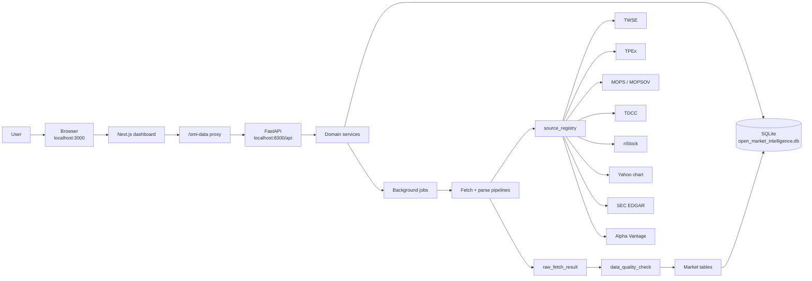
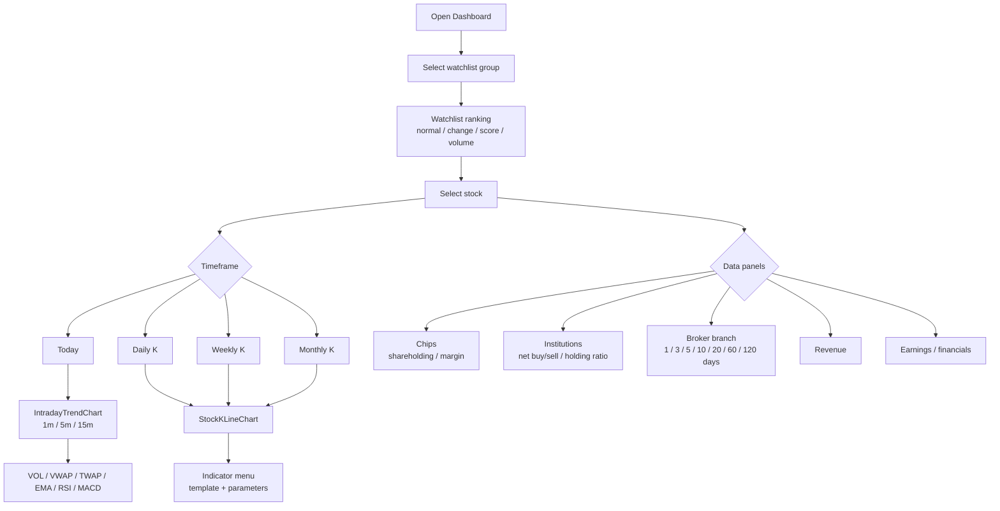
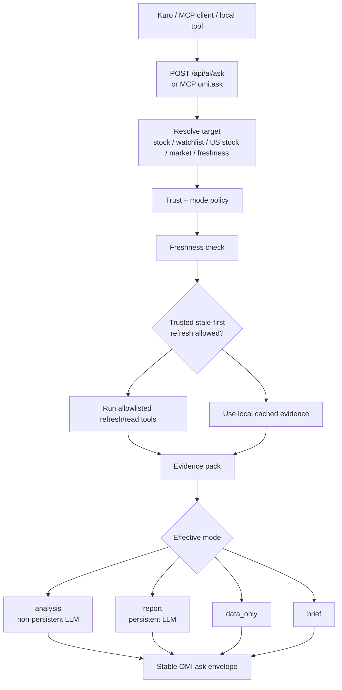

# Open Market Intelligence

Open Market Intelligence 是一套本機優先的市場情報與自選股研究工作台。它把台股看盤、資料回補、技術分析、籌碼資料、基本面資料、美股領先訊號與 AI/Agent 查詢介面整合在同一個專案中，目標是讓使用者能用一致的資料流觀察市場、檢查缺漏、產生研究摘要，並讓外部桌面助理透過穩定合約讀取 OMI 的本機 evidence。

目前完整度最高的主流程是台股 TWSE / TPEx；美股模組定位為台股研究的外部領先訊號層，已支援核心自選股、指數、日週月 K、盤中資料、SEC facts、profile、corporate actions、short volume 與批次刷新。日股、韓股、港股入口保留為後續擴充。

<p align="center">
  
</p>

## Highlights

- 台股 Dashboard：市場指數、自選股群組、排行、個股快速切換、背景更新狀態中心。
- 個股看盤：`今日`、`日K`、`週K`、`月K` 共用版型，支援即時價格、漲跌、成交量與資料新鮮度提示。
- 今日分時：1m / 5m / 15m 聚合、昨收線、VWAP、TWAP、EMA、RSI、MACD、成交量與 hover 對齊線。
- K 線圖：日週月 K、MA/EMA/BOLL/VWAP/SAR/Donchian/VOL/RSI/MACD/KD/ATR/ADX/DMI/OBV/MFI/CCI/Williams %R/ROC/StochRSI。
- 技術總結：依 `today`、`daily`、`weekly`、`monthly` 產生不同時間框架的 technical report，支援短線、中短線、波段與長線觀察。
- 籌碼與基本面：三大法人、法人持股比例、融資融券、集保分布、分點 Top15、多日分點加總、月營收、季度財務與盈餘。
- 資料治理：raw fetch result、fetch log、quality check、parser result、background job、partial success 與 retry 狀態。
- 美股觀測：S&P 500、NASDAQ、Dow、費城半導體等指數脈絡，以及科技股 / ETF 自選 universe 的價量與基本資料。
- AI/Agent 入口：`POST /api/ai/ask` 與 MCP `omi.ask`，讓 Kuro 或其他桌面助理用單一合約讀取本機 evidence、刷新缺漏資料、取得 brief 或 trusted analysis。

## Current Stack

| Layer | Technology | Default |
| --- | --- | --- |
| Backend | FastAPI, SQLAlchemy, Alembic, APScheduler, SQLite | `http://127.0.0.1:8300` |
| Frontend | Next.js 16, React 19, TypeScript, Tailwind CSS | `http://127.0.0.1:3000` |
| API Proxy | Next.js rewrites | `/omi-data -> /api` |
| Database | SQLite | `data/open_market_intelligence.db` |
| Timezone | Asia/Taipei | `.env` |
| Agent Adapter | stdio MCP server | `agents/omi_mcp_server/server.py` |

## Visual Tour

| Market dashboard | Intraday trend |
| --- | --- |
|  |  |

| Institutional flow | Broker branch |
| --- | --- |
|  |  |

| Earnings and fundamentals | Long-term K-line |
| --- | --- |
|  |  |

## Repository Layout

```text
.
  agents/
    omi_mcp_server/       stdio MCP adapter; forwards to backend /api/ai.
  backend/
    app/
      ai/                 OMI ask, evidence packs, report orchestration, local AI memory.
      db/                 SQLAlchemy models, sessions, database initialization.
      jobs/               Background jobs, scheduler, retry and status tracking.
      market/             Taiwan market data, intraday, indicators, technical reports.
      parsers/            TWSE, TPEx, MOPS, TDCC and related parsers.
      pipelines/          Raw-result parse pipeline and quality flow.
      quality/            Raw payload quality checks.
      routers/            FastAPI routers.
      sources/            Source registry seed definitions.
      stocks/             Stock master/profile lookup and sync.
      us_market/          US market sources, watchlists, OHLC, SEC facts and profile data.
      watchlists/         Watchlist tree, ranking, group backfill.
  frontend/
    src/
      app/                Next.js App Router entry.
      components/         Dashboard, sidebar, stock detail, charts and loading UI.
      lib/                API client, Taiwan/US market time helpers and job helpers.
      types/              Shared frontend API types.
  docs/assets/readme/     README screenshots.
  data/                   Local SQLite database and generated data; ignored by git.
  reports/                Local report outputs.
  scripts/                Local maintenance helpers.
```

## System Flow



## Taiwan Market Workflow



## US Market Workflow

美股模組不是台股流程的替代品，而是台股研究的外部訊號層。建議先維護核心科技股 / ETF universe，再用美股指數、半導體、雲端、資料中心、AI megacap、記憶體與設備股作為台股供應鏈的領先訊號。

Currently supported:

- US index cards: S&P 500, NASDAQ Composite, Dow Jones Industrial Average, Philadelphia Semiconductor Index and related sector context.
- US watchlist tree: multi-level categories and stock / ETF leaves.
- OHLC: Yahoo chart and Alpha Vantage daily refresh, with daily / weekly / monthly aggregation.
- Intraday: Yahoo chart 1m data with America/New_York regular-session polling.
- SEC facts: revenue, gross profit, net income, EPS, assets, liabilities, cash, debt, cash flow and shares outstanding.
- Company profile / corporate actions: Alpha Vantage overview, dividend and split data.
- Short volume: FINRA daily short sale volume, not short interest position data.
- Macro: FRED series observations.
- Batch refresh: watchlist resource refresh jobs for daily price, SEC facts, profile and corporate actions.

Important limits:

- US coverage is universe-first. Do not full-backfill every NASDAQ symbol by default.
- Alpha Vantage and FRED require API keys.
- SEC EDGAR calls should use a descriptive `US_SEC_USER_AGENT`.
- US LLM analysis/report persistence is still narrower than Taiwan stock analysis; use US data primarily as leading evidence and peer context.

## AI And Agent Flow

AI is treated as an evidence consumer, not the database owner. OMI reads local data through backend services, builds bounded evidence packs, checks freshness and warnings, and only calls OpenAI when a trusted request explicitly allows LLM use. External assistants should use `omi.ask` instead of direct internal routes.



### `omi.ask` Contract

Use `POST /api/ai/ask` or MCP `omi.ask` as the stable external entrypoint.

Supported modes:

| Mode | Behavior |
| --- | --- |
| `auto` | Backend chooses a safe effective mode from the request and trust policy. |
| `data_only` | Returns structured local evidence without generating a narrative. |
| `brief` | Returns a prompt-ready summary from local evidence. |
| `analysis` | Calls OpenAI for a non-persistent analysis when trusted and `allow_llm=true`. |
| `report` | Calls OpenAI and persists a report when trusted, `allow_llm=true`, and `allow_write=true`. |

Supported analysis horizons:

| Horizon | Intended use |
| --- | --- |
| `intraday` | 盤中 / 即時觀察，can include intraday points when available. |
| `short` | 短線，usually daily evidence plus recent momentum. |
| `swing` | 中短線 / 波段，default when the request is not explicit. |
| `long` | 長線，weekly/monthly and fundamental context matter more. |

Minimal request:

```json
{
  "contract_version": "omi.ai.ask.v2",
  "question": "2330 現在中短線怎麼看？",
  "target": {"type": "tw_stock", "id": "2330"},
  "mode": "analysis",
  "analysis_horizon": "swing",
  "caller_profile": "desktop_agent",
  "allow_llm": true,
  "allow_write": false,
  "allow_external_fetch": true,
  "refresh_policy": {"mode": "stale_first", "before_answer": true},
  "tool_budget": {
    "max_calls": 5,
    "max_external_fetches": 3,
    "max_total_seconds": 25
  }
}
```

Stable response shape:

```json
{
  "kind": "ai_ask",
  "contract_version": "omi.ai.ask.v2",
  "target": {"type": "tw_stock", "id": "2330", "label": "台積電"},
  "mode": {"requested": "analysis", "effective": "analysis"},
  "report_level": "analysis",
  "analysis": {
    "kind": "stock_analysis_digest",
    "selected_horizon": "swing",
    "horizon_label": "中短線",
    "selected_score": 62,
    "selected_summary": "..."
  },
  "warnings": [],
  "missing": [],
  "source_refs": [],
  "tool_runs": []
}
```

Preserve `warnings`, `missing`, `source_refs`, `freshness`, `tool_plan`, `tool_runs`, `mode.effective` and `analysis.human_answer` in downstream UIs. Those fields are part of the user-facing trust model.

### MCP Adapter

Run the MCP adapter after the backend is available:

```powershell
cd "C:\project\Open Market Intelligence"
.\.venv\Scripts\Activate.ps1
$env:OMI_API_BASE_URL = "http://127.0.0.1:8300"
$env:OMI_API_TIMEOUT_SECONDS = "180"
$env:OMI_MCP_EXPOSE_INTERNAL_TOOLS = "false"
python agents\omi_mcp_server\server.py
```

Optional trusted-token bridge:

```powershell
$env:OMI_MCP_AI_TRUST_TOKEN = "<same value as backend OMI_AI_TRUST_TOKEN>"
```

`OMI_MCP_EXPOSE_INTERNAL_TOOLS=true` should only be used for debugging or a trusted local agent. Normal external callers should use `omi.ask`.

## API Map

| Prefix | Examples | Purpose |
| --- | --- | --- |
| `/api/system` | `/health` | Health check |
| `/api/sources` | `/`, `/{id}/run`, `/{id}/logs` | Source registry and fetch logs |
| `/api/raw-results` | `/{id}`, `/{id}/quality` | Raw payload and quality checks |
| `/api/jobs` | `/`, `/{job_id}` | Background job state |
| `/api/ai` | `/ask`, `/tools`, `/strategy-profiles`, `/reports` | Agent entrypoint, local AI tools, memory and reports |
| `/api/stocks` | `/search`, `/{stock_id}`, `/{stock_id}/profile` | Taiwan stock master/profile |
| `/api/watchlists` | `/tree`, `/groups`, `/items`, `/groups/{id}/ranking` | Watchlist tree, items, ranking and group backfill |
| `/api/market/ohlc` | `/api/market/ohlc/2330?timeframe=daily` | Daily/weekly/monthly OHLC |
| `/api/market/intraday` | `/api/market/intraday/2330` | Taiwan intraday trend |
| `/api/market/indicators` | `/api/market/indicators/2330/daily` | Daily technical indicators |
| `/api/market/technical-report` | `/api/market/technical-report/2330?timeframe=today` | Timeframe-specific technical summary |
| `/api/market/broker-branches` | `/api/market/broker-branches/2330/daily?days=20` | Broker branch Top15 and multi-day aggregate |
| `/api/market/institutional` | `/latest`, `/{stock_id}/history`, `/{stock_id}/holding-ratios` | Institutional trading and holding ratio |
| `/api/market/margin` | `/{stock_id}/latest`, `/{stock_id}/history` | Margin trading |
| `/api/market/shareholding` | `/{stock_id}/history` | TDCC shareholding distribution |
| `/api/market/revenue` | `/{stock_id}/latest`, `/{stock_id}/history` | Monthly revenue |
| `/api/market/financials` | `/{stock_id}/latest`, `/{stock_id}/history` | Quarterly financial metrics |
| `/api/market/backfill` | `/twse/{stock_id}`, `/revenue/{stock_id}/history`, `/financials/{stock_id}/history` | Taiwan data backfill jobs |
| `/api/us-market` | `/watchlists/tree`, `/watchlists/groups/{id}/refresh-resources`, `/stocks/search`, `/ohlc/{symbol}`, `/intraday/{symbol}`, `/sec/{symbol}/fundamentals`, `/profiles/{symbol}` | US market watchlists, OHLC, intraday and fundamentals |

## Local Setup

### Requirements

- Windows PowerShell is the primary local workflow.
- Python 3.10+.
- Node.js `>=20.9.0`.
- npm `>=10`.

### Backend

```powershell
cd "C:\project\Open Market Intelligence"
python -m venv .venv
.\.venv\Scripts\Activate.ps1
python -m pip install --upgrade pip
python -m pip install -r backend\requirements.txt

if (-not (Test-Path .env)) { Copy-Item .env.example .env }
python -m alembic upgrade head

$env:PYTHONPATH = "backend"
python -m app.scripts.seed_sources
```

Run:

```powershell
cd "C:\project\Open Market Intelligence"
.\.venv\Scripts\Activate.ps1
$env:PYTHONPATH = "backend"
python -m uvicorn app.main:app --reload --port 8300 --app-dir backend
```

Useful URLs:

```text
http://127.0.0.1:8300
http://127.0.0.1:8300/docs
http://127.0.0.1:8300/api/system/health
```

### Frontend

```powershell
cd "C:\project\Open Market Intelligence\frontend"
if (-not (Test-Path .env.local)) { Copy-Item .env.example .env.local }
npm ci
npm run dev
```

Open:

```text
http://127.0.0.1:3000
```

### Optional Launcher

```powershell
cd "C:\project\Open Market Intelligence"
.\Start-OMI-Launcher.cmd
```

The launcher is a local convenience wrapper. Backend and frontend commands above remain the canonical development path.

## Environment

Root `.env.example` contains backend settings. Important keys:

```env
APP_NAME=Open Market Intelligence
APP_ENV=development
APP_HOST=127.0.0.1
APP_PORT=8300
TIMEZONE=Asia/Taipei
ENABLE_SCHEDULER=false

OPENAI_API_KEY=
OPENAI_LLM_API_KEY=
OMI_OPENAI_ENV_FILE=
OPENAI_MODEL=gpt-5.4-mini
OPENAI_RESPONSES_URL=https://api.openai.com/v1/responses
OPENAI_TIMEOUT_SECONDS=120
OPENAI_MAX_OUTPUT_TOKENS=1800

OMI_AI_ALLOW_LOCAL_TRUST=true
OMI_AI_TRUSTED_CLIENT_HOSTS=127.0.0.1,::1
OMI_AI_TRUST_TOKEN=
```

US market optional keys:

```env
ALPHAVANTAGE_API_KEY=
FRED_API_KEY=
US_SEC_USER_AGENT="Open Market Intelligence local research contact@example.com"
ENABLE_US_MARKET_SCHEDULER=false
```

Frontend `.env.example`:

```env
API_PROXY_TARGET=http://127.0.0.1:8300
API_PROXY_PATH=/omi-data
NEXT_PUBLIC_API_PROXY_PATH=/omi-data
NEXT_PUBLIC_API_BASE_URL=
```

OpenAI key resolution order:

1. `OPENAI_API_KEY`
2. `OPENAI_LLM_API_KEY`
3. `OMI_OPENAI_ENV_FILE`, pointing at a local env file that contains either key

Never commit real keys. `.env` and `frontend/.env.local` are local-only.

## Database And Migrations

The backend runs `alembic upgrade head` during startup before opening application sessions. This keeps packaged releases and older local SQLite databases aligned with the current schema.

Manual migration:

```powershell
cd "C:\project\Open Market Intelligence"
.\.venv\Scripts\Activate.ps1
python -m alembic upgrade head
```

Only use `stamp head` when the schema is already confirmed to match code and you only need to synchronize Alembic metadata:

```powershell
python -m alembic stamp head
```

Local-only paths:

```text
data/open_market_intelligence.db
.venv/
frontend/node_modules/
frontend/.next/
.env
frontend/.env.local
logs/
.tmp/
.cache/
暫存區/
```

These should not be committed.

## Validation

Backend:

```powershell
cd "C:\project\Open Market Intelligence"
.\.venv\Scripts\Activate.ps1
$env:PYTHONPATH = "backend"
python -m compileall backend\app
python -m unittest discover -s backend\tests -p "test_*.py"
```

Frontend:

```powershell
cd "C:\project\Open Market Intelligence\frontend"
npm run lint
npm run build
```

Useful API spot checks when services are running:

```powershell
Invoke-RestMethod "http://127.0.0.1:8300/api/system/health"
Invoke-RestMethod "http://127.0.0.1:8300/api/market/intraday/2330"
Invoke-RestMethod "http://127.0.0.1:8300/api/market/ohlc/2330?timeframe=daily&limit=120"
Invoke-RestMethod "http://127.0.0.1:8300/api/market/technical-report/2330?timeframe=today"
Invoke-RestMethod "http://127.0.0.1:8300/api/market/broker-branches/2330/daily?days=3&ensure_daily=false"
```

Git hygiene:

```powershell
git status --short
git diff --check
```

## Operating Notes

- GET routes should stay read-oriented. Expensive or mutating fetches should go through POST backfill/job routes.
- New data sources should be registered in `source_registry` first, then wired through parser and quality checks.
- Raw payloads should be saved before parsing so source-format changes can be debugged later.
- Frontend API access should go through `frontend/src/lib/api.ts` and the `/omi-data` proxy unless there is a deliberate exception.
- Taiwan market time, regular-session logic and X-axis ratio belong in `frontend/src/lib/taiwanMarketTime.ts` and `frontend/src/lib/taiwanMarketRules.ts`.
- US regular-session logic belongs in `frontend/src/lib/usMarketTime.ts`.
- Chart dimensions should stay stable. Hover states, indicator toggles, labels and refreshes should not cause layout shifts.
- Multi-day broker branch data is an aggregate of stored daily Top15 snapshots, not a full branch ledger.
- Intraday indicators are calculated from the current intraday payload. Early-session RSI/MACD can show `-` until enough points exist.
- Agent responses should expose stale/partial data clearly instead of hiding `warnings` or `missing`.

## Current Limitations

- Taiwan stock flow is the primary production path. US market flow is useful but still universe-first and API-key dependent.
- US-TW supply-chain mapping is not yet a complete semantic layer; use US data as peer/sector context first.
- 日股、韓股、港股 currently remain navigation placeholders.
- Broker branch multi-day analysis depends on stored daily Top15 snapshots. If the DB has only one day, multi-day mode returns partial coverage.
- Intraday data depends on external source availability and can fall back to snapshot-only behavior.
- SQLite is appropriate for local research and development; multi-user or long-running deployment should evaluate PostgreSQL or another managed database.

## Production Hygiene

- Do not commit `.env`, `.env.local`, `.venv`, `node_modules`, `.next`, local SQLite databases, logs, cache directories or downloaded private data.
- Do not hard-code API keys, tokens or credentials.
- Keep migrations explicit when schema changes.
- Before push, run backend compile/tests plus frontend lint/build when practical.
- When changing parsers or market-data fetches, add at least one API spot check with a real symbol and inspect dates/counts.
- When changing AI behavior, preserve the `omi.ask` envelope and make partial freshness visible to downstream clients.
