# Open Market Intelligence

Open Market Intelligence 是一套本機優先的市場情報與自選股研究工作台。它把台股自選股、日線、週線、月線、盤中分時、技術指標、三大法人、融資融券、集保分布、分點、營收與財務資料整合在同一個介面，方便用一致的資料流做看盤、回補、檢查與後續分析。

目前主力流程聚焦在台股 TWSE / TPEx。介面上保留美股、日股、韓股、港股入口，但本 README 以目前實作完整度最高的台股流程為準。

<p align="center">
  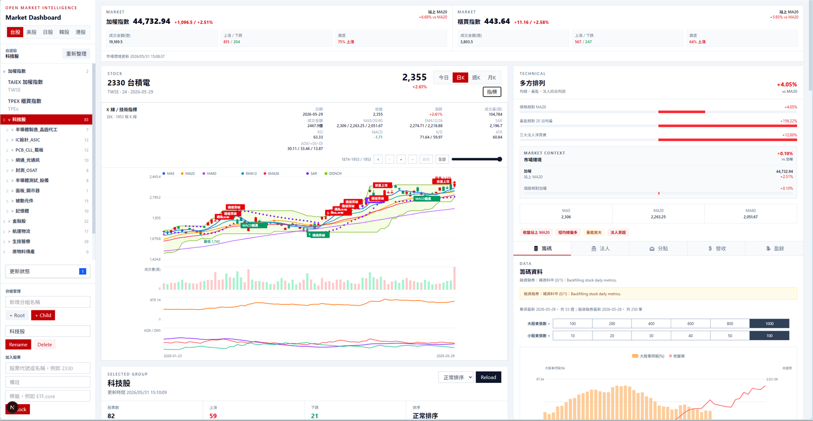
</p>

## Current Stack

| Layer | Technology | Default |
| --- | --- | --- |
| Backend | FastAPI, SQLAlchemy, Alembic, APScheduler, SQLite | `http://127.0.0.1:8300` |
| Frontend | Next.js 16, React 19, TypeScript, Tailwind CSS | `http://127.0.0.1:3000` |
| API Proxy | Next.js rewrites | `/omi-data -> /api` |
| Database | SQLite | `data/open_market_intelligence.db` |
| Timezone | Asia/Taipei | configured by `.env` |

## What It Does

- 自選股管理：支援市場分頁、樹狀群組、子群組、拖曳排序、股票加入、備註與標籤。
- 台股 Dashboard：支援股票數、漲跌家數、排序、排行與個股快速切換。
- 個股看盤：支援 `今日`、`日K`、`週K`、`月K`。
- 今日分時：支援 1m / 5m / 15m 聚合、盤中成交量、最高最低標記、昨收線、漲跌停參考、VWAP、TWAP、EMA5/20、RSI14、MACD 12/26/9。
- K 線圖：支援放大、縮小、回滾歷史資料、固定視窗檢視與滑桿調整顯示區間。
- K 線技術指標：支援 SIGNAL、MA、EMA、BOLL、VWAP、SAR、Donchian、VOL、RSI、MACD、KD、ATR、ADX / DMI、OBV、MFI、CCI、Williams %R、ROC、StochRSI。
- 指標控制：今日分時與日週月 K 線都在右上角使用同一個 `指標` 按鈕開關顯示項目；日週月 K 線另支援指標模板與參數調整。
- 籌碼與基本面：支援三大法人、法人持股比例、融資融券、集保分布、分點 Top15、多日分點加總、月營收、季度財務與盈餘。
- 資料回補：支援 TWSE / TPEx 日線、法人、融資融券、集保、營收、財務與自選股群組回補。
- 資料治理：保存 raw result、fetch log、quality check、parser result 與 background job 狀態。
- 外部 Agent 介面：提供 `POST /api/ai/ask` 與 MCP `omi.ask`，讓 Kuro 或其他桌面助理以單一入口讀取本機 evidence pack、brief、freshness 與 warning。

## Visual Tour

| Market dashboard | Intraday trend |
| --- | --- |
| 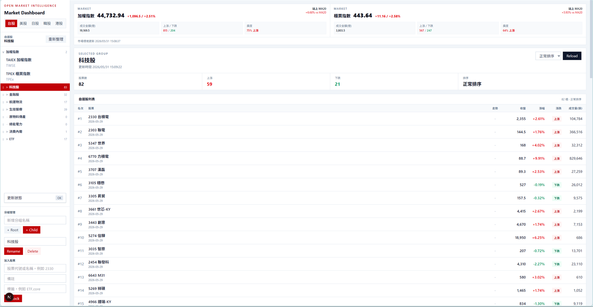 | 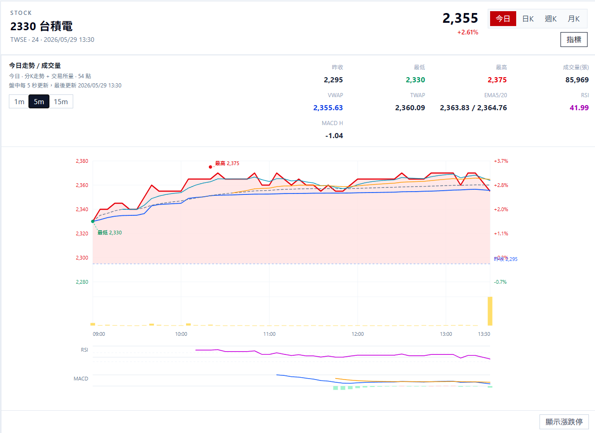 |

| Institutional flow | Broker branch |
| --- | --- |
| 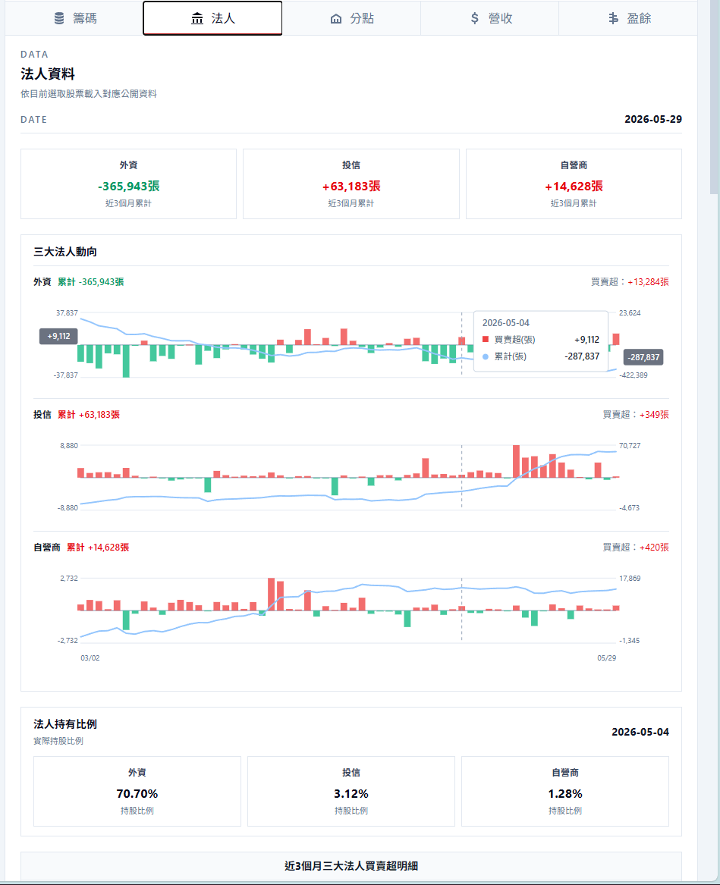 | 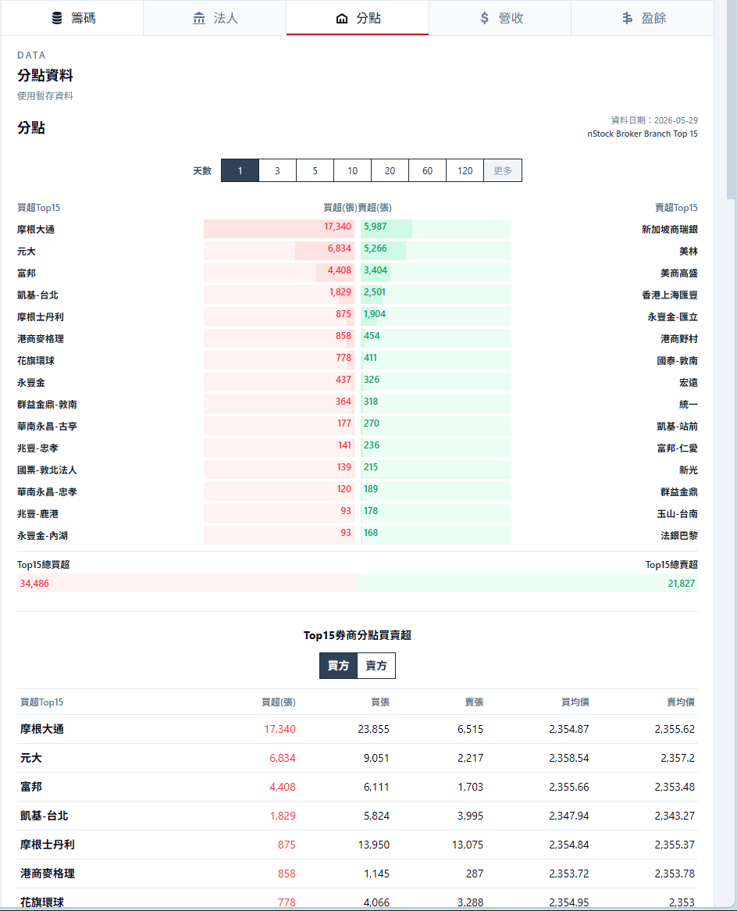 |

| Earnings and fundamentals | Long-term K-line |
| --- | --- |
| 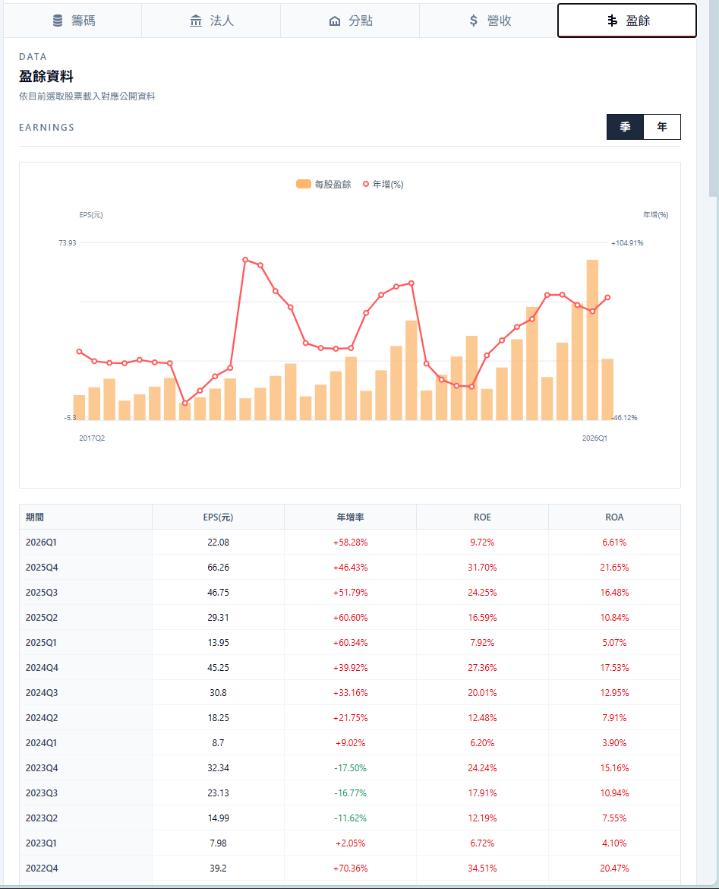 | 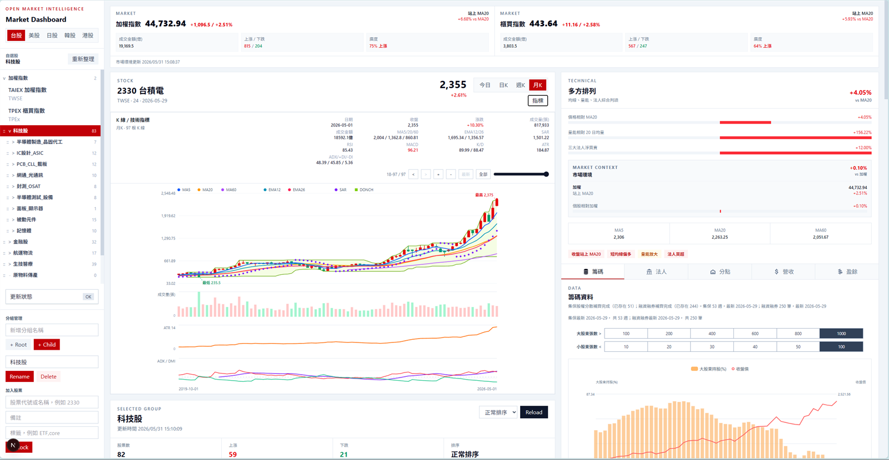 |

## System Flow

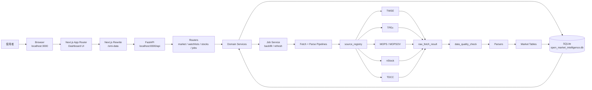

## Frontend User Flow

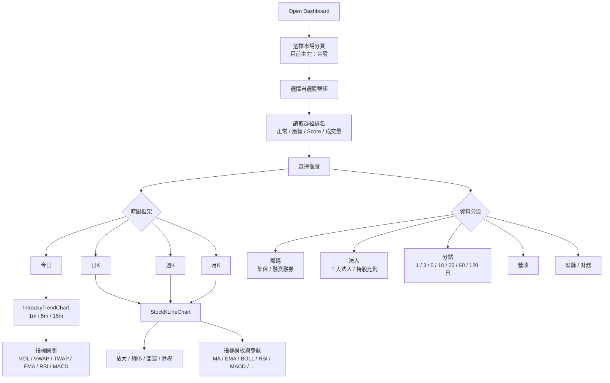

## Backend Data Flow

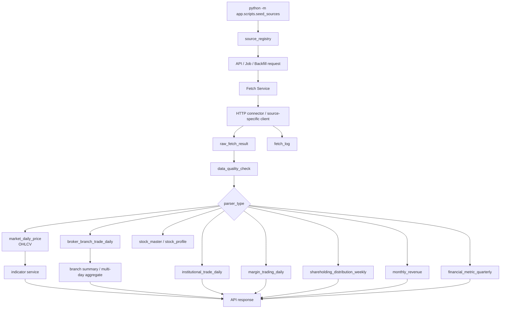

## Intraday Flow

今日走勢不是只畫價格線。後端先取分K資料，再用交易所快照校正最新價與成交量；前端再依使用者選擇聚合成 1m / 5m / 15m，並即時計算盤中指標。

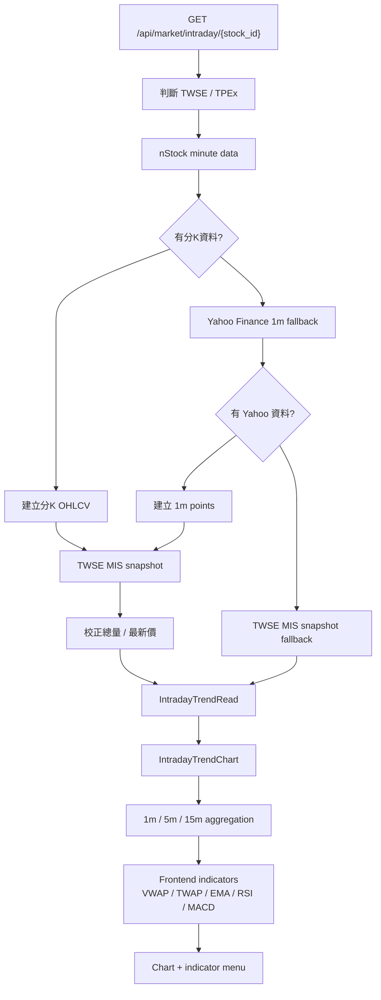

## K-Line And Indicator Flow

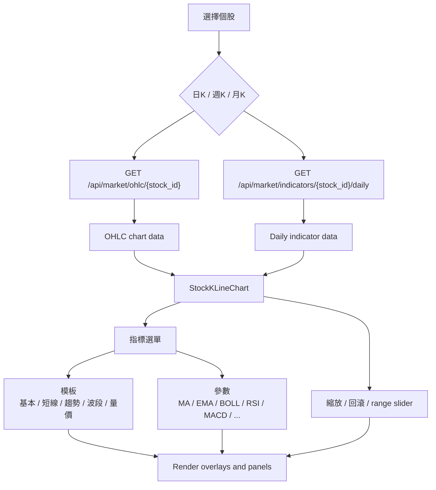

## Broker Branch Flow

分點資料來源目前是 nStock Top15。單日模式保留買超與賣超排名；多日模式會用已存每日 Top15 快照做分點加總，依淨買賣超重新排序。

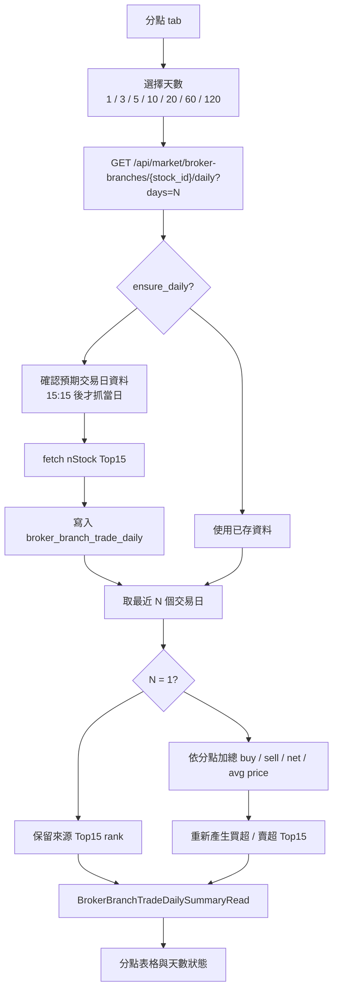

## Directory Layout

```text
.
  backend/
    app/
      connectors/      通用 HTTP 與資料來源連線器。
      db/              SQLAlchemy models、session 與資料庫初始化。
      jobs/            Background job、scheduler 與狀態查詢。
      market/          台股市場資料、日線、盤中、回補、指標與分點服務。
      parsers/         TWSE、TPEx、MOPS、TDCC 等 parser。
      pipelines/       Raw result parse pipeline。
      quality/         Raw payload 品質檢查。
      routers/         FastAPI API routes。
      scripts/         seed sources 與維運腳本。
      sources/         預設資料來源定義。
      stocks/          股票主檔查詢與同步。
      watchlists/      自選股群組、排行與回補服務。
  frontend/
    src/
      app/             Next.js App Router entry。
      components/      Dashboard、側欄、個股面板、圖表元件。
      lib/             API client、台股交易時間工具。
      types/           前端 API 型別。
  data/                本機 SQLite database，Git ignore。
  alembic/             Database migrations。
```

## Important Backend Modules

| Module | Responsibility |
| --- | --- |
| `backend/app/main.py` | FastAPI app、middleware、router registration、startup / shutdown lifecycle |
| `backend/app/config.py` | `.env` 設定、database URL、timezone、scheduler options |
| `backend/app/ai/tools.py` | AI 可用的本機資料工具與 evidence pack 組裝 |
| `backend/app/ai/prompts.py` | AI 策略 profile、system prompt 與研究偏好 |
| `backend/app/ai/llm.py` | OpenAI Responses API 呼叫、JSON schema 驗證與錯誤處理 |
| `backend/app/ai/orchestrator.py` | 個股與自選群組 AI 報告產生流程 |
| `backend/app/ai/memory.py` | AI 記憶建立、查詢、封存與相關記憶選取 |
| `backend/app/market/intraday.py` | 今日分時資料來源、fallback 與交易所快照校正 |
| `backend/app/market/backfill.py` | TWSE / TPEx 日線回補 |
| `backend/app/market/daily_metrics_backfill.py` | 法人與融資融券回補 |
| `backend/app/market/broker_branch.py` | 分點 Top15 擷取、單日查詢、多日加總 |
| `backend/app/market/monthly_revenue_history_backfill.py` | 月營收歷史回補 |
| `backend/app/market/financial_metrics_history_backfill.py` | 財務季度資料歷史回補 |
| `backend/app/market/indicators.py` | 日線技術指標計算 |
| `backend/app/watchlists/service.py` | 自選股 CRUD 與排行 |
| `backend/app/watchlists/backfill_service.py` | 群組股票批次回補 |

## Important Frontend Components

| Component | Responsibility |
| --- | --- |
| `MarketDashboardClient.tsx` | Dashboard 主狀態、群組選取、排序、股票選取 |
| `SidebarWatchlistExplorer.tsx` | 左側市場分頁、自選股樹、群組與股票操作 |
| `StockDetailPanel.tsx` | 個股頁籤、API 載入、指標選單、籌碼/法人/分點/營收/財務面板 |
| `IntradayTrendChart.tsx` | 今日分時圖、1m/5m/15m、盤中指標與指標開關 |
| `StockKLineChart.tsx` | K 線、縮放/回滾、技術指標模板、指標參數、副圖 |
| `WatchlistManager.tsx` | 自選股管理輔助操作 |

## API Map

| Prefix | Examples | Purpose |
| --- | --- | --- |
| `/api/system` | `/health` | 健康檢查 |
| `/api/sources` | `/`, `/{id}/run`, `/{id}/logs` | 資料來源、擷取與 raw result |
| `/api/raw-results` | `/{id}`, `/{id}/quality` | Raw payload、品質檢查與 parse |
| `/api/jobs` | `/`, `/{job_id}` | Background job 狀態 |
| `/api/ai` | `/ask`, `/tools`, `/strategy-profiles`, `/stocks/{id}/brief/generate`, `/watchlists/{id}/brief/generate` | AI/agent 入口、工具清單、記憶、個股報告與自選群組報告 |
| `/api/stocks` | `/search`, `/{stock_id}`, `/{stock_id}/profile` | 股票主檔與公司資料 |
| `/api/watchlists` | `/tree`, `/groups`, `/items`, `/groups/{id}/ranking` | 自選股群組、項目、排行與群組回補 |
| `/api/market/ohlc` | `/api/market/ohlc/2330?timeframe=daily` | 日週月 K 線 |
| `/api/market/intraday` | `/api/market/intraday/2330` | 今日分時 |
| `/api/market/indicators` | `/api/market/indicators/2330/daily` | 日線技術指標 |
| `/api/market/broker-branches` | `/api/market/broker-branches/2330/daily?days=20` | 分點 Top15 與多日加總 |
| `/api/market/institutional` | `/latest`, `/{stock_id}/history`, `/{stock_id}/holding-ratios` | 三大法人與持股比例 |
| `/api/market/margin` | `/{stock_id}/latest`, `/{stock_id}/history` | 融資融券 |
| `/api/market/shareholding` | `/{stock_id}/history` | 集保分布 |
| `/api/market/revenue` | `/{stock_id}/latest`, `/{stock_id}/history` | 月營收 |
| `/api/market/financials` | `/{stock_id}/latest`, `/{stock_id}/history` | 季度財務 |
| `/api/market/backfill` | `/twse/{stock_id}`, `/revenue/{stock_id}/history`, `/financials/{stock_id}/history` | 資料回補 job |

## Setup

### Requirements

- Windows PowerShell is the primary local workflow.
- Python 3.10+ is required. Current local workflow has been used with Python 3.12.
- Node.js `>=20.9.0`.
- npm `>=10`.

### Backend First-Time Setup

```powershell
cd "C:\Open Market Intelligence"
python -m venv .venv
.\.venv\Scripts\Activate.ps1
python -m pip install --upgrade pip
python -m pip install -r backend\requirements.txt

if (-not (Test-Path .env)) { Copy-Item .env.example .env }
python -m alembic upgrade head

$env:PYTHONPATH = "backend"
python -m app.scripts.seed_sources
```

### Frontend First-Time Setup

```powershell
cd "C:\Open Market Intelligence\frontend"
if (-not (Test-Path .env.local)) { Copy-Item .env.example .env.local }
npm ci
```

## Running Locally

### Backend

```powershell
cd "C:\Open Market Intelligence"
.\.venv\Scripts\Activate.ps1
cd backend
python -m uvicorn app.main:app --reload --port 8300
```

Useful URLs:

```text
http://127.0.0.1:8300
http://127.0.0.1:8300/docs
http://127.0.0.1:8300/api/system/health
```

### Frontend

```powershell
cd "C:\Open Market Intelligence\frontend"
npm run dev
```

Open:

```text
http://127.0.0.1:3000
```

## Environment Files

Root `.env.example`:

```env
APP_NAME=Open Market Intelligence
APP_ENV=development
APP_HOST=127.0.0.1
APP_PORT=8300
# DATABASE_URL 未設定時，預設使用 data/open_market_intelligence.db
# DATABASE_URL=sqlite:///C:/Open Market Intelligence/data/open_market_intelligence.db
ENABLE_SCHEDULER=false
TIMEZONE=Asia/Taipei
OPENAI_API_KEY=
OPENAI_LLM_API_KEY=
OMI_OPENAI_ENV_FILE=
OPENAI_MODEL=gpt-5.4-mini
OPENAI_RESPONSES_URL=https://api.openai.com/v1/responses
OPENAI_TIMEOUT_SECONDS=120
OPENAI_MAX_OUTPUT_TOKENS=1800
OMI_AI_ALLOW_LOCAL_TRUST=true
OMI_AI_TRUSTED_CLIENT_HOSTS=127.0.0.1,::1
OMI_AI_TRUST_TOKEN=
```

OpenAI key resolution order:

1. `OPENAI_API_KEY`
2. `OPENAI_LLM_API_KEY`
3. `OMI_OPENAI_ENV_FILE`, pointing at a local env file that contains either key

Do not commit real keys. `.env` is local-only and ignored by git.

AI report generation and internal AI tool listing use server-side trust checks.
Local development can trust loopback clients through `OMI_AI_ALLOW_LOCAL_TRUST`
and `OMI_AI_TRUSTED_CLIENT_HOSTS`. Non-loopback clients should use
`X-OMI-AI-Trust-Token` with `OMI_AI_TRUST_TOKEN`; `caller_profile` is only a
label and is not a security boundary.

Frontend `.env.example`:

```env
API_PROXY_TARGET=http://127.0.0.1:8300
API_PROXY_PATH=/omi-data
NEXT_PUBLIC_API_PROXY_PATH=/omi-data
NEXT_PUBLIC_API_BASE_URL=
```

Next.js rewrite:

```text
/omi-data/wl/... -> http://127.0.0.1:8300/api/watchlists/...
/omi-data/...    -> http://127.0.0.1:8300/api/...
/api/...         -> http://127.0.0.1:8300/api/...
```

## AI Research Flow

AI 研究功能在 OMI 裡不是主要視覺介面，而是外部 Agent 的本機資料插座。Kuro 或其他桌面助理可以透過 `omi.ask` 接入；OMI 負責讀取 SQLite 與既有 service、整理 evidence pack、回傳 brief / report / freshness warnings，並在允許時才把資料交給 OpenAI 做摘要與判讀。LLM 不直接碰資料庫，也不自行假設缺漏資料。

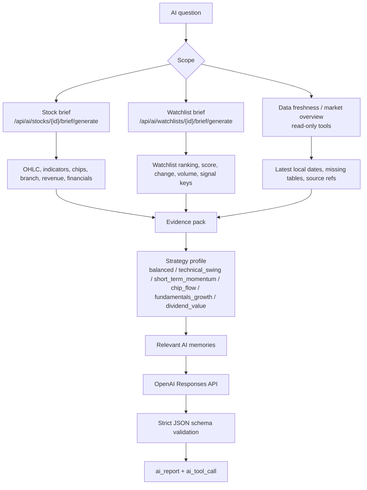

### AI Question Modes

For external agents, prefer `POST /api/ai/ask` or MCP `omi.ask`. This is the
single public entry point: callers send a question and optional scope, while OMI
decides whether to return raw data, a prompt-ready brief, or a persisted LLM
report. It defaults to `strategy_profile=short_term_momentum` and does not call
OpenAI unless report mode is explicitly allowed by server-side policy. `GET
/api/ai/tools` also returns only `omi.ask` by default; add `debug=true` or
`include_internal=true` only from a trusted local/token-authenticated request to
list internal tools.

The direct write/cost routes are internal integration paths. Creating/updating
AI memory, saving briefs, and generating LLM reports require the same
server-side trusted request policy used by `ask`. Read-only context and brief
routes stay available for local dashboard inspection.

### External Agent Contract

External desktop assistants should treat OMI as the stock/market authority and
should not call the internal AI routes directly. The supported contract is:

1. Call `POST /api/ai/ask` or MCP `omi.ask`.
2. Use `mode=data_only` when the caller only needs structured local evidence.
3. Use `mode=brief` when the caller needs a compact prompt-ready summary.
4. Use `mode=report` only when the request is server-side trusted and explicitly
   sets both `allow_llm=true` and `allow_write=true`.
5. Preserve `warnings`, `missing`, `source_refs`, `mode_effective`, and
   `as_of` in downstream UIs so partial or stale local data is visible.

The response envelope is intentionally stable for agents:

```json
{
  "kind": "ai_ask",
  "scope_type": "stock",
  "scope_id": "2330",
  "mode_requested": "brief",
  "mode_effective": "brief",
  "action": "omi.generate_stock_brief",
  "policy": {
    "allow_llm": false,
    "allow_write": false,
    "can_generate_report": false
  },
  "result": {
    "kind": "stock_brief",
    "as_of": "2026-05-26"
  },
  "warnings": [],
  "source_refs": []
}
```

For Kuro, the intended route is OMI-first: stock, watchlist, and local market
questions should call `omi.ask` before any web search. Web search should be used
only as enrichment for explicit realtime quote, fresh news, or missing-context
questions.

| Mode | API | Reads | Use case |
| --- | --- | --- | --- |
| OMI ask | `POST /api/ai/ask` / MCP `omi.ask` | Auto-dispatched data, stock, watchlist, or report path | External agent integration through one stable entry point |
| Data freshness | `GET /api/ai/data-freshness` | Latest available dates and missing coverage | Check whether the local dataset is usable before analysis |
| Market overview | `GET /api/ai/market-overview` | Latest market breadth and movers | Quick market context without an LLM call |
| Stock context | `GET /api/ai/stocks/{stock_id}/context` | Full single-stock evidence pack | Inspect what would be sent to AI |
| Stock LLM brief | `POST /api/ai/stocks/{stock_id}/brief/generate` | Single-stock evidence plus strategy profile and memory | Deep stock report |
| Watchlist context | `GET /api/ai/watchlists/{group_id}/context` | Group ranking, score, change, volume, status and signal keys | Inspect group scan payload |
| Watchlist LLM brief | `POST /api/ai/watchlists/{group_id}/brief/generate` | Compact group ranking plus strategy profile and memory | Sector/watchlist scan |

For short-term trading research, use `strategy_profile=short_term_momentum` first. The intended flow is group scan first, then deep stock briefs only for selected candidates. This keeps the prompt small and avoids sending full single-stock data for every item in a large watchlist.

### AI Cost And Token Controls

- Watchlist AI reports send a scan pack: top 20 candidates, bottom 5 watchlist rows, and up to 20 attention rows. They do not send every stock's full branch, institutional, revenue and financial history.
- Stock AI reports are heavier because they include one stock's chart, chips, branch, revenue and financial context.
- Large groups should be treated as scan mode. If a group has many stocks, call the watchlist brief first, pick top candidates, then call stock briefs for those candidates.
- The OpenAI output budget is controlled by `OPENAI_MAX_OUTPUT_TOKENS`; request timeout is controlled by `OPENAI_TIMEOUT_SECONDS`.
- Generated reports are persisted in `ai_report` with `ai_tool_call` records so later agents can inspect what tools were used.
- `caller_profile` is only a caller label. Trust is decided by backend policy:
  loopback hosts listed in `OMI_AI_TRUSTED_CLIENT_HOSTS` when
  `OMI_AI_ALLOW_LOCAL_TRUST=true`, or a matching `X-OMI-AI-Trust-Token` header
  when `OMI_AI_TRUST_TOKEN` is configured.

## Database And Migrations

The backend runs `alembic upgrade head` automatically during startup before
opening application sessions. This keeps packaged releases and local runs on the
current schema, including older SQLite databases that were created before
Alembic version tracking existed.

新環境套用 migration：

```powershell
cd "C:\Open Market Intelligence"
.\.venv\Scripts\Activate.ps1
python -m alembic upgrade head
```

只有在你已經確認資料庫 schema 與目前程式碼一致、只想同步 Alembic 版本標記時，才使用：

```powershell
python -m alembic stamp head
```

Local-only paths:

```text
data/open_market_intelligence.db
.venv/
frontend/node_modules/
frontend/.next/
.env
frontend/.env.local
```

These should not be committed.

## Validation

Backend:

```powershell
$env:PYTHONPATH = "backend"
python -m compileall backend\app
python -m unittest discover -s backend\tests -p "test_*.py"
```

Frontend:

```powershell
cd frontend
npm run lint
npm run build
```

## Common Workflows

### 1. Add Stocks To Watchlist

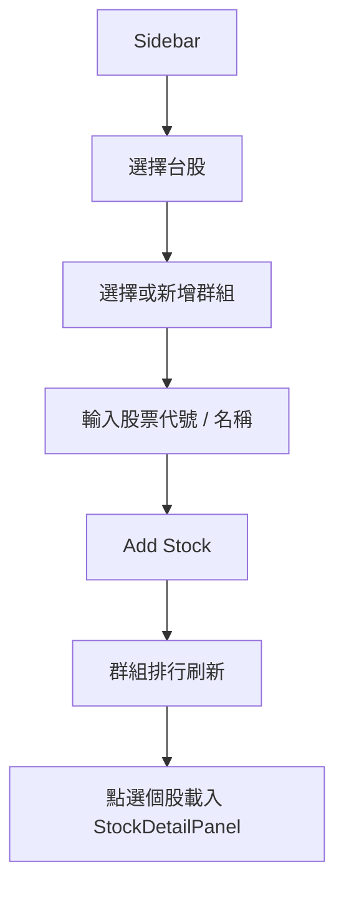

### 2. Backfill A Watchlist Group

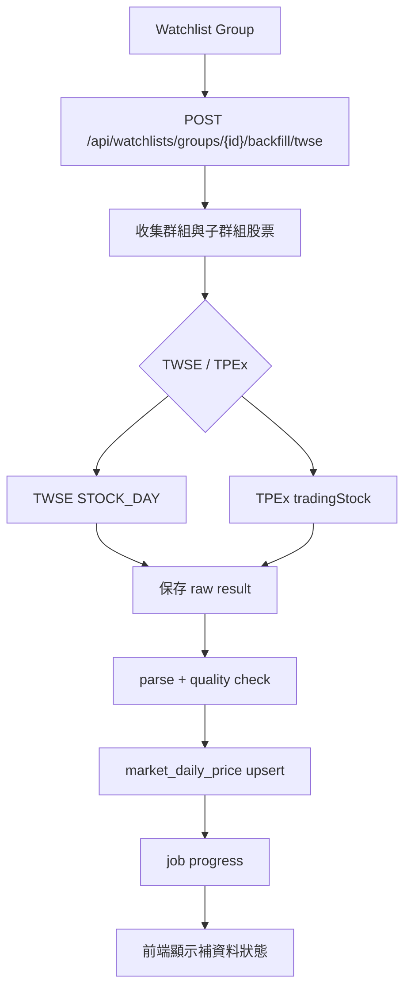

### 3. Study A Stock

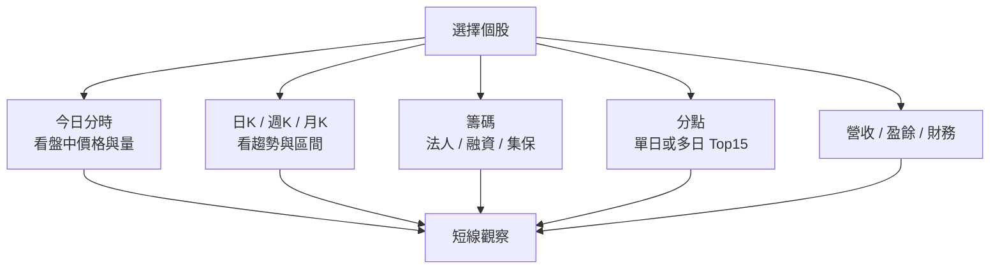

## Validation

Backend syntax check:

```powershell
cd "C:\Open Market Intelligence\backend"
python -m compileall app
```

Frontend type check:

```powershell
cd "C:\Open Market Intelligence\frontend"
npx tsc --noEmit
```

Frontend lint:

```powershell
cd "C:\Open Market Intelligence\frontend"
npm run lint
```

Frontend production build:

```powershell
cd "C:\Open Market Intelligence\frontend"
npm run build
```

Useful API spot-checks:

```powershell
Invoke-RestMethod "http://127.0.0.1:8300/api/system/health"
Invoke-RestMethod "http://127.0.0.1:8300/api/market/intraday/2330"
Invoke-RestMethod "http://127.0.0.1:8300/api/market/ohlc/2330?timeframe=daily&limit=120"
Invoke-RestMethod "http://127.0.0.1:8300/api/market/indicators/2330/daily?limit=120"
Invoke-RestMethod "http://127.0.0.1:8300/api/market/broker-branches/2330/daily?days=3&ensure_daily=false"
```

Git whitespace check:

```powershell
git diff --check
```

## Operating Notes

- GET routes should stay read-oriented. Expensive or mutating data fetches should go through POST backfill or job routes where possible.
- New data sources should be registered in `source_registry` first, then wired through parser and quality checks.
- Raw payloads should be saved before parsing so source format changes can be debugged later.
- Frontend API access should go through `frontend/src/lib/api.ts` and the `/omi-data` proxy unless there is a deliberate reason not to.
- 台股盤中時間、regular session 判斷與 X 軸比例集中在 `frontend/src/lib/taiwanMarketTime.ts`。
- Chart controls should keep dimensions stable. Hover, indicator toggles, labels and refreshes should not cause incoherent layout shifts.
- Multi-day branch data is an aggregate of stored daily Top15 snapshots, not a full broker ledger.
- Intraday indicators are calculated client-side from the current intraday payload. Early-session RSI/MACD can show `-` until enough points exist.

## Current Limitations

- 美股、日股、韓股、港股目前偏向入口與未來擴充，不是完整資料流。
- 分點多日統計受限於已存的每日 Top15 快照；若資料庫只有 1 天資料，`days=3` 會回傳 partial 狀態。
- 盤中資料依外部來源可用性 fallback；來源故障時可能只剩交易所快照。
- SQLite 適合本機研究與開發；多使用者或長期服務應評估 PostgreSQL 等資料庫。

## Production Hygiene

- Do not commit `.env`, `.env.local`, `.venv`, `node_modules`, `.next`, local SQLite databases, logs or downloaded raw private data.
- Do not hard-code API keys or credentials. Use `.env`.
- Keep migrations explicit when schema changes.
- Before push, run backend compile plus frontend type/lint/build at minimum.
- When changing source parsing, add an API spot-check with a real stock id and inspect returned dates/counts.
