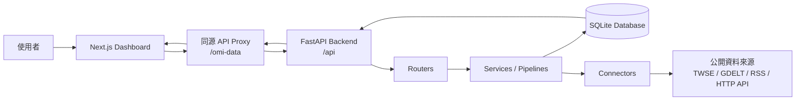
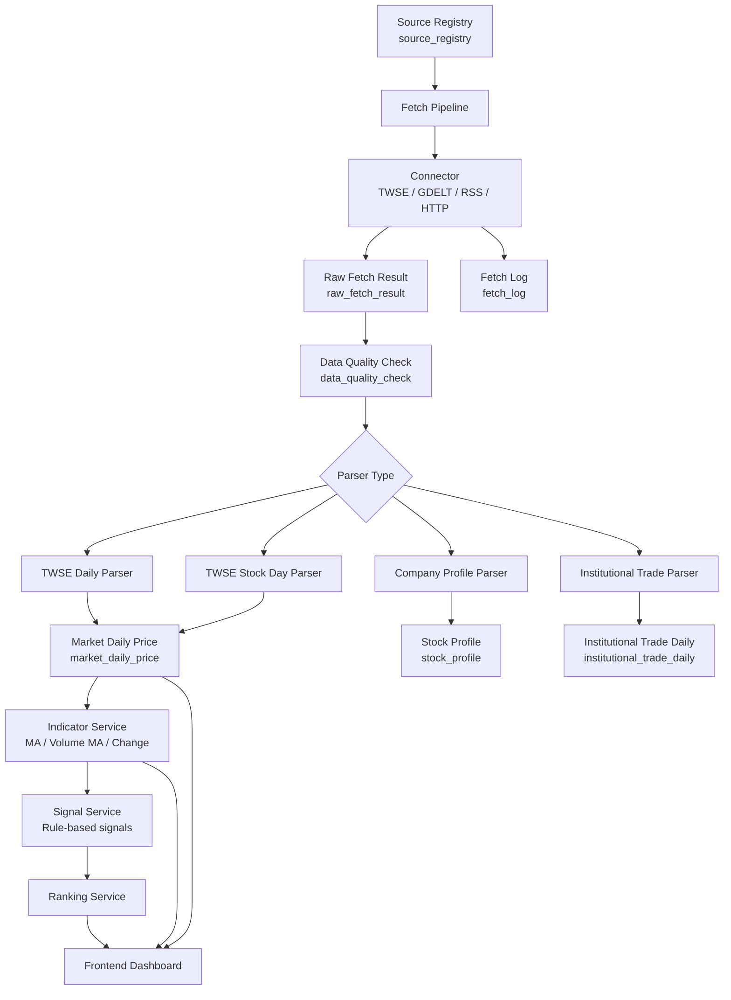
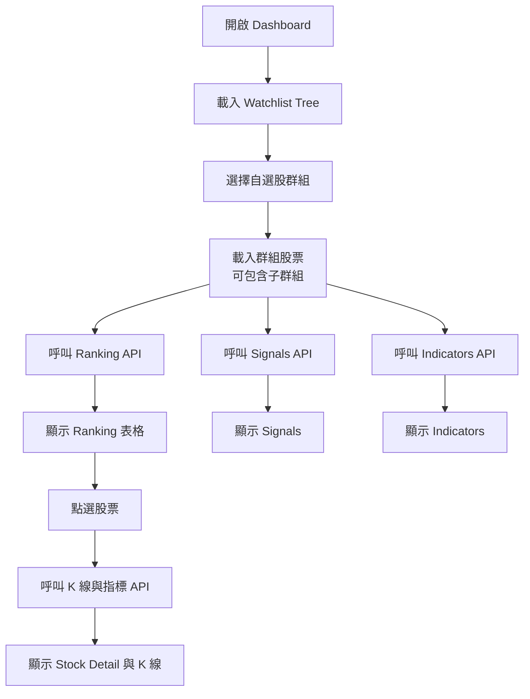

# Open Market Intelligence

## 1. 專案定位

Open Market Intelligence 是一套以公開資料為基礎、以本機優先為設計方向的市場情報儀表板系統。系統目前以台股資料監控為核心，透過 FastAPI 後端收集與保存公開資料，再由 Next.js 前端提供自選股分類、排名、訊號、技術指標與 K 線檢視。

本專案定位為研究與工程原型，不是自動交易系統，也不提供投資建議。

## 2. 核心原則

- 僅使用公開資料。
- 採用 local-first 架構，資料優先保存在本機。
- 保留原始資料，確保後續可追溯。
- 建立來源登錄與資料品質檢查。
- 優先使用規則式分析，再進一步考慮 AI 摘要。
- 不執行自動交易。
- 不使用任何非公開重大資訊。

## 3. 系統總覽

系統分為三個主要層次：

- 後端服務：FastAPI、SQLAlchemy、SQLite，負責資料擷取、保存、解析、指標計算與 API。
- 前端儀表板：Next.js、React、TypeScript、Tailwind CSS，負責操作自選股與展示市場資訊。
- 本機資料庫：SQLite，保存來源、原始擷取結果、品質檢查、行情資料、股票主檔與自選清單。



## 4. 目前功能

### 4.1 後端功能

- FastAPI API 服務。
- SQLite 本機資料庫。
- Source Registry 來源登錄。
- Fetch Pipeline 資料擷取流程。
- Raw Fetch Result 原始資料保存。
- Data Quality Check 資料品質檢查。
- TWSE 日行情解析。
- TWSE 個股歷史資料回補。
- 股票主檔同步與搜尋。
- 技術指標計算。
- 訊號與排名計算。
- 自選股群組與項目管理。
- 自選股群組樹狀結構。
- 自選股群組回補 API。
- 盤前與盤後報告 API 佔位。

### 4.2 前端功能

- Market Dashboard 主畫面。
- Sidebar Watchlist Explorer。
- 自選股資料夾新增、重新命名、刪除。
- 自選股項目新增、停用、刪除。
- 自選股群組歷史資料回補。
- Ranking 排名表。
- Signals 訊號摘要。
- Indicators 技術指標摘要。
- Stock Detail 個股詳情。
- K 線與成交量圖。
- 同源 API Proxy，避免瀏覽器直接跨 port 呼叫後端。

## 5. 資料流程

資料流程從來源登錄開始，經過擷取、品質檢查、原始資料保存、解析與結構化，最後提供給指標、訊號、排名與前端儀表板使用。



## 6. 自選股操作流程

前端以自選股群組為主要操作入口。使用者先選擇群組，系統依該群組與子群組內的股票，載入最新行情、指標、訊號與排名。



## 7. API Proxy 設計

前端預設不直接呼叫 `http://127.0.0.1:8000/api`，而是呼叫同源路徑，再由 Next.js 轉送到 FastAPI。

### 7.1 Proxy 規則

設定位置：

```text
frontend/next.config.ts
```

目前設定：

```ts
const apiProxyTarget = process.env.API_PROXY_TARGET ?? "http://127.0.0.1:8000";
const apiProxyPath = process.env.API_PROXY_PATH ?? "/omi-data";

const nextConfig: NextConfig = {
  async rewrites() {
    return [
      {
        source: `${apiProxyPath}/wl/:path*`,
        destination: `${apiProxyTarget}/api/watchlists/:path*`,
      },
      {
        source: `${apiProxyPath}/:path*`,
        destination: `${apiProxyTarget}/api/:path*`,
      },
      {
        source: "/api/:path*",
        destination: `${apiProxyTarget}/api/:path*`,
      },
    ];
  },
};
```

### 7.2 呼叫範例

```text
前端原始 API path:
/api/watchlists/tree

瀏覽器實際請求:
http://127.0.0.1:3000/omi-data/wl/tree

Next.js 轉送到:
http://127.0.0.1:8000/api/watchlists/tree
```

## 8. 專案結構

```text
Open Market Intelligence/
├─ backend/
│  ├─ requirements.txt
│  └─ app/
│     ├─ connectors/       # 公開資料來源連接器
│     ├─ db/               # SQLAlchemy models 與 session
│     ├─ market/           # 行情查詢、回補、指標、訊號
│     ├─ parsers/          # TWSE / 公司資料 / 法人資料解析器
│     ├─ pipelines/        # fetch 與 parse pipeline
│     ├─ quality/          # 資料品質檢查
│     ├─ routers/          # FastAPI routers
│     ├─ scripts/          # 初始化與 seed scripts
│     ├─ sources/          # 來源登錄 service/schema
│     ├─ stocks/           # 股票主檔 service/schema
│     ├─ utils/            # 共用工具
│     └─ watchlists/       # 自選股 service/schema/ranking/signal
├─ frontend/
│  ├─ src/
│  │  ├─ app/              # Next.js app router 頁面與樣式
│  │  ├─ components/       # Dashboard 元件
│  │  ├─ lib/              # API helper
│  │  └─ types/            # TypeScript 型別
│  ├─ next.config.ts       # API proxy 設定
│  ├─ package.json
│  └─ .env.example
├─ data/                   # SQLite DB，本機資料
├─ docs/
├─ logs/
├─ reports/
├─ README.md
└─ READ.md
```

## 9. 本機啟動方式

### 9.1 啟動後端

在專案根目錄執行：

```powershell
cd "C:\Open Market Intelligence"
.\.venv\Scripts\Activate.ps1
cd backend
python -m uvicorn app.main:app --reload --port 8000
```

後端網址：

```text
http://127.0.0.1:8000
http://127.0.0.1:8000/docs
http://127.0.0.1:8000/api/system/health
```

### 9.2 啟動前端

在前端資料夾執行：

```powershell
cd "C:\Open Market Intelligence\frontend"
npm run dev
```

前端網址：

```text
http://127.0.0.1:3000
```

## 10. 前端環境設定

建議建立：

```text
frontend/.env.local
```

內容：

```env
API_PROXY_TARGET=http://127.0.0.1:8000
API_PROXY_PATH=/omi-data
NEXT_PUBLIC_API_PROXY_PATH=/omi-data
NEXT_PUBLIC_API_BASE_URL=
```

說明：

- `API_PROXY_TARGET`：Next.js server 端 proxy 目標，預設指向 FastAPI。
- `API_PROXY_PATH`：Next.js rewrite 的前端同源路徑。
- `NEXT_PUBLIC_API_PROXY_PATH`：瀏覽器端使用的 proxy path。
- `NEXT_PUBLIC_API_BASE_URL`：保留空值時，前端會走同源 proxy；若填入完整 URL，前端會直接呼叫指定 API base URL。

## 11. 主要 API 分組

| 分組 | Prefix | 用途 |
| --- | --- | --- |
| System | `/api/system` | 健康檢查 |
| Sources | `/api/sources` | 來源登錄、手動擷取、refresh、logs |
| Raw Results | `/api/raw-results` | 原始資料檢視與解析 |
| Market | `/api/market` | 日行情、歷史資料、K 線資料、回補 |
| Indicators | `/api/market/indicators` | 技術指標 |
| Stocks | `/api/stocks` | 股票主檔同步、搜尋、更新 |
| Watchlists | `/api/watchlists` | 自選股群組、項目、排名、訊號、指標 |
| Reports | `/api/reports` | 盤前/盤後報告佔位 |

## 12. 驗證方式

### 12.1 後端語法檢查

```powershell
cd "C:\Open Market Intelligence"
.\.venv\Scripts\Activate.ps1
python -m compileall backend\app
```

### 12.2 前端 lint

```powershell
cd "C:\Open Market Intelligence\frontend"
npm run lint
```

### 12.3 前端 production build

```powershell
cd "C:\Open Market Intelligence\frontend"
npm run build
```

### 12.4 API proxy 檢查

後端與前端都啟動後，開啟：

```text
http://127.0.0.1:3000/omi-data/wl/tree
```

預期結果：

```text
Next.js 會將請求轉送到 FastAPI 的 /api/watchlists/tree。
```

## 13. 資料表概覽

| 資料表 | 用途 |
| --- | --- |
| `source_registry` | 資料來源登錄 |
| `fetch_log` | 擷取工作紀錄 |
| `raw_fetch_result` | 原始擷取資料 |
| `data_quality_check` | 資料品質檢查 |
| `market_daily_price` | 日行情 |
| `institutional_trade_daily` | 法人買賣超資料 |
| `stock_master` | 股票主檔 |
| `stock_profile` | 公司基本資料 |
| `watchlist_group` | 自選股群組 |
| `watchlist_item` | 自選股項目 |

## 14. 目前開發狀態

目前系統已具備可運作的 MVP：

- 後端 API 已能初始化資料庫並提供核心資料查詢。
- 前端儀表板可讀取自選股群組、排名、訊號、指標與 K 線。
- 已建立同源 proxy，降低本機瀏覽器跨 port 呼叫問題。
- 已移除 Google Fonts build-time 依賴，改善離線 build 穩定性。
- 已修正 disabled source refresh 的錯誤處理。

## 15. 後續規劃

### 15.1 近期

- 補齊後端測試，特別是 source refresh、watchlist、ranking、indicator。
- 改善 README / READ 文件一致性。
- 建立資料庫 migration 流程。
- 加入股票搜尋與快速加入自選股。
- 改善 K 線圖互動與錯誤狀態。

### 15.2 中期

- 擴充技術指標與規則式訊號。
- 增加資料來源可靠性儀表板。
- 加入資料品質監控頁面。
- 建立盤前與盤後報告生成流程。
- 在規則式分析後加入 AI 輔助摘要。

### 15.3 長期

- 整合更多公開資料來源。
- 建立公司事件、新聞、RSS、國際事件收集器。
- 產生可追溯研究報告。
- 發展成本機優先的個人市場情報助理。

## 16. 使用限制與聲明

本專案僅供研究、學習與個人市場監控使用。

本專案：

- 不執行自動交易。
- 不提供投資建議。
- 不保證資料即時性或完整性。
- 不使用非公開重大資訊。

所有分析結果皆應由使用者自行查證，不應作為任何投資決策的唯一依據。
