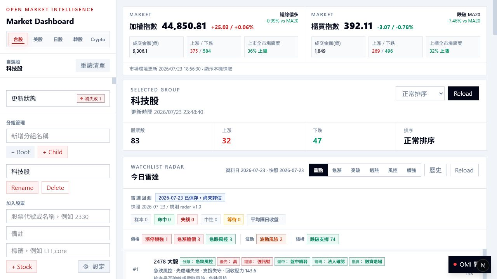
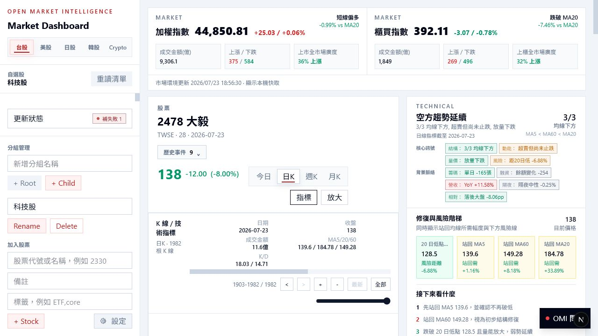
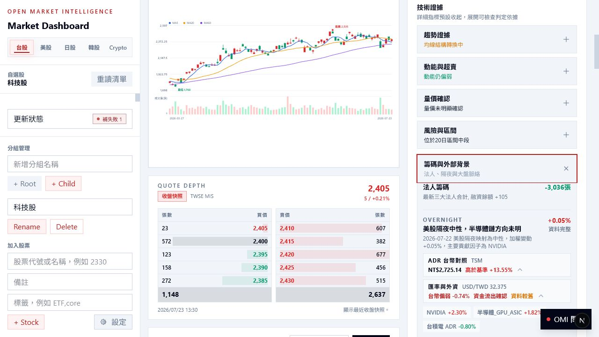
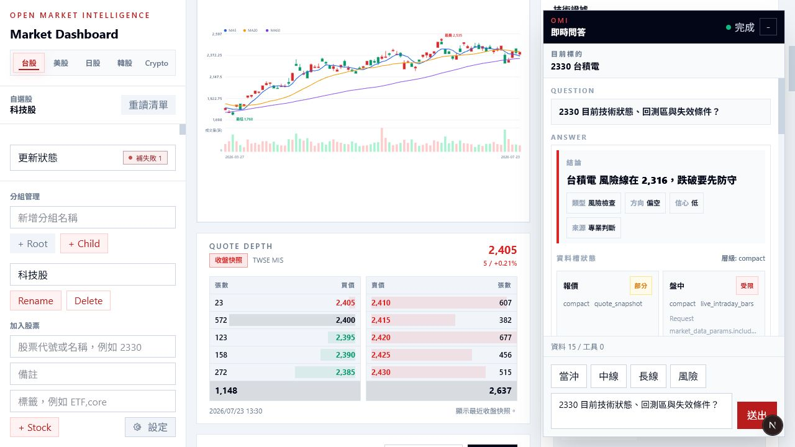
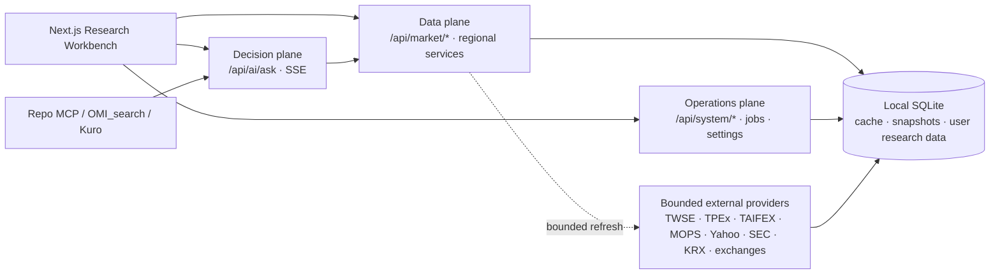

# Open Market Intelligence

本機優先、台股優先、以 evidence 為核心的市場研究與技術決策工作台。

Open Market Intelligence（OMI）把市場資料、Watchlist Radar、專業 K 線、籌碼／基本面、跨市場 context、資料新鮮度與 AI decision core 放進同一個可檢查的研究流程。它的目標不是猜漲跌，而是回答：

- 現在的趨勢、動能、量價與風險是什麼？
- 哪些價位值得等待，什麼條件才算確認？
- 哪些 evidence 會讓原判斷失效？
- 資料是否 stale、partial、missing，或 provider 已失敗？

OMI 不會自動下單，也不應被視為保證獲利的投資建議。

## 產品畫面

以下截圖來自 `2026-07-23` 的本機實際 runtime，不是 mock 畫面。

### 台股 Dashboard、全市場廣度與 Watchlist Radar

<p align="center">
  
</p>

Dashboard 以台股為主線：大盤卡片、全市場廣度、自選群組、Radar 訊號、回測狀態與資料更新異常都在同一個掃描面。

### 個股技術狀態、修復階梯與風險線

<p align="center">
  
</p>

技術卡由 backend 產出 structured current state。Frontend 只負責呈現「趨勢／動能／量價／風險」、MA5／20／60 修復順序、20 日低點風險線與下一步確認條件。

### ADR 台幣隱含價、匯率與外資資金流

<p align="center">
  
</p>

台股隔夜 context 可同時檢查直接 ADR 映射、USD/TWD、外資大盤與個股流向；資料較舊時會保留 stale 標示，不把缺值改成 `0`。

### OMI Decision Envelope v4

<p align="center">
  
</p>

OMI dock、HTTP、SSE、repo MCP 與外部 consumer 共用 `omi.decision.v4`。Consumer
可按 capability、欄位、筆數與總 bytes 選取資料；backend 以
`evidence.quality` 統一 availability、freshness、completeness、release phase、
continuity、unit 與 decision usability。Transport 成功不會被誤當成
decision-ready。目前 registry v1 共有 38 個 capabilities，涵蓋原有 stock、
market、watchlist、portfolio、macro、derivatives、crypto 與 diagnostics context。

## 產品定位

OMI 是本機市場研究工作台，不是交易執行系統。

| 原則 | 實際含義 |
| --- | --- |
| 台股優先 | 台股是產品主線；美股、日股、韓股、Crypto 與商品是 context layer。 |
| Evidence before narrative | AI 回答先建立可追溯 evidence，再產出敘事與決策條件。 |
| Backend owns truth | 市場整併、freshness、provider fallback、scope resolution 與 decision readiness 留在 backend。 |
| Freshness is visible | `stale`、`partial`、`missing`、`blocked`、`provider_failure` 不會被隱藏。 |
| Bounded refresh | 外部抓取有 target、range、timeout、次數、來源與失敗狀態，不做無限制全市場回補。 |
| Local-first | SQLite、cache、jobs、設定與研究資料預設留在本機。 |
| No automatic trading | 沒有 order placement、券商帳戶操作或自動下單 contract。 |

長期產品基線請見：

- [`docs/product/ProductVision.md`](docs/product/ProductVision.md)
- [`docs/product/OperatingModel.md`](docs/product/OperatingModel.md)
- [`docs/product/QualityBar.md`](docs/product/QualityBar.md)
- [`docs/product/Roadmap.md`](docs/product/Roadmap.md)

## 目前能力

### 台股主線

- TAIEX、TPEx 指數、全市場廣度、漲跌家數、成交金額與 release-aware freshness。
- 自選群組、排行、Watchlist Radar、盤後快照與 T+1 outcome loop。
- 台股個股 `今日`／日 K／週 K／月 K、五檔、VWAP、技術指標、專業 K 線與畫線保存。
- 法人、融資融券、TDCC、券商分點 Top15、營收、財報與盈餘。
- 台指期 TXF／MXF／TMF、期現價差、日夜盤 quote context 與 TAIFEX 盤後衍生資料。
- 公司事件歷史與 K 線 event markers，可顯示除權息、法說／財報等已保存事件。
- 台股全市場 minute state：盤中成交值節奏、廣度與完整性狀態。

### 新版研究 context

- 技術 current state：headline、qualifier、均線位置、修復階梯、風險線、evidence groups 與 next conditions。
- 同市場同分鐘量能節奏：TW／US／JP／KR 個股以 regular-session 累積量對比歷史同分鐘中位數；樣本不足時回傳 `partial`。
- ADR parity：`2330 ↔ TSM`、`2303 ↔ UMC`、`3711 ↔ ASX`、`8150 ↔ IMOS`。
- 匯率與外資 context：USD/TWD、全市場外資金額與個股外資股數的 1／5／20 日視窗。
- OMI Decision Envelope v4：統一 HTTP、SSE、Frontend、MCP 與 Kuro-facing
  capability selection、資料品質與 answer semantics；v2/v3 僅留在 backend
  私有實作，不再是公開 consumer contract。

### 其他市場 context layer

| 市場 | 目前定位與能力 |
| --- | --- |
| 美股 | 指數、自選股、OHLC／intraday、SEC facts、corporate actions、FINRA short volume、FRED macro 與台股隔夜映射。 |
| 日股 | 指數／個股、自選、OHLC／intraday、J-Quants fundamentals 與 source health；仍是早期 context layer。 |
| 韓股 | KRX／Yahoo／Naver bounded data、OpenDART fundamentals、指數／個股、自選與 source health；仍在收斂 frontend/AI parity。 |
| Crypto | BitoPro／Binance／OKX／CoinGecko provider contract、WebSocket/REST、OHLCV、order book、funding/OI、spread、CVD 與 liquidation context。 |
| 商品 | 黃金、白銀、銅、WTI、Brent、天然氣等 Yahoo chart best-effort quote/OHLCV；定位為 watch-only reference。 |

不同市場不保證同步更新。跨市場值必須連同 `as_of`、session、provider 與 freshness 解讀。

## 架構



責任邊界：

- `backend/`：市場資料、provider、cache、freshness、AI reasoning、tool orchestration、answer contract。
- `frontend/`：研究工作台 layout、互動、圖表與狀態呈現，不重算 backend 市場語意。
- `agents/`：thin adapters；呼叫 backend API，不直接讀寫 OMI database。
- `data/open_market_intelligence.db`：本機 SQLite 狀態；schema 只透過 Alembic migration 演進。

深入文件：

- [`docs/architecture/BackendArchitecture.md`](docs/architecture/BackendArchitecture.md)
- [`docs/architecture/OmiDecisionContract.md`](docs/architecture/OmiDecisionContract.md)
- [`docs/ExternalInterfaces.md`](docs/ExternalInterfaces.md)

## OMI Decision Contract

所有 public consumer 使用 `omi.decision.v4`：

```json
{
  "contract_version": "omi.decision.v4",
  "question": "2330 目前技術狀態、回測區與失效條件？",
  "target": {
    "type": "tw_stock",
    "id": "2330",
    "market": "TW"
  },
  "mode": "brief",
  "caller_profile": "frontend_readonly",
  "output": "decision_with_evidence",
  "realtime_policy": "prefer_live",
  "selection": {
    "include": [
      "quote.snapshot",
      "technical.structure"
    ],
    "fields": {
      "quote.snapshot": [
        "price",
        "trade_date",
        "quote_time",
        "currency",
        "price_unit",
        "freshness"
      ]
    },
    "limits": {
      "technical.structure": 10
    },
    "max_response_bytes": 32768
  },
  "allow_llm": false,
  "allow_write": false,
  "allow_external_fetch": false,
  "market_data_params": {
    "payload_level": "compact"
  }
}
```

Canonical response 的主要區域：

| 欄位 | 用途 |
| --- | --- |
| `status.readiness` | `response_ready`、`facts_ready`、`analysis_ready`、`decision_ready` 與 `decision_blocked`。 |
| `answer` | 可直接顯示或語音化的 headline、text、summary、stance。 |
| `decision` | 情境、action plan、價位、部位、風險、反證與資料限制。 |
| `evidence.quality` | Canonical availability、freshness、completeness、release phase、continuity、unit 與 usability。 |
| `evidence.manifest` / `evidence.data` | 實際選取的 capability manifest 與 bounded data；未選取資料不會整包回傳。 |
| `limitations` | Missing、warnings 與 provider failures。 |
| `execution` | Policy、query/tool plan、budget、runs 與 diagnostics。 |
| `continuation` | Resolved target、clarification、next context 與 next actions。 |
| `error` | Business error；不能只看 HTTP status 或 SSE `done`。 |

公開 HTTP、SSE、MCP 與 OpenAPI 只接受並回傳 v4。明確傳入
`omi.decision.v3` 或 `omi.ai.ask.v2` 會被拒絕；backend 內部仍保留舊 builder
作為回歸與安全實作 seam，不屬於對外承諾。

### HTTP

```powershell
$body = @{
  contract_version = "omi.decision.v4"
  question = "2330 目前技術狀態、回測區與失效條件？"
  target = @{ type = "tw_stock"; id = "2330"; market = "TW" }
  mode = "brief"
  output = "decision_with_evidence"
  realtime_policy = "prefer_live"
  selection = @{
    include = @("quote.snapshot", "technical.structure")
    limits = @{ "technical.structure" = 10 }
    max_response_bytes = 32768
  }
  allow_llm = $false
  allow_write = $false
  allow_external_fetch = $false
  market_data_params = @{ payload_level = "compact" }
} | ConvertTo-Json -Depth 6

Invoke-RestMethod `
  -Method Post `
  -Uri "http://127.0.0.1:8400/api/ai/ask" `
  -ContentType "application/json" `
  -Body $body
```

### MCP

Repo 內 adapter 位於 [`agents/omi_mcp_server`](agents/omi_mcp_server)。Public tools：

- `omi.ask`
- `omi.ask_stream`

Adapter 只 forward canonical envelope，不自行重建 readiness、freshness 或 market logic。Backend URL 由 `OMI_API_BASE_URL` 指向 launcher 實際選到的位址。

## 快速啟動

### 系統需求

- Windows PowerShell
- Python `3.11+`
- Node.js `>=20.9.0`
- npm `>=10`

### 已設定完成的本機 checkout

```powershell
cd "C:\project\Open Market Intelligence"
.\Start-OMI-Launcher.cmd
```

Launcher 會啟動 tray、Backend 與 Frontend，並在 preferred port 被佔用、Windows 保留或不是目前 checkout 時選擇可用 port。

Preferred defaults：

- Backend：`127.0.0.1:8400`
- Frontend：`127.0.0.1:3000`

實際 URL 以 `logs\launcher\<date>\launcher.log` 的 `selected=`、tray 的 **Open API Health**／**Open Dashboard** 為準，不要假設一定是固定 port。

### 第一次安裝

```powershell
cd "C:\project\Open Market Intelligence"

python -m venv .venv
.\.venv\Scripts\python.exe -m pip install --upgrade pip
.\.venv\Scripts\python.exe -m pip install -r backend\requirements.txt

if (-not (Test-Path .env)) {
  Copy-Item .env.example .env
}

$env:PYTHONPATH = (Resolve-Path backend).Path
.\.venv\Scripts\python.exe -m alembic upgrade head
.\.venv\Scripts\python.exe -m app.scripts.seed_sources

Set-Location frontend
npm install
if (-not (Test-Path .env.local)) {
  Copy-Item .env.example .env.local
}
```

完成後回到 repo root 執行 `.\Start-OMI-Launcher.cmd`。

### 開發模式

Backend：

```powershell
cd "C:\project\Open Market Intelligence"
$env:PYTHONPATH = (Resolve-Path backend).Path
.\.venv\Scripts\python.exe -m uvicorn app.main:app `
  --reload `
  --host 127.0.0.1 `
  --port 8400 `
  --app-dir backend
```

Frontend：

```powershell
cd "C:\project\Open Market Intelligence\frontend"
npm run dev
```

常用入口：

- Dashboard：`http://127.0.0.1:3000`
- API docs：`http://127.0.0.1:8400/docs`
- Health：`http://127.0.0.1:8400/api/system/health`
- Readiness：`http://127.0.0.1:8400/api/system/readyz`
- AI tool schema：`http://127.0.0.1:8400/api/ai/tools`

## 設定與秘密

Backend 設定範本在 [`.env.example`](.env.example)，Frontend 設定範本在 [`frontend/.env.example`](frontend/.env.example)。

重要類別：

- Runtime：host、preferred ports、timezone、process locks。
- Market providers：FinMind、Alpha Vantage、FRED、J-Quants、OpenDART、TAIFEX／broker slots。
- AI：OpenAI model、timeout、token budget、local trust allowlist 與 trust token。
- Scheduler：calendar、corporate events、market chips、margin、broker branch、futures、regional refresh、Radar outcome、dispatch。
- Crypto：REST/WebSocket providers、sampling、stale threshold、persistence 與 bounded history。
- Dispatch：SMTP 與排程。

不要提交：

- `.env`、`.env.local`
- API keys、tokens、passwords、cookies、certificate
- `.venv`、`node_modules`、`.next`
- 本機 SQLite、logs、cache、reports 或下載的私人資料

Backend 預設只應 listen loopback。FastAPI app 並沒有為所有資料與管理 route 提供統一的 Internet-facing authentication；不要直接把 backend port 暴露到公網。

## 資料新鮮度與排程

OMI 以市場 session、交易日與 release window 判斷資料是否可用。典型台股盤後階段：

| 資料 | 典型時間 | 說明 |
| --- | --- | --- |
| 大盤籌碼日報 | 約 `15:10` 後 | 早於 release window 不應把前一交易日標成失敗。 |
| 台股日線／一般盤後資料 | 約 `15:15` 後 | 依 provider 與交易日 calendar 判斷。 |
| Radar snapshot | 預設 `15:45` | 保存 action-mode snapshot，之後評估 T+1 outcome。 |
| 券商分點 | 預設 `16:00` 起 | 限速全市場 ordinary-stock 收集，之後只補缺漏。 |
| TAIFEX 盤後衍生資料 | 預設 `16:20` | 期貨／選擇權盤後資料。 |
| 融資融券／margin | 約 `21:10` 後 | 與 15:10 market chips 分開判斷。 |

排程設定與 provider 行為以 `.env.example`、source-health endpoint 與實際 scheduler log 為準。`HTTP 200` 或 scheduler 啟動不代表 business data 已完整。

## Database 與 migration

預設資料庫：

```text
data/open_market_intelligence.db
```

手動 migration：

```powershell
cd "C:\project\Open Market Intelligence"
$env:PYTHONPATH = (Resolve-Path backend).Path
.\.venv\Scripts\python.exe -m alembic upgrade head
```

Runtime 會以 process lock 保護 schema 與 background ownership。不要刪除、重建或覆蓋本機 DB 來處理一般 migration 問題。

## 驗證

Repo 提供有 timeout、集中 log 與敏感 port 提示的安全驗證 wrapper：

```powershell
cd "C:\project\Open Market Intelligence"
.\scripts\run-safe-validation.ps1 -Profile quick
.\scripts\run-safe-validation.ps1 -Profile backend
.\scripts\run-safe-validation.ps1 -Profile frontend
.\scripts\run-safe-validation.ps1 -Profile full
```

預設不要啟動長駐 runtime、Playwright 或清除 port owner。只有需要真實 UI 驗證時才明確加入：

```powershell
.\scripts\run-safe-validation.ps1 -Profile frontend -IncludeE2E
```

精準檢查：

```powershell
# Backend
.\.venv\Scripts\python.exe -m compileall backend\app
.\scripts\run-backend-tests.ps1

# Frontend
Set-Location frontend
npm run lint
npm exec tsc -- --noEmit --incremental false
npm run build
```

修改 contract、freshness、DB、scheduler、market data 或 MCP 時，除了 tests 之外，還要檢查 representative business endpoint；health 只能證明 process 活著。

## 專案結構

```text
Open Market Intelligence/
├─ backend/
│  ├─ app/
│  │  ├─ ai/                 decision core、evidence、tools、contract
│  │  ├─ market/             台股市場、技術、籌碼與共用市場能力
│  │  ├─ us_market/          美股 context
│  │  ├─ jp_market/          日股 context
│  │  ├─ kr_market/          韓股 context
│  │  ├─ crypto_market/      Crypto provider/runtime
│  │  ├─ resource_market/    商品 reference
│  │  ├─ jobs/               scheduler 與 bounded background work
│  │  └─ routers/            FastAPI outward routes
│  ├─ alembic/               schema migrations
│  └─ tests/                 backend regression tests
├─ frontend/
│  ├─ src/app/               Next.js App Router
│  ├─ src/components/        dashboard、detail、chart、OMI dock
│  ├─ src/lib/               API、market time、projection helpers
│  └─ e2e/                   Playwright smoke tests
├─ agents/omi_mcp_server/    thin repo MCP adapter
├─ docs/
│  ├─ architecture/          durable architecture contracts
│  ├─ product/               product direction and quality bar
│  ├─ agent-runs/            scoped task records
│  └─ assets/readme/         README screenshots
├─ scripts/                  launcher、validation、maintenance
├─ Installer/                Windows packaging assets
├─ data/                     local runtime data（gitignored）
└─ reports/                  generated reports（gitignored）
```

## 已知限制

- 台股是目前主要 production path；其他市場仍是 bounded context layer。
- 美股／日股／韓股與部分宏觀／基本面 refresh 依 provider、API key 與 release schedule 而定。
- ADR ratio 是有 verified metadata 的 versioned registry，不是 filing 自動同步。
- USD/TWD 與商品資料是 best-effort delayed context，不是交易級 FX feed。
- 同分鐘量能基線需要歷史 minute bars 累積；樣本不足時會保持 `partial`，不顯示假精確值。
- Corporate events、分點、Radar outcome 與 sampled Crypto history 從 collector 啟用後逐步累積，不保證自動回補完整歷史。
- Crypto ticker／order book／funding／OI／spread history 是 sampled snapshots，不等同交易所逐筆 archive。
- 公開 contract 已只剩 v4；backend 內部 v2/v3 builder 尚未刪除，避免在同一
  次收斂中破壞既有 evidence 與回歸 seam。

## 開發與維護原則

- 先讀本機 cache 與 freshness；需要時才由 backend 做 bounded refresh。
- GET/read path 不隱性觸發昂貴 quota、報告寫入或 AI memory 寫入。
- 新增市場能力時先定義 provider、target、freshness、failure、transaction owner 與 public contract。
- Frontend、MCP、Kuro 不重做 backend 市場邏輯。
- 所有 schema 變更走 Alembic migration。
- 所有 outward answer 保留 missing、warnings、provider failure 與 source refs。

## 免責聲明

OMI 僅供研究、資料整理、技術位階推演與決策輔助。市場資料可能延遲、不完整或因第三方 provider 變更而失效。任何分析、情境、價位或風險條件都不構成投資建議；使用者仍需自行判斷並承擔交易風險。
