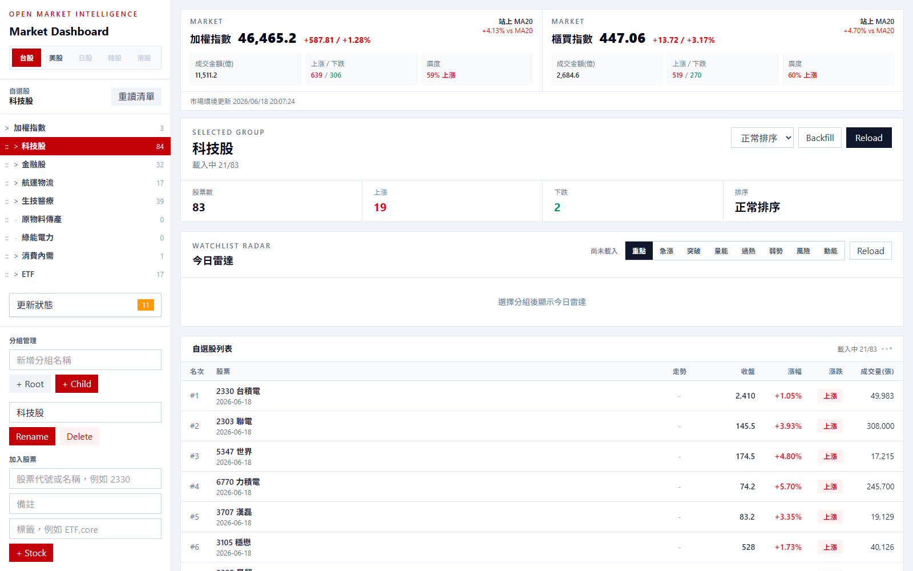
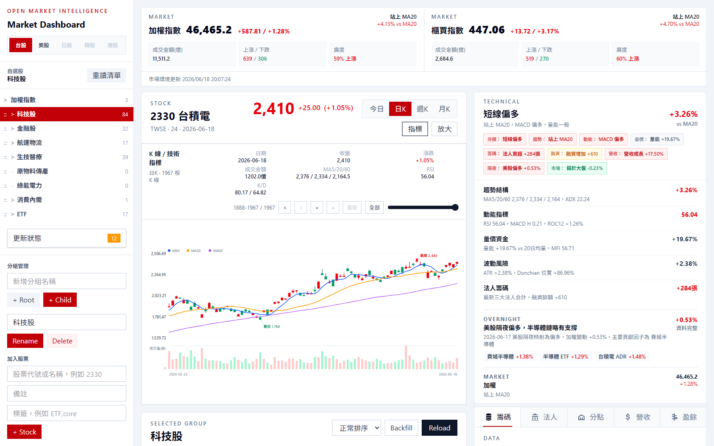
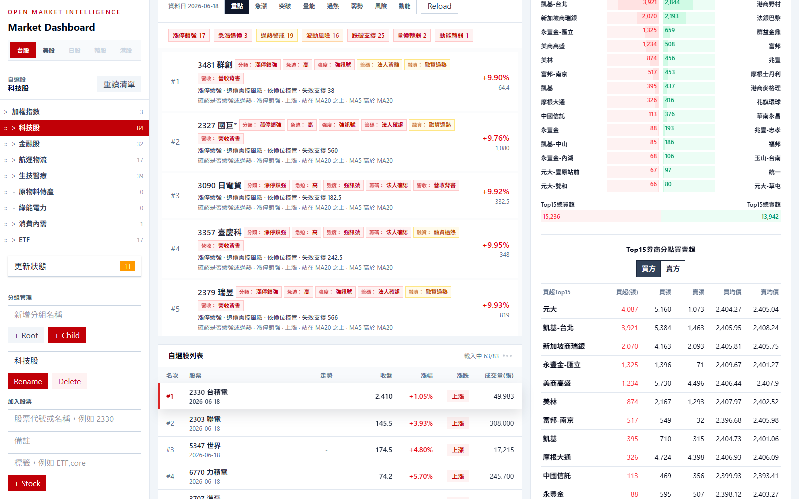
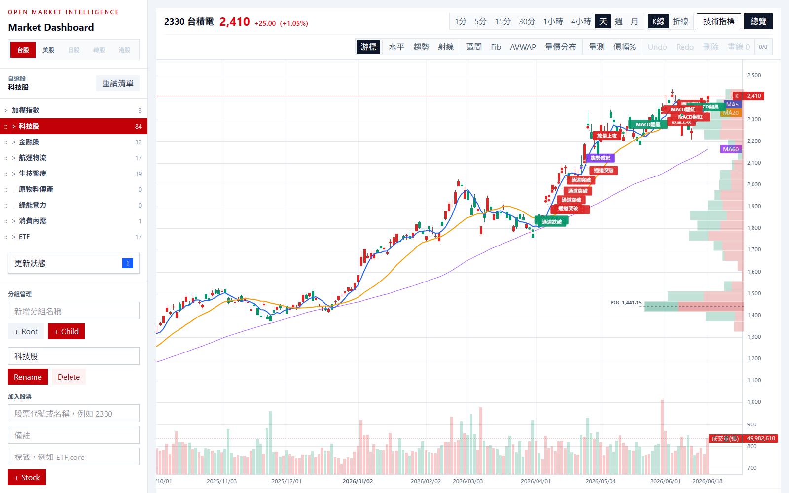
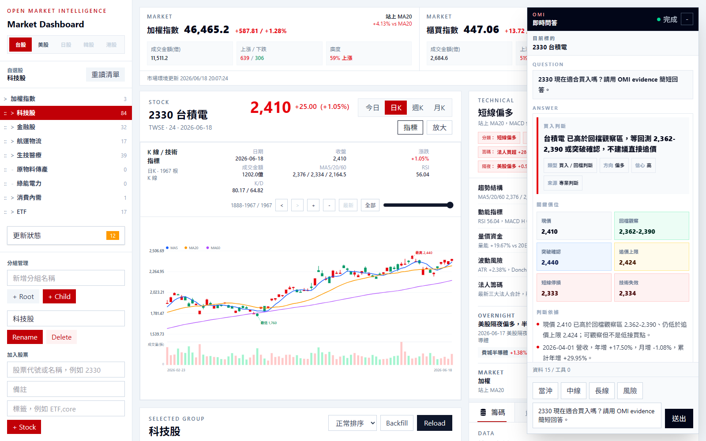
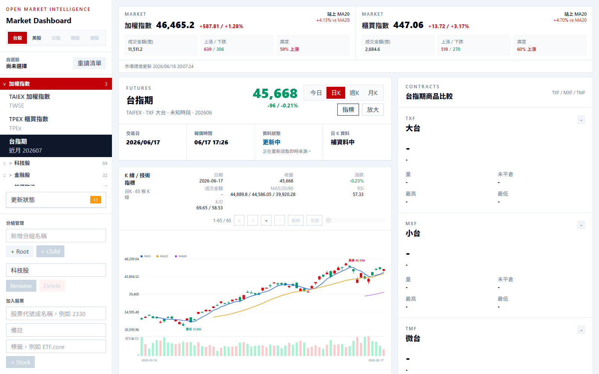
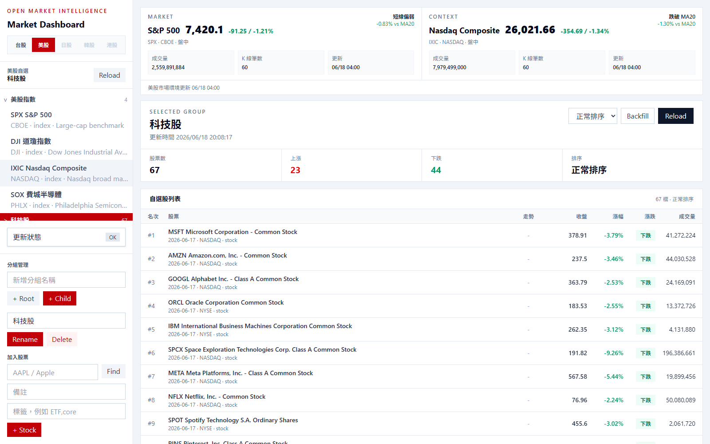

# Open Market Intelligence

Open Market Intelligence（OMI）是一套本機優先的市場情報與看盤研究工作台。它把自選股、盤勢脈絡、盤中監控、K 線分析、籌碼資料、基本面資料、美股隔夜訊號、Crypto 即時資料、商品參考，以及 AI/Agent evidence 介面整合在同一個專案中。

目前產品主軸仍是台股。美股模組已可作為台股研究的領先訊號層，特別適合觀察半導體、AI 基建、雲端、記憶體、ETF 與大型科技股對台股供應鏈的影響。日股是早期 context layer；Crypto 與商品市場是獨立的輔助市場資料域，用來觀察 24/7 風險資產、USDT 計價脈絡與大宗商品 reference，不是自動交易或下單系統。

## 產品畫面

### 台股 Dashboard 與 Watchlist Radar

<p align="center">
  
</p>

Dashboard 整合大盤卡片、自選股群組、Watchlist Radar 與排行表；固定的加權指數入口預設收起，讓主要空間留給自選股操作。

### 個股研究工作台

<p align="center">
  
</p>

個股頁把 K 線、技術摘要、雷達候選與資料分頁放在同一個研究工作台；一般 K 線預設不顯示交叉/突破標記，保留乾淨讀圖視野。

### 籌碼、分點與資料面板

<p align="center">
  
</p>

資料面板覆蓋籌碼、法人、券商分點、融資融券、營收、財報與盈餘，支援把同一檔股票的價格、技術與基本面證據分層檢視。

### 專業 K 線模式

<p align="center">
  
</p>

專業模式保留左側選股 context，將主要空間交給全寬 K 線圖；VPVR 與交叉/突破標記會在切換商品、週期或圖表重建後重新投影。

### OMI 即時問答

<p align="center">
  
</p>

OMI dock 以本機 evidence 為預設，直接回傳買入判斷、關鍵價位、風險條件與資料引用，不需要讓日常 UI 依賴 LLM 或外部抓取才能完成回答。

### 台指期 Context

<p align="center">
  
</p>

台指期頁提供 TXF、MXF、TMF 報價、期現價差、成交量、契約月份與 K 線，作為台股研究的衍生性商品 context。

### 美股隔夜與跨市場 Context

<p align="center">
  
</p>

美股模組提供指數、自選股、OHLC、盤中資料、SEC facts、Alpha Vantage actions、FINRA short volume 與 FRED macro，定位為台股供應鏈與隔夜市場脈絡。

## 目前狀態

這版是台股 v2 基線版，日常本機研究流程已具備可用穩定度：

- 台股 dashboard：大盤脈絡、自選股群組、群組排行、背景更新狀態、資料過期 loading guard；固定的加權指數資料夾預設收起，避免干擾主要自選股操作。
- 今日雷達：依技術、價量、風險與籌碼/基本面 context，把群組股票分成重點、急漲、突破、量能、過熱、弱勢、風險、動能等掃描視角，支援 SSR 初始資料、URL mode、reload 與點選跳轉個股。
- 台股個股頁：`今日`、`日K`、`週K`、`月K` 共用一致版型；一般 K 線預設保留乾淨視圖，交叉/突破標記改為 opt-in。
- 台指期頁：TXF、MXF、TMF 報價、日內/日週月 K、期現價差、成交量與商品比較；即時報價帶 freshness 狀態與 provider fallback。
- Crypto 市場：BTC/ETH/USDT/SOL/BNB/XRP/DOGE/TON/LINK registry、BitoPro/Binance/OKX/CoinGecko provider contract、Crypto 自選群組、USDT 為主的全球報價視角、WebSocket 即時資料、REST auto-refresh、OHLCV 與 ticker/order book/funding/open-interest/spread bounded history。
- 商品市場：商品資料獨立在 `商品` 底下，先提供黃金、白銀、銅、WTI、Brent、天然氣的 watch-only contract；報價單位以 USDT 為主，provider 尚未接入時會明確標記 pending。
- 專業 K 線模式：台股、美股、台指期與 Crypto 共用同一套全寬圖表 shell，支援壓縮 header、指標分類、VPVR、交叉/突破標記、畫線工具、量測工具、undo/redo、畫線快照保存。
- 台股籌碼與基本面：法人、融資融券、集保、券商分點 Top15、營收、財報、盈餘。
- 美股市場：主要指數、自選股、OHLC、盤中資料、SEC facts、Alpha Vantage profile/actions、FINRA short volume、FRED macro。
- AI/Agent 入口：`POST /api/ai/ask` 與 MCP `omi.ask`，支援 evidence freshness、warnings、missing data、tool runs；前端 OMI dock 預設走本機 evidence-only brief answer，自選股問題會把 Watchlist Radar 納入回答與 action plan。

## 產品原則

- 本機優先：SQLite、cache、jobs、agent evidence 預設都在本機。
- Evidence before narrative：AI 只能讀 bounded local evidence，不應編造不存在的市場資料。
- 新鮮度可見：stale、partial、missing、best-effort 狀態要顯示出來。
- 台股優先：美股、日股、Crypto 與商品是台股研究的 context layer，不是台股資料替代品。
- 讀取路徑保持輕量：昂貴或會改資料的刷新行為走明確 POST/job route。

## 功能地圖

### 台股 Dashboard

- TAIEX 與 TPEx 市場卡片。
- 自選股樹狀群組、群組數量、群組總覽、排序、排行、reload/backfill 控制。
- 固定的加權指數入口包含 TAIEX、TPEx 與台指期 context，預設收起，讓左側主要空間保留給使用者自選股。
- 今日雷達：以 `action`、`surge`、`breakout`、`volume`、`overheat`、`weakness`、`risk`、`momentum` 八種模式掃描群組，標出急漲、突破、量價攻擊、過熱警戒、跌破支撐、量價轉弱、動能轉弱與趨勢延續。
- 雷達結果以一排訊號 chip 呈現分類、急迫性、技術強度與 context：法人、融資、營收、財務、盤中等訊號會直接標註來源與方向，方便快速掃過判斷方向。
- 背景工作中心，台股與美股工作分開顯示。
- stale-date guard：資料日期不正確時先顯示 loading/empty 狀態，不直接展示舊資料。

### 台股個股頁

- Header 顯示代號、名稱、價格、漲跌點、漲跌幅，並有價格更新 pulse。
- `今日` 使用盤中資料、昨收、VWAP、TWAP、EMA、RSI、MACD、成交量與 hover guide line。
- `日K`、`週K`、`月K` 使用歷史 OHLC 與衍生技術指標。
- 一般 K 線預設關閉 `交叉 / 突破標記`，需要時再從指標選單打開，避免一般讀圖時被訊號標籤遮住。
- Technical summary 依 timeframe 切換盤中、短線、波段、長線觀點，並在卡片上方彙整分類、趨勢、動能、量價、籌碼、融資、營收、隔夜與相對大盤訊號。
- 分析區與資料區分離，避免技術解讀和基本面/籌碼資料混在同一層。

### 專業 K 線模式

專業模式會保留左側自選股與目前商品 context，並將 K 線圖最大化。

台股個股、美股個股/指數與台指期都使用共用的 `ProfessionalChartPanel`：

- 台股：支援盤中分鐘線、日 K、週 K、月 K 與台股技術指標資料。
- 美股：支援 Yahoo chart OHLC/intraday、指數與個股 context。
- 台指期：支援 `今日`、`日K`、`週K`、`月K`，成交量以口數顯示，畫線 context 使用 `TW_FUTURES` market。

支援控制：

- 週期：台股與美股支援 `1分`、`5分`、`15分`、`30分`、`1小時`、`4小時`、`日`、`週`、`月`；台指期支援 `今日`、`日K`、`週K`、`月K`。
- 圖表型態：K 線、折線。
- 指標分類：趨勢、均線、通道、波動、動能、成交量、相對強弱、型態、風險。
- 視覺化 overlay：VPVR 可視區成交量分布、支撐壓力、缺口、交叉/突破標記、背離與型態訊號；專業模式會在 chart resize / rebuild 後重新投影 overlay，避免切換後消失。
- 畫線工具：游標、水平線、趨勢線、射線、區間、Fibonacci、anchored VWAP、量價分布、量測、價格百分比。
- 操作工具：undo、redo、刪除選取物件、清除畫線、保存畫線數。

畫線快照會先存本機，並透過以下 route 做 best-effort sync：

```text
/api/market/chart-drawings/{market}/{symbol}/{timeframe}
```

畫線表儲存的是 bounded JSON，定位是使用者註記、AI 可讀圖表 context、未來報告素材，不是下單或交易紀錄。

### 台股資料面板

- 籌碼：TDCC 集保分布、融資融券、大盤籌碼日報。
- 法人：三大法人買賣超、法人持股比例、歷史淨買賣。
- 分點：nStock 券商分點 Top15，支援單日與多日加總。
- 營收：月營收歷史。
- 盈餘與基本面：MOPS/MOPSOV 季度財務指標。

### 台指期

台指期是台股研究的衍生性商品 context，和台股 dashboard 共用同一個市場入口。

目前支援：

- 商品：TXF、MXF、TMF。
- 報價：日盤/夜盤最新價、漲跌、漲跌幅、報價時間、契約月份。
- 即時來源：預設 TAIFEX MIS；`TAIWAN_FUTURES_QUOTE_PROVIDER=kgi` 是預留給凱基 API 的插槽，目前會明確回傳 adapter 尚未實作，不會假裝有資料。
- Freshness：報價會標記 `live`、`stale`、`cached` 或 `session_mismatch`，來源失敗時會使用快取並寫入 provider event/job issue。
- K 線：日內、日 K、週 K、月 K。
- 重點資訊：開高低、參考/結算、期現價差、振幅、成交量、未平倉、買賣價。
- 專業模式：和台股/美股共用工具列、圖表型態切換、技術指標選單、畫線工具與本機/遠端畫線快照。

### 美股市場

美股定位是台股供應鏈與隔夜市場 context。

目前支援：

- 指數脈絡：S&P 500、Nasdaq Composite、Dow Jones Industrial Average、Philadelphia Semiconductor Index。
- 美股自選股樹與排行。
- 本地主檔缺少新上市股票時，使用 Yahoo chart metadata 做 symbol fallback discovery。
- Yahoo chart OHLC 與 intraday。
- SEC company facts 與 normalized fundamentals。
- Alpha Vantage overview、dividends、splits，需設定 `ALPHAVANTAGE_API_KEY`。
- FINRA daily short sale volume。
- FRED macro observations，需設定 `FRED_API_KEY`。
- 美股自選股資源批次刷新工作。

重要限制：

- 美股採 universe-first，不預設全市場大量回補。
- Yahoo chart 是 best-effort unofficial source。
- Alpha Vantage 與 FRED 受 API key 和 rate limit 影響。
- SEC EDGAR 需要描述清楚的 `US_SEC_USER_AGENT`。
- FINRA short volume 是每日 short sale volume，不是 short interest position。

### 日股市場

日股定位和美股相同，是台股研究的外部 context layer。現階段以自選股、OHLC、技術雷達與資源補齊流程為主，資料源以 Yahoo chart 與 J-Quants 設定槽為核心。

韓股目前仍是預留市場入口，不會產生假資料或把其他市場資料套用成韓股 context。

### Crypto 與商品市場

Crypto 是獨立市場資料域，不和台股、美股或商品共用交易邏輯。目標是提供 24/7 風險資產 context、USDT 計價基準、台灣本地溢價觀察與未來 AI evidence 來源；目前不提供下單 API，也不把 AI 回答設計成自動交易。

目前支援：

- 資產 registry：BTC、ETH、USDT、SOL、BNB、XRP、DOGE、TON、LINK。
- 預設自選：主流幣群組包含 core/major assets；USDT 另放在 `商品 > 貨幣` 作為 TWD/USDT 參考。
- 來源 contract：BitoPro 提供台灣 TWD spot reference；Binance 提供主要 USDT spot/perpetual reference；OKX 是 secondary global reference；CoinGecko 提供 ranking 與 market cap context。
- 即時資料：WebSocket collector 預設啟用 BitoPro 與 Binance verified streams，寫入 in-memory latest store，並透過 bounded persistence 批次保存 OHLCV、ticker、order book、spread 與 derivatives snapshot。
- REST auto-refresh：背景輪詢用於補齊 WebSocket 不涵蓋的資料與 bounded K 線視窗；subscription settings 決定哪些資產與資源 always-on 或 on-select。
- 歷史資料：OHLCV 是主要 K 線歷史；ticker、order book、funding/open interest、spread 是 sampled history，用於趨勢觀察與資料品質追蹤，不是逐筆交易帳本。
- 前端 K 線：一般 K 線與專業模式使用同一套視覺架構，支援 `1分`、`5分`、`15分`、`30分`、`1小時`、`4小時`、`日K`、`週K`、`月K`，Crypto 時間顯示會轉成台灣時間。

商品市場目前是 watch-only reference layer：

- 金屬：GC 黃金、SI 白銀、HG 銅。
- 能源：CL WTI 原油、BZ Brent 原油、NG 天然氣。
- 報價單位預設 USDT，provider 尚未接入時會顯示 `provider_pending`，不會產生假即時報價。

## 資料來源信任模型

OMI 把每個來源都當作帶有 provenance 與 freshness 的 evidence，而不是單一無條件真相。

| 區域 | 來源 | 信任說明 |
| --- | --- | --- |
| 台股上市價量 | TWSE OpenAPI/RWD、TPEx endpoints | 優先官方來源；顯示前仍檢查日期與筆數。 |
| 台股盤中 | nStock minute data、TWSE MIS volume adjustment | 適合本機監控；盤中可用性會受來源狀態影響。 |
| 台股大盤/指數 | TWSE/TPEx market endpoints、部分 Yahoo fallback | 官方日資料優先；Yahoo 只補官方歷史覆蓋不足處。 |
| 台指期即時報價 | TAIFEX MIS、KGI provider slot | 預設 TAIFEX MIS；KGI 目前只保留設定與錯誤邊界，adapter 實作前不會產生假即時資料。 |
| 台指期日資料 | TAIFEX futures daily market report | 官方日資料，用於日/週/月 K 與非盤中 fallback。 |
| 台股籌碼 | TWSE BFI82U、TPEx institutional summary、TDCC | 發布時間很重要，排程需晚於來源發布窗口。 |
| 台股基本面 | MOPS/MOPSOV | 官方來源族群；parser 需用 quality check 防格式變動。 |
| 券商分點 | nStock branch Top15 | 便利型非官方來源；多日模式是已存 Top15 snapshot 加總，不是完整分點帳本。 |
| 美股 OHLC/盤中 | Yahoo chart、Alpha Vantage daily | Yahoo best-effort；Alpha Vantage 受 key/rate limit 影響。 |
| 美股基本面 | SEC EDGAR company facts | 公司申報官方來源；ETF 或非公司資產可能沒有 facts。 |
| 美股 profile/actions | Alpha Vantage | 補充資料，API-key dependent。 |
| 美股 short volume | FINRA CNMS daily short volume | 官方每日 short sale volume，不是 short interest。 |
| 日股 OHLC/基本面 | Yahoo chart、J-Quants 設定槽 | 早期 context layer；J-Quants 需 key，缺資料時要顯示 missing/partial。 |
| Crypto TWD spot | BitoPro REST/WebSocket | 台灣 TWD spot reference 與本地溢價觀察；不是全球成交量基準。 |
| Crypto USDT spot/perpetual | Binance、OKX | Binance 是主要 verified realtime/reference；OKX 是 secondary source。來源失敗、stale 或 disabled 要顯示在 source health。 |
| Crypto ranking/market cap | CoinGecko | 排名與市值 context；不是執行價格來源。 |
| 商品 futures reference | Resource contract | 目前 provider pending、watch-only；接入 provider 前不得產生假 quote。 |
| Macro | FRED | 官方 FRED API，需 key。 |

設計規則：如果來源 stale、partial 或 unavailable，UI 與 AI response 要透過 `warnings`、`missing`、status chip、loading state 顯示出來。

## 架構

```mermaid
flowchart LR
    user["User"] --> browser["Browser<br/>127.0.0.1:3000"]
    browser --> next["Next.js dashboard"]
    next --> proxy["/omi-data proxy"]
    proxy --> api["FastAPI<br/>127.0.0.1:8400/api"]

    api --> services["Domain services"]
    services --> db[("SQLite<br/>data/open_market_intelligence.db")]
    services --> jobs["Background jobs"]
    jobs --> fetch["Fetch + parse pipelines"]

    fetch --> raw["raw_fetch_result"]
    raw --> quality["data_quality_check"]
    quality --> tables["Market tables"]
    tables --> db

    api --> ai["AI evidence + omi.ask"]
    ai --> tools["Allowlisted refresh/read tools"]
    tools --> services
```



## 專案結構

```text
.
├─ agents/
│  └─ omi_mcp_server/          stdio MCP adapter for external assistants
├─ backend/
│  ├─ alembic/                 schema migrations
│  ├─ app/
│  │  ├─ ai/                   omi.ask, freshness, evidence, tools, LLM calls
│  │  ├─ crypto_market/        crypto registry, providers, realtime, history, watchlists
│  │  ├─ db/                   SQLAlchemy models/session/migration helpers
│  │  ├─ jobs/                 background job queue and task runners
│  │  ├─ market/               Taiwan market data, indicators, chips, reports
│  │  ├─ parsers/              TWSE/TPEx/MOPS/TDCC parsers
│  │  ├─ resource_market/      watch-only commodity/resource contracts
│  │  ├─ routers/              FastAPI routers
│  │  ├─ sources/              source registry seed definitions
│  │  ├─ stocks/               Taiwan stock master/profile
│  │  ├─ us_market/            US symbols, OHLC, SEC facts, profile, macro
│  │  └─ watchlists/           Taiwan watchlist tree/ranking/radar/backfills
│  └─ tests/
├─ frontend/
│  └─ src/
│     ├─ app/                  Next.js App Router
│     ├─ components/           dashboard, shared professional charts, panels, loading UI
│     ├─ lib/                  API client, market-time helpers, job helpers
│     └─ types/                frontend API types
├─ docs/assets/readme/         README screenshots
├─ scripts/                    local launcher and maintenance helpers
├─ data/                       local database; ignored by git
└─ reports/                    local reports; ignored by git
```

## API Map

| Prefix | 用途 |
| --- | --- |
| `/api/system` | Health 與 runtime status |
| `/api/sources` | Source registry、fetch runs、logs |
| `/api/raw-results` | Raw payload inspection 與 quality checks |
| `/api/jobs` | Background job status |
| `/api/settings` | 技術分析、高對比與刷新節奏等設定 |
| `/api/ai` | `omi.ask`、tools、strategy profiles、reports |
| `/api/dispatch` | 派報收件群組、預覽、SMTP 發送與派報記錄 |
| `/api/stocks` | 台股 search、master、profile |
| `/api/watchlists` | 台股 watchlists、groups、ranking、Radar、backfills |
| `/api/market/ohlc` | 台股日/週/月 OHLC |
| `/api/market/intraday` | 台股盤中 trend |
| `/api/market/technical` | timeframe-aware technical reports |
| `/api/market/chart-drawings` | K 線畫線快照保存 |
| `/api/market/broker-branches` | 券商分點 Top15 與 aggregate summaries |
| `/api/market/institutional` | 法人買賣與持股比例 |
| `/api/market/margin` | 融資融券 |
| `/api/market/shareholding` | TDCC 集保分布 |
| `/api/market/revenue` | 月營收 |
| `/api/market/financials` | 季度財務指標 |
| `/api/market/backfill` | 台股 backfill jobs |
| `/api/market/tw-futures` | 台指期 TXF/MXF/TMF 報價、日內與日 K 資料 |
| `/api/us-market` | 美股 symbols、watchlists、OHLC、intraday、SEC facts、profile、actions、macro |
| `/api/jp-market` | 日股 symbols、watchlists、OHLC、resource refresh 與 context |
| `/api/crypto-market` | Crypto provider contract、source health、realtime、watchlists、OHLCV、ticker、order book、derivatives、spread |
| `/api/resource-market` | 商品/resource provider contract、instruments、quotes、OHLCV reference |

## AI And Agent Contract

AI 是 local evidence 的讀取者與分析者，不是資料真相來源。

外部助理應使用 `POST /api/ai/ask` 或 MCP `omi.ask`。

支援模式：

| Mode | 行為 |
| --- | --- |
| `auto` | 後端依 request 與 trust policy 選擇最安全模式。 |
| `data_only` | 回傳 structured local evidence，不產生敘事。 |
| `brief` | 回傳精簡 evidence summary。 |
| `analysis` | 在 trusted 且允許時呼叫 OpenAI 產生非持久分析。 |
| `report` | 在 trusted、LLM enabled、write enabled 時呼叫 OpenAI 並保存 report。 |

支援 horizon：

| Horizon | 用途 |
| --- | --- |
| `intraday` | 盤中/即時監控。 |
| `short` | 短線日資料與動能。 |
| `swing` | 預設中短線/波段。 |
| `long` | 週/月與基本面 context。 |

Minimal request：

```json
{
  "question": "2330 近況如何？",
  "target": {"type": "tw_stock", "id": "2330"},
  "mode": "analysis",
  "analysis_horizon": "swing",
  "allow_llm": true,
  "allow_external_fetch": false,
  "allow_write": false
}
```

Watchlist request：

```json
{
  "question": "watchlist group 1 哪些有風險？",
  "target": {"type": "tw_watchlist", "id": "1"},
  "mode": "brief",
  "allow_llm": false,
  "allow_external_fetch": false,
  "allow_write": false
}
```

下游 UI 或桌寵應保留這些欄位：

```text
warnings
missing
source_refs
freshness
tool_plan
tool_runs
mode.effective
analysis.human_answer
```

這些欄位屬於 trust 與 freshness model，不只是 debug metadata。

## AI Logic

OMI 的 AI 問答以 deterministic local analysis 為主，LLM 是可選的敘事與報告層。一般使用者在右下角 OMI dock 直接提問時，前端預設送出 `brief` / evidence-only request（`allow_llm=false`、`allow_external_fetch=false`），後端會先把問題轉成可驗證的 decision task，再用本機 evidence 組回答。

### 問題理解

`POST /api/ai/ask` 與 `/api/ai/ask/stream` 會先解析 `question_intent`：

| Intent | 典型問題 | 回答重點 |
| --- | --- | --- |
| `entry_decision` | 適合買嗎、買入、進場、回檔買點、追價 | 回檔區、突破確認、追價上限、停損、技術失效。 |
| `exit_decision` | 要賣嗎、續抱、停利、出場 | 續抱條件、出場條件、失效線。 |
| `risk_check` | 風險、會不會跌、空方條件 | 主要風險線、轉弱條件、風控提醒。 |
| `position_risk_decision` | 已買在某價位，該止損嗎 | 成本距離、現價位置、部位風險。 |
| `trend_view` | 怎麼看、趨勢如何 | 短線/波段/長線方向與確認條件。 |

直接問「適合買入嗎、如果等回檔看哪裡」會走 `entry_decision`，不應退回通用技術摘要模板。

### Watchlist Radar for AI

自選股群組會先建立 ranking，再由同一份 ranking 衍生 Radar，避免 AI 重新計算或拿到不同資料版本。

Radar mode：

| Mode | 用途 |
| --- | --- |
| `action` | 預設重點掃描，排除安靜、缺資料與錯誤列。 |
| `risk` | 聚焦漲跌停/急漲急跌與風險優先標的。 |
| `momentum` | 聚焦突破動能、量能異動、強勢回檔與趨勢延續。 |
| `all` | 保留全部 bucket，適合除錯或完整檢查。 |

`omi.ask` 會依 `question_intent` 自動選 mode：

- `risk_check` / `exit_decision`：使用 `risk`。
- `entry_decision`：使用 `momentum`。
- `trend_view` / `general`：使用 `action`。

AI 回答會優先使用 `analysis.radar_rows` 組 watchlist action plan；例如「哪些有風險」會先列風險 bucket，「可以買嗎」會先列動能候選，並保留「Radar 不是直接買賣訊號」的限制。

### Evidence pipeline

AI 回答會先讀取 bounded local evidence，而不是直接要求模型自由發揮：

1. 解析 target：台股、台指期、群組或美股 context。
2. 讀取 freshness：檢查資料日期、缺口、warnings、missing。
3. 建立 technical summary：依 horizon 產生盤中、短線、波段或長線評分。
4. 建立 decision evidence：整合價量、均線、MACD、波動、法人/籌碼、營收、財報與市場 context。
5. 建立 technical price levels：推導回檔區、突破確認、追價上限、停損與技術失效。
6. 組裝 `analysis.human_answer`：輸出 UI 可直接呈現的 headline、summary、action plan、risks、data limits。

LLM enabled 時，模型只能基於這些 evidence 補強敘事；如果 freshness、coverage 或可信度不足，回答必須明確說明限制。

### Trading-session awareness

`GET /api/market/calendar-status` 是交易日與資料發布窗口的後端單一來源，回傳 `tw` / `us` market status：

- `is_trading_day`、`phase`、`reason`、`holiday_name`
- `previous_trading_day`、`next_trading_day`
- `session.next_session_start_at`、`session.is_polling_window`、`session.is_after_close`
- `release_windows`，包含日線、法人、融資融券、分點、市場籌碼與美股日線的 `expected_trade_date` / `status`

台股 target 會檢查台灣交易日：

- 交易日盤中：可使用 intraday/today evidence。
- 休市或週末：不使用盤中資料，改用最新日線與下一交易日提示。
- 最新日線日期會暴露在 `data_limits`，例如「2026-06-14 非台股交易日；最新日線截至 2026-06-12；下一交易日 2026-06-15 再確認」。

這個判斷會進入 `decision_evidence.market_session`，來源優先使用 `app.market.calendar_status`；前端 OMI dock 會在 Signals 顯示「交易日判斷」。

Scheduler、refresh policy、AI freshness、watchlist ranking freshness 與美股 overnight context 也會從 calendar status helper 推導 expected trade date；低階 parser/backfill helper 仍保留 trading-day function 作為日期區間計算。

### Price-level logic

`entry_decision` 會優先使用 `analysis.technical_levels`：

| 欄位 | UI 顯示 | 用途 |
| --- | --- | --- |
| `latest_price` | 現價 | 判斷目前是否已離開買點。 |
| `entry.preferred_zone` | 回檔觀察 | 偏好的低接/回測區間。 |
| `entry.breakout_confirm_above` | 突破確認 | 追高前需要確認的強勢突破價。 |
| `entry.do_not_chase_above` | 追價上限 | 高於此區不建議把它當低接買點。 |
| `risk.short_stop` | 短線停損 | 短線防守價。 |
| `risk.technical_invalidation` | 技術失效 | 波段假設失效價。 |

這些價位來自 MA、ATR、Donchian、latest close 與風險緩衝，不是 LLM 自行生成的數字。

### Confidence and limits

OMI 會把回答分成方向、信心、風險與資料限制：

- `stance_label`：偏多、偏空、多空分歧或未定。
- `confidence_label`：由資料完整度、指標一致性與 warning 共同決定。
- `risks`：波動放大、指標失真、追價過熱、關鍵線跌破。
- `data_limits`：休市、資料 stale、缺少 intraday、缺少法人/籌碼/基本面或來源 partial coverage。

如果資料不足，OMI 應說明「不能判斷哪一段」，而不是直接產生看似完整的買賣建議。

### OMI dock rendering

前端 `OmiAskDock` 會優先渲染 `analysis.human_answer`，而不是原始 technical digest。

Dock 入口以 React portal 掛載到自身的 stable anchor，避免 raw script、runtime globals 或 `dangerouslySetInnerHTML`。SSE 串流由 `frontend/src/hooks/useOmiAskStream.ts` 集中處理，負責 fetch、abort、request id stale guard 與 buffer parsing；dock component 只管理 UI state、signals 與回答渲染。

`entry_decision` 使用專屬版型：

- 買入判斷：headline、方向、信心與來源。
- 關鍵價位：現價、回檔觀察、突破確認、追價上限、短線停損、技術失效。
- 判斷依據：從 evidence summary 與 technical summary 萃取。
- 操作條件：現在、進場條件、風控。
- 風險與資料限制：明確列在回答下方。

Signals popover 顯示處理節點：

- 辨識問題
- 交易日判斷
- 推導價位
- 風控價位
- 資料來源
- 渲染答案

底部計數使用 `資料 / 工具`，其中資料數來自 `source_refs` 與 `decision_evidence.data_quality.source_names`，工具數來自本次 SSE `tool_run` 事件。判斷模組數會保留在 Signals 的資料來源訊號中，包含 technical levels、market session、volatility、indicator quality、fundamentals 等模組。

### Frontend interaction tests

`frontend/e2e/omi-smoke.spec.ts` 提供 Playwright smoke tests：

- OMI dock 可開啟，並能消化 mocked `/omi-data/ai/ask/stream` SSE 回答。
- 台股指數專業圖表 shell 可從一般 K 線切到 focus mode，且 chart canvas 可見。

測試使用 route mock，不依賴本機後端資料庫內容。Playwright 預設使用 `127.0.0.1:3100`，避免干擾日常開發用的 `3000` port；若同一專案已有 `next dev` process，Next 可能因 dev lock 阻止第二個 dev server，需要先停止既有 dev server 或用 `PLAYWRIGHT_PORT` 指向可用 runtime。

## MCP Adapter

後端啟動後再啟動 MCP adapter：

```powershell
cd "C:\project\Open Market Intelligence"
$env:OMI_API_BASE = "http://127.0.0.1:8400/api"
python agents\omi_mcp_server\server.py
```

可選 trusted-token bridge：

```powershell
$env:OMI_MCP_AI_TRUST_TOKEN = "<same value as backend OMI_AI_TRUST_TOKEN>"
```

`OMI_MCP_EXPOSE_INTERNAL_TOOLS=true` 只應用於 trusted local debugging。

## Local Setup

### Requirements

- Windows PowerShell
- Python 3.10+
- Node.js `>=20.9.0`
- npm `>=10`

### Backend

```powershell
cd "C:\project\Open Market Intelligence"
python -m venv .venv
.\.venv\Scripts\python.exe -m pip install --upgrade pip
.\.venv\Scripts\python.exe -m pip install -r backend\requirements.txt

if (-not (Test-Path .env)) { Copy-Item .env.example .env }
.\.venv\Scripts\python.exe -m alembic upgrade head

$env:PYTHONPATH = (Resolve-Path backend).Path
.\.venv\Scripts\python.exe -m app.scripts.seed_sources
```

Run：

```powershell
cd "C:\project\Open Market Intelligence"
$env:PYTHONPATH = (Resolve-Path backend).Path
.\.venv\Scripts\python.exe -m uvicorn app.main:app --reload --host 127.0.0.1 --port 8400 --app-dir backend
```

Useful URLs：

- `http://127.0.0.1:8400/api/system/health`
- `http://127.0.0.1:8400/docs`

### Frontend

```powershell
cd "C:\project\Open Market Intelligence\frontend"
npm install
if (-not (Test-Path .env.local)) { Copy-Item .env.example .env.local }
npm run dev
```

Open：

```text
http://127.0.0.1:3000
```

### Launcher

```powershell
cd "C:\project\Open Market Intelligence"
.\Start-OMI-Launcher.cmd
```

Launcher 是本機 convenience wrapper。開發時後端與前端命令仍是 canonical path。

開發模式下 launcher 預期使用 `.\.venv\Scripts\python.exe`。Backend port 由 `OMI_BACKEND_PORT` 或 `APP_PORT` 決定，預設 `8400`。Frontend port 由 `OMI_FRONTEND_PORT` 或 `FRONTEND_PORT` 決定，預設 `3000`。如果 frontend 預設 port 已被其他 process 佔用、被 Windows 保留或拒絕 bind，或不是目前 checkout 的 `/omi-ui-health`，launcher 會自動改用下一個可用 port 並開啟正確 Dashboard URL。如果 backend port 被其他 checkout 或其他 Python runtime 的舊 OMI backend 佔用，launcher 會嘗試清掉 stale OMI process 後再啟動目前 checkout；如果該 port 落在 Windows TCP excluded range，launcher 會要求改用可綁定的 port。

## Environment

根目錄 `.env.example` 包含 backend settings：

```env
APP_NAME=Open Market Intelligence
APP_ENV=development
DEBUG=true
APP_HOST=127.0.0.1
APP_PORT=8400
TIMEZONE=Asia/Taipei
ENABLE_SCHEDULER=false

ALPHAVANTAGE_API_KEY=
FRED_API_KEY=
TAIWAN_FUTURES_QUOTE_PROVIDER=taifex_mis
KGI_API_KEY=
KGI_API_SECRET=
KGI_ACCOUNT=
KGI_CERT_PATH=
KGI_API_BASE_URL=
US_SEC_USER_AGENT=Open Market Intelligence local research; contact=you@example.com
US_MARKET_HTTP_TIMEOUT_SECONDS=30
JP_MARKET_HTTP_TIMEOUT_SECONDS=30
JQUANTS_API_BASE_URL=https://api.jquants.com/v2
JQUANTS_API_KEY=
JQUANTS_ID_TOKEN=
JQUANTS_REFRESH_TOKEN=
JQUANTS_MAIL_ADDRESS=
JQUANTS_PASSWORD=
JQUANTS_ID_TOKEN_CACHE_SECONDS=82800

CRYPTO_MARKET_HTTP_TIMEOUT_SECONDS=15
CRYPTO_MARKET_TICKER_STALE_SECONDS=15
ENABLE_CRYPTO_MARKET_AUTO_REFRESH=true
CRYPTO_MARKET_AUTO_REFRESH_LOOP_SECONDS=1.0
CRYPTO_MARKET_AUTO_REFRESH_MIN_INTERVAL_SECONDS=5.0
CRYPTO_MARKET_AUTO_REFRESH_OHLCV_LIMIT=10
ENABLE_CRYPTO_MARKET_WS_COLLECTOR=true
CRYPTO_MARKET_WS_ENABLED_PROVIDERS=bitopro,binance
CRYPTO_MARKET_WS_MESSAGE_STALE_SECONDS=10
CRYPTO_MARKET_WS_RECONNECT_INITIAL_SECONDS=1.0
CRYPTO_MARKET_WS_RECONNECT_MAX_SECONDS=30.0
CRYPTO_MARKET_WS_ORDER_BOOK_DEPTH=5
ENABLE_CRYPTO_MARKET_WS_PERSISTENCE=true
CRYPTO_MARKET_WS_PERSISTENCE_FLUSH_SECONDS=1.0
CRYPTO_MARKET_WS_PERSISTENCE_MAX_PENDING_KEYS=500
ENABLE_CRYPTO_MARKET_HISTORY=true
CRYPTO_MARKET_HISTORY_SAMPLE_SECONDS=10
CRYPTO_MARKET_DERIVATIVES_HISTORY_SAMPLE_SECONDS=60
CRYPTO_MARKET_SPREAD_HISTORY_SAMPLE_SECONDS=10
BITOPRO_API_BASE_URL=https://api.bitopro.com/v3
BITOPRO_WS_BASE_URL=wss://stream.bitopro.com:443/ws
BINANCE_SPOT_API_BASE_URL=https://api.binance.com
BINANCE_SPOT_WS_BASE_URL=wss://stream.binance.com:9443
BINANCE_FUTURES_API_BASE_URL=https://fapi.binance.com
OKX_API_BASE_URL=https://www.okx.com
OKX_WS_PUBLIC_URL=wss://ws.okx.com:8443/ws/v5/public
COINGECKO_API_BASE_URL=https://api.coingecko.com/api/v3
COINGECKO_API_KEY=
COINGECKO_API_KEY_HEADER=x-cg-demo-api-key
OMI_HTTP_TRUST_ENV=false

DISPATCH_SMTP_HOST=
DISPATCH_SMTP_PORT=587
DISPATCH_SMTP_USERNAME=
DISPATCH_SMTP_PASSWORD=
DISPATCH_SMTP_FROM_EMAIL=
DISPATCH_SMTP_FROM_NAME=Open Market Intelligence
DISPATCH_SMTP_USE_TLS=true
DISPATCH_SMTP_USE_SSL=false
DISPATCH_SMTP_TIMEOUT_SECONDS=30

OPENAI_API_KEY=
OPENAI_LLM_API_KEY=
OMI_OPENAI_ENV_FILE=
OMI_AI_LLM_PROVIDER=openai
OMI_AI_MODEL=gpt-4.1-mini
OMI_AI_REPORT_MODEL=gpt-4.1
OMI_AI_LLM_ENABLED=false
OMI_AI_ALLOW_UNTRUSTED_LLM=false
OMI_AI_TRUSTED_CLIENT_HOSTS=127.0.0.1,::1
OMI_AI_TRUST_TOKEN=
```

Frontend `.env.example`：

```env
NEXT_PUBLIC_OMI_API_BASE=http://127.0.0.1:8400/api
```

OpenAI key resolution order：

1. `OPENAI_API_KEY`
2. `OPENAI_LLM_API_KEY`
3. `OMI_OPENAI_ENV_FILE` 指向的本機 env file

不要提交真實 API keys、tokens 或 private env files。

## Scheduler Notes

`ENABLE_SCHEDULER=true` 時，台股排程以 Asia/Taipei 為準。

相關預設：

```env
SCHEDULER_MARKET_REFRESH_TIME=15:15
SCHEDULER_MARKET_CHIP_REFRESH_TIME=18:35
ENABLE_TAIWAN_FUTURES_SCHEDULER=true
SCHEDULER_TAIWAN_FUTURES_SYMBOLS=TXF,MXF,TMF
SCHEDULER_TAIWAN_FUTURES_SESSION=auto
SCHEDULER_TAIWAN_FUTURES_INTERVAL_SECONDS=30
SCHEDULER_TAIWAN_FUTURES_SUCCESS_EVENT_INTERVAL_SECONDS=300
ENABLE_US_MARKET_SCHEDULER=false
SCHEDULER_US_MARKET_REFRESH_TIME=06:30
SCHEDULER_US_MARKET_REFRESH_DAY_OF_WEEK=tue-sat
SCHEDULER_US_MARKET_REFRESH_SLEEP_SECONDS=12.0
ENABLE_JP_MARKET_SCHEDULER=false
SCHEDULER_JP_MARKET_REFRESH_TIME=16:10
SCHEDULER_JP_MARKET_REFRESH_DAY_OF_WEEK=mon-fri
SCHEDULER_JP_MARKET_REFRESH_PROVIDER=auto
SCHEDULER_JP_MARKET_REFRESH_SLEEP_SECONDS=15.0
```

大盤籌碼日報有發布窗口，排程應晚於 TWSE/TPEx 來源發布時間。

Crypto 即時資料不依賴傳統交易日 scheduler。Backend 啟動後會依 `ENABLE_CRYPTO_MARKET_AUTO_REFRESH` 與 `ENABLE_CRYPTO_MARKET_WS_COLLECTOR` 啟動 runtime loop；WebSocket latest state 會先進 in-memory store，再由 `ENABLE_CRYPTO_MARKET_WS_PERSISTENCE` 控制的 bounded persistence manager 批次寫入 SQLite。前端只負責訂閱 `/api/crypto-market/realtime/latest/stream` 或 fallback polling，不應自己成為資料真相來源。

## Database And Migrations

後端啟動時會先跑 Alembic migrations，再打開 application sessions。這能讓舊本機 SQLite database 對齊目前 schema。

手動 migration：

```powershell
cd "C:\project\Open Market Intelligence"
$env:PYTHONPATH = (Resolve-Path backend).Path
.\.venv\Scripts\python.exe -m alembic upgrade head
```

Database path：

```text
data/open_market_intelligence.db
```

本機 SQLite 目前包含台股、美股、日股、台指期、Crypto 與商品 reference tables。Crypto schema 包含 provider instruments、ticker snapshots、order book snapshots、OHLCV bars、derivatives metrics、market cap、spread，以及 sampled history tables；這些資料可支援研究與回測前置觀察，但 ticker/order book/funding/OI history 是取樣紀錄，不是交易所逐筆 archive。

## Validation

Backend：

```powershell
cd "C:\project\Open Market Intelligence"
.\.venv\Scripts\python.exe -m compileall backend\app
.\scripts\run-backend-tests.ps1
```

Frontend：

```powershell
cd "C:\project\Open Market Intelligence\frontend"
npm run lint
npm exec tsc -- --noEmit --incremental false
npm run build
npm run test:e2e
```

API spot checks：

```powershell
Invoke-RestMethod "http://127.0.0.1:8400/api/system/health"
Invoke-RestMethod "http://127.0.0.1:8400/api/system/provider-events?limit=20"
Invoke-RestMethod "http://127.0.0.1:8400/api/system/source-health-snapshots?market=tw"
Invoke-RestMethod "http://127.0.0.1:8400/api/market/intraday/2330"
Invoke-RestMethod "http://127.0.0.1:8400/api/market/ohlc/2330?timeframe=daily&limit=120"
Invoke-RestMethod "http://127.0.0.1:8400/api/market/technical-report/2330?timeframe=today"
Invoke-RestMethod "http://127.0.0.1:8400/api/market/broker-branches/2330/daily?days=3&ensure_daily=false"
Invoke-RestMethod "http://127.0.0.1:8400/api/market/source-health?stock_id=2330"
Invoke-RestMethod "http://127.0.0.1:8400/api/watchlists/groups/1/radar?mode=action&max_results=8"
Invoke-RestMethod "http://127.0.0.1:8400/api/market/tw-futures/latest?symbols=TXF&refresh=true&session=auto"
Invoke-RestMethod "http://127.0.0.1:8400/api/us-market/stocks/search?q=SPCX"
Invoke-RestMethod "http://127.0.0.1:8400/api/us-market/source-health?symbol=MU"
Invoke-RestMethod "http://127.0.0.1:8400/api/crypto-market/provider-contract"
Invoke-RestMethod "http://127.0.0.1:8400/api/crypto-market/source-health?base=BTC"
Invoke-RestMethod "http://127.0.0.1:8400/api/crypto-market/realtime/status"
Invoke-RestMethod "http://127.0.0.1:8400/api/crypto-market/quotes/latest?symbols=BTC-USDT"
Invoke-RestMethod "http://127.0.0.1:8400/api/crypto-market/quotes/history?symbols=BTC-USDT&limit=20"
Invoke-RestMethod "http://127.0.0.1:8400/api/resource-market/provider-contract"
Invoke-RestMethod "http://127.0.0.1:8400/api/resource-market/instruments"
```

Git hygiene：

```powershell
git status --short
git diff --check
```

## Operating Notes

- Frontend API access 應透過 `frontend/src/lib/api.ts` 與 `/omi-data` proxy，除非有明確例外。
- Backend 外部 HTTP 呼叫應透過 `backend/app/http_client.py`；預設 `OMI_HTTP_TRUST_ENV=false`，避免本機 shell 或 launcher 的 `HTTP_PROXY` / `HTTPS_PROXY` 把 OpenAI、Yahoo、TWSE/TPEx 等來源導到無效 proxy。只有確定需要真實 outbound proxy 時才設成 `true`。
- Provider/source health observability 使用 `provider_event` 與 `source_health_snapshot` 兩張表；服務入口在 `backend/app/observability/provider_health.py`。`GET /api/system/provider-events` 可查 provider 事件歷史，`GET /api/system/source-health-snapshots` 可查目前持久化 health snapshot。台股與美股 source health API 會同步 snapshot；外部 fetcher 若要記錄錯誤、rate limit、retry-after，應呼叫 `record_provider_event()`。
- 台股 source health 由 `backend/app/market/source_health.py` 從本地表與 `market_calendar_status` 的 release window 推導，API 為 `GET /api/market/source-health`；支援 `stock_id`、`dataset`、`index_id` 與 `now` filter。OMI 台股 context 會帶入 `data.source_health`，用來區分 `current`、`stale`、`empty` 與 ETF/權證等 `not_applicable` 資料。
- 台指期即時資料預設使用 `TAIWAN_FUTURES_QUOTE_PROVIDER=taifex_mis`；若切到 `kgi`，目前只會檢查 KGI 設定並回傳「adapter 尚未實作」錯誤，避免把空 adapter 當成真實即時資料。相關 API 支援 `provider=auto|taifex_mis|kgi`。
- 美股 provider adapter 入口放在 `backend/app/us_market/providers/`；source health 由 `backend/app/us_market/source_health.py` 從本地表推導，API 為 `GET /api/us-market/source-health`，OMI 美股 context 也會帶入 `data.source_health`。美股回答權重使用 `backend/app/ai/us_decision_adapter.py`，以 price trend、relative volume、fundamentals、FINRA short volume 與 source health 為核心，不套用台股法人/分點模型。
- Crypto provider contract 在 `backend/app/crypto_market/contract.py`，資產 universe 在 `backend/app/crypto_market/assets.py`。新增主流幣時先擴充 registry，再讓 subscription、watchlist、provider contract 與前端 sidebar 自動吃同一份定義。
- Crypto 即時資料入口在 `backend/app/crypto_market/ws_runtime.py`、`backend/app/crypto_market/realtime.py` 與 `backend/app/crypto_market/realtime_persistence.py`。Frontend 只能讀 `/api/crypto-market/realtime/latest` 或 SSE stream，不應自行直連交易所或把瀏覽器狀態當資料庫。
- Crypto source health 由 `backend/app/crypto_market/source_health.py` 彙整 REST cache、WebSocket latest store、auto-refresh 與 persistence 狀態；UI 應顯示 stale/empty/error，不應把 24/7 市場的 missing data 靜默隱藏。
- 商品/resource 市場目前由 `backend/app/resource_market/contract.py` 管理 static contract；provider 接入前，`provider_pending` 是正確狀態，不應在前端補假報價。
- 台股 market time 與 trading-session helpers 放在 `frontend/src/lib/taiwanMarketTime.ts` 與 `frontend/src/lib/taiwanMarketRules.ts`；會優先使用 `frontend/src/lib/marketCalendarStatus.ts` 的後端 snapshot，沒有 snapshot 時才使用本地 fallback。
- 美股 regular-session helpers 放在 `frontend/src/lib/usMarketTime.ts`；會優先使用 `frontend/src/lib/marketCalendarStatus.ts` 的後端 snapshot，沒有 snapshot 時才使用本地 fallback。
- 台股、美股與台指期的專業圖表模式應共用 `frontend/src/components/ProfessionalChartPanel.tsx` 與 `frontend/src/components/professionalChartDrawing.ts`；不要在單一 detail panel 重新實作一套工具列。
- 自選股 Radar 的前端入口在 `frontend/src/components/WatchlistRadarPanel.tsx`；後端入口是 `GET /api/watchlists/groups/{group_id}/radar`，AI 入口則透過 `read_watchlist_context` 與 `build_watchlist_brief` 帶入 `data.radar`、`summary.radar`、`analysis.radar_rows`。
- `frontend/src/components/LightweightKLineChart.tsx` 的純 UI layer 應優先往 `frontend/src/components/chart/` 拆分；目前 header、選取畫線摘要卡與靜態 indicator overlay 已拆出。
- Chart dimensions 要穩定；indicator toggle、hover state、label、refresh 不應重置 visible range 或中斷畫線操作。
- 專業 K 線模式要隱藏次要 dashboard panels，但保留左側自選股與目前商品 context。
- 券商分點多日資料是已存 daily Top15 snapshots 的 aggregate，不是完整券商分點帳本。
- 盤中指標由目前 intraday points 計算；早盤 RSI/MACD 可能因資料不足顯示 `-`。
- Agent responses 要明確暴露 stale/partial data，不要隱藏 `warnings` 或 `missing`。

## Current Limitations

- 台股是目前主要 production path；美股可用但仍是 universe-first 且 API-key dependent。
- US-TW supply-chain mapping 還不是完整 semantic layer，先作為 peer、sector、overnight context 使用。
- 日股仍是早期 context layer；韓股仍是入口 placeholder。
- Crypto 已有 registry、provider contract、local cache、WebSocket/REST refresh、K 線與 sampled history，但交易所覆蓋仍是 bounded universe，不是完整 crypto market universe；新增資產仍需進 registry，不做無限制全市場抓取。
- Crypto WebSocket 目前預設只啟用 BitoPro 與 Binance verified streams；OKX 是 secondary provider/source，正式即時 stream 還需要獨立驗證後再打開。
- Crypto ticker、order book、funding、OI、spread history 是 sampled snapshots；適合研究趨勢與資料品質，不等同完整 tick/order-book archive。
- 商品市場目前 provider pending、watch-only；正式 quote/OHLCV 來源接入前，只能作為分類與 UI/reference contract。
- 派報第一版支援固定模板預覽與手動 SMTP 發送；定時派報與大漲/大跌觸發派報仍是後續版本。
- 券商分點多日分析取決於已存 daily Top15 snapshots；如果 DB 只有一天，就只能回傳 partial coverage。
- 盤中資料取決於外部來源可用性，必要時會退回 snapshot-only 行為。
- 凱基台指期 API 目前是設定與 provider slot，尚未實作 response adapter；正式接上前仍以 TAIFEX MIS 與本地快取為主。
- SQLite 適合本機研究與開發；多使用者或長期部署應評估 PostgreSQL 或其他 managed database。

## Production Hygiene

- 不要提交 `.env`、`.env.local`、`.venv`、`node_modules`、`.next`、local SQLite databases、logs、cache directories 或 downloaded private data。
- 不要 hard-code API keys、tokens、passwords、cookies 或 credentials。
- schema 變更要有 explicit migration。
- 新增資料來源時，同步更新 source registry、parser、quality behavior 與 README trust notes。
- 修改 market-data fetch 時，用真實 symbol 檢查日期與筆數。
- 修改 AI 行為時，保留 `omi.ask` envelope，並讓 freshness/partial coverage 對 downstream clients 可見。
