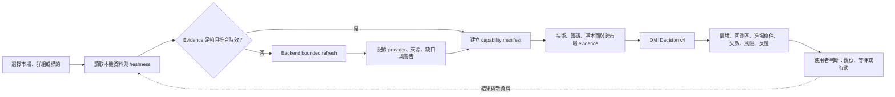
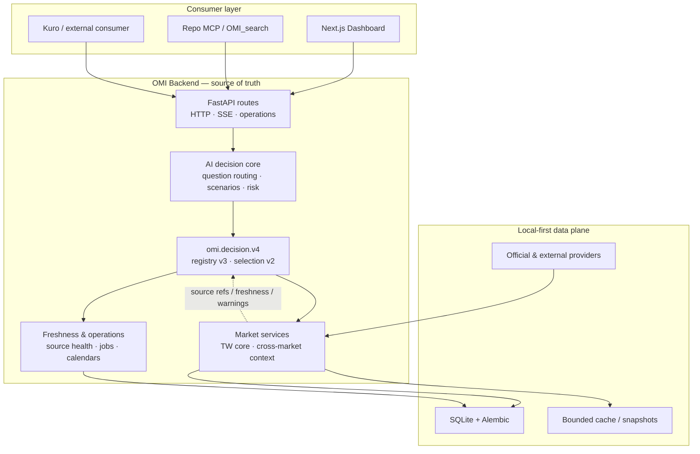

# Open Market Intelligence 4.4

> Local-first · Taiwan-reference · Multi-market research · Evidence-first

[](https://github.com/lulu930128/open-market-intelligence/actions/workflows/ci.yml)
[](https://github.com/lulu930128/open-market-intelligence/actions/workflows/codeql.yml)
[](https://github.com/lulu930128/open-market-intelligence/releases/latest)
[](LICENSE)

**目前程式版本：OMI 4.4.0（TW／US Shared Core source consolidation 基線）。**

Open Market Intelligence（OMI）是一套本機優先的市場情報與交易決策研究工作台。台股是 primary／reference market，美股是 first-class research market；其他市場可作 secondary／context，並共同遵守 Canonical Observation、Resolver、freshness 與 outward contract。OMI 把行情、技術結構、籌碼、基本面、跨市場關係與資料品質整合在同一個研究流程中，讓結論不只回答「偏多或偏空」，還能交代回測區、確認條件、失效條件、主要風險與反證。

OMI 不是自動交易系統，也不代替使用者下單。它的工作是把資料、情境與風險整理成可檢查、可反駁、可持續追蹤的決策依據。

## 目前狀態

Release、Source、Runtime、Live 與 Product acceptance 是不同 gate。最後已記錄的市場整合與 live-session checkpoint 請讀 [`CurrentImplementationState.md`](docs/architecture/CurrentImplementationState.md)；版本歷史請讀 [`CHANGELOG.md`](CHANGELOG.md)。README 不固定保存容易過期的 PID、port、capability 數量或單次驗收戰況。


_OMI 4.0 實際本機 runtime，2560×1440。畫面保留資料日期、Radar 狀態與補資料失敗等真實品質訊號。_

## 一眼看懂 OMI

| 研究問題 | OMI 提供的工作面 |
| --- | --- |
| 今天市場處於什麼狀態？ | 加權／櫃買指數、市場廣度、量價、交易日與 session-aware freshness。 |
| 哪些標的值得先看？ | Watchlist Radar v2、訊號分類、排序、風險與失效條件。 |
| 這檔股票現在能不能做？ | K 線、均線、量價、籌碼、基本面、跨市場背景與技術風險階梯。 |
| 什麼情況才算確認？ | 回測區、突破條件、續抱／等待條件與 scenario。 |
| 哪裡代表原判斷失效？ | 明確價位、量價惡化、資料缺口與反證。 |
| 這份判斷能信多少？ | source refs、freshness、partial／missing、provider warning 與 capability readiness。 |

## 產品巡覽

### 個股研究：價格、結構、風險與跨市場背景同屏


台股個股頁把日 K、均線、量價、技術摘要、修復與風險階梯、報價深度、ADR／匯率／美股隔夜背景及籌碼、法人、分點、營收、盈餘等研究入口放在同一個工作面。在這個頁面中，跨市場資料是可追溯的 relation／context evidence；美股另有可獨立研究的 first-class workflow。

### 專業圖表：從讀圖到標記交易假設


專業 K 線支援多週期、K 線／折線、技術指標、水平線、趨勢線、射線、區間、Fibonacci、AVWAP、量價分布與量測工具。圖表是研究畫布，不會把尚未成立的條件包裝成交易訊號。

### OMI Decision Dock：讓決策核心直接面對目前標的


OMI dock 會帶入目前市場、群組或標的上下文，使用 backend 的行情、技術、籌碼、基本面與 freshness contract 形成 decision-ready answer。Frontend 只負責呈現，不在瀏覽器端重做市場判斷。

## 4.0 的立腳點

OMI 4.0 把過去分散的市場功能收斂成一個可被 UI、HTTP、SSE、MCP 與外部 consumer 共用的研究平台。

| 核心面向 | 4.0 現況 |
| --- | --- |
| 決策合約 | `omi.decision.v4` 是唯一 public request／response contract。 |
| Evidence 選取 | Capability registry 與 bounded selection 由 backend source／runtime schema 提供，不在 README 固定 inventory。 |
| Radar | Radar v2 正式運行；保留分類、排序、風險、失效與 outcome 追蹤。 |
| 台股資料真相 | 區分盤中／盤後、session 累積量／區間量、official close、partial bar 與來源狀態。 |
| 財務語意 | 台灣 Q1–Q3 YTD 與 Q4 年度語意在 backend 正規化，避免錯誤 EPS／TTM／估值推導。 |
| 市場研究 | 台股是 reference implementation；美股可獨立研究，也可提供 ADR、匯率與隔夜關係 evidence。 |
| 可觀測性 | Source health、provider events、jobs、warnings、missing data 與 readiness 可被 UI／API 看見。 |
| 外部整合 | Repo MCP、OMI_search 與 Kuro-facing consumer 讀取同一個 backend-owned answer contract。 |

## 從資料到決策的研究流程



這個流程有三個不可省略的原則：

1. 先確認資料可用性，再形成敘事。
2. 缺資料、stale、partial 或 provider failure 必須可見。
3. 最後決策屬於使用者；OMI 只提供研究與風險框架。

## 市場版圖

| 層級 | 市場與資料 | 角色 |
| --- | --- | --- |
| Primary／reference | 台股個股、上市／上櫃指數、廣度、籌碼、分點、基本面、期貨／選擇權 | 優先 production coverage、UI pattern 與市場語意驗證。 |
| First-class research | 美股行情、日線／盤中 OHLCV、技術、基本面、ADR、watchlist 與 portfolio context | 可獨立研究，也可解釋台股隔夜情境；逐能力揭露 readiness。 |
| 區域背景 | 日股、韓股、港股相關 context | 供應鏈、風險偏好與區域同步性參照。 |
| 風險參照 | Crypto、黃金、原油與其他資源商品 | Best-effort risk context，不作交易級即時 feed。 |

## 資料真實性也是產品功能

OMI 不把「有值」當成「可用」。每一個 outward answer 都應保留資料日期、來源、session、freshness、release phase、partial／finalized、warning 與 missing semantics。

- `HTTP 200` 只代表 transport 成功，不代表市場資料已完成更新。
- Cache hit 不等於 realtime；必須同時確認 source time 與有效 session。
- 盤中 provisional bar、盤後 official close、交易所日量與分鐘成交量是不同 contract。
- 休市日不把上一交易日資料誤標成失敗；下一個交易日與 release window 會一併判斷。
- Provider 無法取得資料時，系統保留缺口，不合成零值或虛構 K 線。

## 產品架構



核心責任邊界：

- Backend 擁有市場語意、freshness、tool orchestration、AI reasoning 與 public answer contract。
- Frontend 專注資訊密度、圖表、狀態呈現與操作節奏。
- MCP／Kuro adapter 保持 thin，只呼叫 backend API，不直接讀寫 OMI database。
- Schema 變更走 Alembic migration；本機 SQLite 不以刪除重建處理一般升級。

## 可靠派報與定時執行

OMI 的派報排程由 backend 擁有。每個正式時段先建立具唯一鍵的 schedule run，再保存當次排程、內容需求與收件快照，之後才交給背景工作產生 delivery 與 SMTP 寄送。這能避免多個 scheduler tick 或重啟恢復時重複消耗同一個時段。

- `next_run_at` 以 UTC 保存，顯示與規則仍使用排程指定的 IANA timezone；DST 不存在時段會順延到第一個有效分鐘，重複時段固定採第一個 fold。
- 預設 catch-up 是 `latest_only`，避免停機後一次補寄大量過時報告；可另設逾時寬限與 skip policy。
- Readiness profile 與 policy 由 backend 判斷並留下 structured evidence。`waiting_data`、`skipped`、stale、missing 與 provider failure 不會被 UI 隱藏。
- Queue 成功不等於寄送成功。只有 SMTP 完成後才更新 `last_sent_at`；若程序在 `sending` 中斷，結果標成 unknown 並禁止自動重寄，避免收件人收到重複郵件。
- 啟動與週期 reconciliation 只恢復尚未進入 SMTP 的安全 handoff，並重用既有 delivery；run history 保留 scheduled、manual 與 manual retry lineage。

SMTP 憑證只放在本機 `.env`。設定範例見 `.env.example`；不要把真實帳號、收件地址、app password、資料庫或寄送 log 提交到 repository。

## 快速啟動

### 系統需求

- Windows PowerShell
- Python `3.11+`
- Node.js `>=20.9.0`
- npm `>=10`

### 已完成設定的本機 checkout

```powershell
cd "C:\project\Open Market Intelligence"
.\Start-OMI-Launcher.cmd
```

正式 launcher 會啟動 tray、Backend 與 Frontend。Preferred ports 是 Backend `8400`、Frontend `3000`；若遇到 Windows excluded range、既有 listener 或 bind failure，launcher 會選擇可用 port，並同步 runtime environment。

實際 URL 請查看 `logs\launcher\<date>\launcher.log` 的 `selected=`，或使用 tray 的 **Open API Health**／**Open Dashboard**，不要假設 port 永遠固定。

<details>
<summary><strong>第一次安裝</strong></summary>

```powershell
cd "C:\project\Open Market Intelligence"

python -m venv .venv
.\.venv\Scripts\python.exe -m pip install --upgrade pip
.\.venv\Scripts\python.exe -m pip install -r backend\requirements.txt

if (-not (Test-Path .env)) {
  Copy-Item .env.example .env
}

$env:PYTHONPATH = (Resolve-Path backend).Path
.\.venv\Scripts\python.exe -m alembic upgrade head
.\.venv\Scripts\python.exe -m app.scripts.seed_sources

Set-Location frontend
npm install
if (-not (Test-Path .env.local)) {
  Copy-Item .env.example .env.local
}
```

完成後回到 repo root 執行 `.\Start-OMI-Launcher.cmd`。

### 選配：凱基 SuperPy 選取個股即時行情

KGI SuperPy 的行情能力只用於「目前正在查看的台股」之即時成交、五檔與試撮。Frontend 會建立有 TTL 的 viewer lease；第一個 viewer 出現才啟動隔離子程序並訂閱該檔，最後一個 viewer 離開就退訂。KGI 尚未收到合格 event、斷線或過期時，backend 會維持既有 TWSE MIS／本機快照來源並在 quote contract 揭露 fallback。

同一個隔離 runtime 也提供明確按鈕觸發的唯讀持股同步：台股使用 `Account.InventorySum`，美股使用 `SubAccount.StockPositionReport`。同步成功後只覆蓋所選市場的 `portfolio_holding`；provider、登入、權限或 payload 驗證失敗時不改既有資料。美股介面未提供成本時會保留為 `null`，不以市價冒充成本。此 bridge 不接受任何下單命令。若登入只有一個證券／複委託帳號會自動選用；有多個帳號時，以 `KGI_SUPERPY_TW_ACCOUNT`／`KGI_SUPERPY_US_ACCOUNT` 明確指定。

KGI 登入不使用 API key，但官方 `login(person_id, person_pwd, simulation)` 仍會先驗證 Windows CA 憑證環境，通過後才會建立行情 token 與 `Quote` 服務。首次使用前請完成[官方前置準備](https://superpy.kgieworld.com.tw/kgipythonapi/guide/tw/prefix)中的憑證元件安裝、CA 憑證申請與 API 資格，並用「憑證小幫手」確認 ActiveX／憑證環境檢測均通過；若出現 `CheckCAComponent` 或 `CoCreateInstance` 失敗，請先重新安裝憑證支援元件，再測試 OMI。

KGI SDK 使用獨立的 **64-bit Python 3.12** 環境，避免把其大型依賴與交易物件載入主 backend。OMI 不以關閉 TLS 驗證來迴避憑證錯誤；安裝腳本會優先透過 Windows `py` launcher 尋找 Python 3.12，並拒絕其他版本：

```powershell
cd "C:\project\Open Market Intelligence"
.\scripts\setup-kgi-superpy.ps1
```

如果 `.venv-kgi` 是先前由其他 Python 版本建立，明確重建一次：

```powershell
.\scripts\setup-kgi-superpy.ps1 -Recreate
```

KGI SDK 與 CA 環境都準備完成後，只在 repo root 的本機 `.env` 填寫：

```dotenv
ENABLE_KGI_SUPERPY_QUOTE=true
KGI_SUPERPY_PERSON_ID=你的身分證字號
KGI_SUPERPY_PASSWORD=你的登入密碼
KGI_SUPERPY_SIMULATION=false
```

預設 interpreter 是 `.venv-kgi\Scripts\python.exe`；需要自訂時，`KGI_SUPERPY_PYTHON` 也必須指向 64-bit Python 3.12 的隔離環境。其他 lease、freshness 與 timeout 參數見 [`.env.example`](.env.example)。請勿把真實憑證提交到 Git，也不要把這些欄位放到 `frontend/.env.local`。

KGI `Quote` 與 `Data` 的權限分開。OMI 提供明示且有界的 `POST /api/market/kgi-data/{stock_id}/backfill`，白名單只包含盤中快照、當日成交明細、歷史分 K 與分價量；單次最多四個 provider request、每項最多 500 列、分價量最多 5 天。回應會逐項標示 `available`、`empty`、`plan_restricted` 或 `failed`，不會因帳號未開通某張 Data table 而把其他成功資料隱藏。此 endpoint 回傳 bounded raw records，尚未寫入 canonical 歷史資料表。

第一次啟動空白資料庫時，backend 會排入一次有界的台股代號初始化工作，從 TWSE／TPEx 官方來源建立本機 `stock_master`。Repository 與 Windows 安裝包都不包含開發者的 SQLite、watchlist 或股票代號 seed；若 provider 暫時失敗，應用仍會啟動，錯誤會保留在更新工作與來源紀錄中。

</details>

<details>
<summary><strong>開發模式與常用入口</strong></summary>

Backend：

```powershell
cd "C:\project\Open Market Intelligence"
$env:PYTHONPATH = (Resolve-Path backend).Path
.\.venv\Scripts\python.exe -m uvicorn app.main:app `
  --reload `
  --host 127.0.0.1 `
  --port 8400 `
  --app-dir backend
```

Frontend：

```powershell
cd "C:\project\Open Market Intelligence\frontend"
npm run dev
```

常用入口：

- Dashboard：`http://127.0.0.1:3000`
- API docs：`http://127.0.0.1:8400/docs`
- Health：`http://127.0.0.1:8400/api/system/health`
- Readiness：`http://127.0.0.1:8400/api/system/readyz`
- AI tool schema：`http://127.0.0.1:8400/api/ai/tools`

</details>

## 工程入口

| 主題 | 文件／入口 |
| --- | --- |
| 產品方向 | [`docs/product/ProductVision.md`](docs/product/ProductVision.md) |
| 運作模型 | [`docs/product/OperatingModel.md`](docs/product/OperatingModel.md) |
| 品質標準 | [`docs/product/QualityBar.md`](docs/product/QualityBar.md) |
| 產品路線 | [`docs/product/Roadmap.md`](docs/product/Roadmap.md) |
| 架構導航 | [`docs/architecture/index.md`](docs/architecture/index.md) |
| 最後已記錄狀態 | [`docs/architecture/CurrentImplementationState.md`](docs/architecture/CurrentImplementationState.md) |
| Backend 邊界 | [`docs/architecture/BackendArchitecture.md`](docs/architecture/BackendArchitecture.md) |
| Decision v4 contract | [`docs/architecture/OmiDecisionContract.md`](docs/architecture/OmiDecisionContract.md) |
| HTTP／SSE／MCP | [`docs/ExternalInterfaces.md`](docs/ExternalInterfaces.md) |
| 環境設定 | [`.env.example`](.env.example)、[`frontend/.env.example`](frontend/.env.example) |
| 版本變更 | [`CHANGELOG.md`](CHANGELOG.md) |
| 參與貢獻 | [`CONTRIBUTING.md`](CONTRIBUTING.md) |
| 安全回報 | [`SECURITY.md`](SECURITY.md) |
| 使用支援 | [`SUPPORT.md`](SUPPORT.md) |
| 開源授權 | [`LICENSE`](LICENSE)、[`NOTICE`](NOTICE)、[`THIRD_PARTY_NOTICES.md`](THIRD_PARTY_NOTICES.md) |

### 安全驗證

Repo 提供帶 timeout、集中 log 與敏感 port 提示的安全驗證 wrapper：

```powershell
cd "C:\project\Open Market Intelligence"
.\scripts\run-safe-validation.ps1 -Profile quick
.\scripts\run-safe-validation.ps1 -Profile backend
.\scripts\run-safe-validation.ps1 -Profile frontend
.\scripts\run-safe-validation.ps1 -Profile full
```

預設不啟動長駐 runtime、Playwright 或清除 port owner。只有需要真實 UI 驗證時才明確加入 `-IncludeE2E`。

### README 截圖

啟動正式 OMI runtime 後，可重現本頁的 2560×1440 截圖：

```powershell
node scripts\capture-readme-screenshots.mjs
```

腳本使用本機 Chrome 與現行資料，只進行頁面導覽與開啟 dock，不送出 OMI 問題、不呼叫 LLM、不寫入資料。

<details>
<summary><strong>專案結構</strong></summary>

```text
Open Market Intelligence/
├─ backend/
│  ├─ app/
│  │  ├─ ai/                 decision core、evidence、tools、contract
│  │  ├─ market_data/        provider-neutral Canonical／Resolver／registry
│  │  ├─ market/             台股市場、技術、籌碼與市場特有能力
│  │  ├─ us_market/          美股市場、session、provider integration 與研究能力
│  │  ├─ jp_market/          日股 context
│  │  ├─ kr_market/          韓股 context
│  │  ├─ crypto_market/      Crypto provider/runtime
│  │  ├─ resource_market/    商品 reference
│  │  ├─ jobs/               scheduler 與 bounded background work
│  │  └─ routers/            FastAPI outward routes
│  ├─ alembic/               schema migrations
│  └─ tests/                 backend regression tests
├─ frontend/
│  ├─ src/app/               Next.js App Router
│  ├─ src/components/        dashboard、detail、chart、OMI dock
│  ├─ src/lib/               API、market time、projection helpers
│  └─ e2e/                   Playwright smoke tests
├─ agents/omi_mcp_server/    thin repo MCP adapter
├─ docs/
│  ├─ architecture/          durable architecture contracts
│  ├─ product/               product direction and quality bar
│  └─ assets/readme/         README screenshots
├─ scripts/                  launcher、validation、maintenance
├─ Installer/                Windows packaging assets
├─ data/                     local runtime data（gitignored）
└─ reports/                  generated reports（gitignored）
```

</details>

## 設定、安全與資料邊界

- Backend 預設只應 listen loopback；不要把 FastAPI port 直接暴露到公網。
- Secrets 只放 `.env`／`.env.local`，不得提交 API keys、tokens、passwords、cookies 或 certificates。
- `.venv`、`node_modules`、`.next`、本機 SQLite、logs、cache、reports 與私人下載資料不進 Git。
- GET／read path 不隱性觸發昂貴 quota、報告寫入或 AI memory 寫入。
- External refresh 必須 bounded：有明確 target、provider、次數、timeout、來源紀錄與失敗回報。
- `data/open_market_intelligence.db` 是本機狀態；不要以刪除或覆蓋資料庫處理 migration 問題。

## 已知限制

- 台股是 primary／reference production path；美股是 first-class research market，但各 dataset／capability 的 source、runtime、live 與 product readiness 仍須逐項判讀。
- 日股、韓股、Crypto、Resource 與其他市場預設是 bounded secondary／context markets。
- 部分市場、宏觀與基本面 refresh 依 provider、API key 與 release schedule 而定。
- ADR ratio 來自帶驗證 metadata 的 versioned registry，不是 filing 自動同步。
- USD/TWD 與商品資料是 best-effort delayed context，不是交易級 FX feed。
- Corporate events、分點、Radar outcome 與 sampled Crypto history 會從 collector 啟用後逐步累積，不保證完整回補歷史。
- Crypto ticker、order book、funding、OI 與 spread history 是 sampled snapshots，不等同交易所逐筆 archive。
- Public contract 已收斂到 v4；backend 內部仍保留部分舊 builder 作為回歸 seam，不代表 consumer 可選用舊版。

## 免責聲明

OMI 僅供研究、資料整理、技術位階推演與決策輔助。市場資料可能延遲、不完整或因第三方 provider 變更而失效。任何分析、情境、價位或風險條件都不構成投資建議；使用者仍需自行判斷並承擔交易風險。

## 授權

OMI 由盧星豪以 [Apache License 2.0](LICENSE) 開源。第三方相依套件仍依各自授權提供；OMI 所抓取的市場與 provider 資料不因本專案採 Apache-2.0 而改變其原始權利或使用條款，詳見 [THIRD_PARTY_NOTICES.md](THIRD_PARTY_NOTICES.md)。
