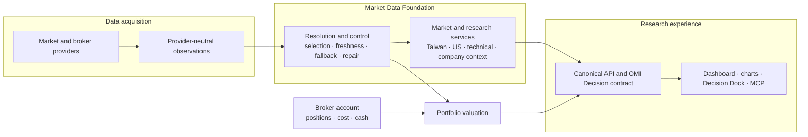

# Open Market Intelligence

<p align="center">
  <strong>English</strong> · <a href="./README.zh-TW.md">繁體中文</a> · <a href="./README.ja-JP.md">日本語</a>
</p>

<p align="center">
  
  
  
</p>

Open Market Intelligence (OMI) is a local-first workspace for researching markets and individual companies. It brings prices, charts, market structure, watchlists, technical context, company data, and data-source status into one place—so you can inspect the evidence before deciding what to do.

Taiwan is OMI's reference market, and US stocks have a first-class research workflow. Japan, Korea, Hong Kong, futures, commodities, and crypto can provide additional context where reliable data is available.

OMI is a research tool. It does not place trades automatically, hide uncertainty, or promise investment returns.


<sub>Actual OMI local runtime. Prices and market conditions shown in screenshots are historical examples.</sub>

## One workspace, one evidence trail

| When you need to… | OMI helps you… |
| --- | --- |
| Understand the market first | Read breadth, groups, indices, futures, and cross-market context together |
| Research one company | Inspect price history, technical state, fundamentals, ownership, events, and risks |
| Turn observations into a plan | Record scenarios, confirmation conditions, invalidation, and counter-evidence |
| Stay focused | Organize watchlists, research groups, Radar candidates, and local saved state |
| Judge whether a number is usable | See source, freshness, fallback, missing, partial, and finalization status |

The product is built around a simple rule: a number without its source, time, and limitations is not enough evidence.

## How market data becomes research

The current architecture makes provider differences a backend concern. Data is normalized, checked, and resolved before it reaches charts, AI, or external consumers. This keeps each screen from inventing its own provider priority, freshness rules, or fallback behavior.



Source lineage and data-quality status travel with the evidence. Read-only product surfaces do not silently fetch, repair, or rewrite market data; bounded acquisition and repair remain explicit backend operations.

For the durable technical contracts behind this flow, start with the [architecture index](docs/architecture/index.md).

## Research in context

### Start with the wider market

The dashboard combines market breadth, groups, indices, futures, watchlists, and Radar candidates. It is designed to show whether participation supports the headline move—not merely whether an index is up or down.


### Move from market context to one company

The stock workspace keeps charts, market structure, company context, and research notes together. You can move from a broad signal to the evidence for one symbol without rebuilding the context in another tool.


### Inspect price structure without treating indicators as answers

Professional charts include multiple timeframes, volume profile, indicators, signals, and drawing tools. Technical output is presented as evidence with explicit usability and data-quality limits.


### Ask questions about the symbol already on screen

The Decision Dock works with the current research context and presents evidence, scenarios, invalidation conditions, risks, counter-evidence, and data limits together.


### Research US stocks as a first-class market

The US workspace connects major indices, sessions, active symbols, watchlists, company research, and extended-hours context while preserving the limitations of each source.


### Check where the data came from

Source disclosure is part of the product. OMI shows provider roles and limitations instead of presenting every value as equally current or authoritative.


### Use other markets as context

Additional workbenches, including crypto, are available as contextual research surfaces. Coverage and quality depend on the market and provider.


For a screen-by-screen overview, see the [feature tour](docs/guides/feature-tour.md).

## Data status is part of the answer

Market data can be delayed, partial, unavailable, or supplied by a fallback source. OMI keeps those conditions visible:

- missing data is not silently converted to zero;
- stale and partial results stay labeled;
- market session, instrument status, freshness, and finalization remain distinct;
- provider, dataset, and resolved-evidence problems are not reduced to one generic health light;
- research output includes evidence, conditions, risks, and invalidation—not only a conclusion.

This also means a screen may honestly show that evidence is incomplete. That is preferable to presenting an old or inferred value as current truth.

## Start on Windows

### Use the packaged release

The Windows package includes its own Python and Node.js runtimes.

1. Download the Windows zip from [Releases](https://github.com/lulu930128/open-market-intelligence/releases).
2. Extract the entire folder. Do not run it from the zip preview.
3. Run <code>Start-OMI-Launcher.cmd</code>.
4. Use the tray menu to open the dashboard.

Writable data and logs are stored under <code>%LOCALAPPDATA%\Open Market Intelligence</code>.

### Run from a source checkout

If the repository has already been set up:

```powershell
cd "C:\project\Open Market Intelligence"
.\Start-OMI-Launcher.cmd
```

For first-time source installation, requirements, dynamic ports, and troubleshooting, follow the [getting-started guide](docs/guides/getting-started.md).

## Guides and project information

- [Getting started](docs/guides/getting-started.md) — packaged release and source installation
- [Feature tour](docs/guides/feature-tour.md) — what each main workspace is for
- [Development guide](docs/guides/development.md) — local development and validation
- [Architecture index](docs/architecture/index.md) — current product and architecture contracts
- [Optional KGI SuperPy setup](docs/guides/kgi-superpy.md) — live quotes and read-only holdings sync
- [Support](SUPPORT.md) · [Changelog](CHANGELOG.md) · [Contributing](CONTRIBUTING.md)
- [Security](SECURITY.md) · [License](LICENSE) · [Third-party notices](THIRD_PARTY_NOTICES.md)

## Current limits

- OMI is local-first and currently optimized for Windows.
- Market coverage is not identical across Taiwan, the US, Japan, Korea, Hong Kong, crypto, futures, and commodities.
- Some capabilities require optional provider credentials, account permissions, or market-specific services.
- Source availability and provider restrictions can affect freshness and completeness.
- The Decision Dock supports research; it does not remove the need for independent judgment.
- Source, CI, runtime, live-market, and product acceptance are separate gates; one does not automatically prove the others.

## Disclaimer

OMI is for research and information only. It is not investment advice, a performance guarantee, or an autonomous trading system. Verify important information with primary sources and assess suitability and risk independently.

## License

Licensed under the [Apache License 2.0](LICENSE). See [NOTICE](NOTICE) and [THIRD_PARTY_NOTICES.md](THIRD_PARTY_NOTICES.md) for attribution and third-party terms.
