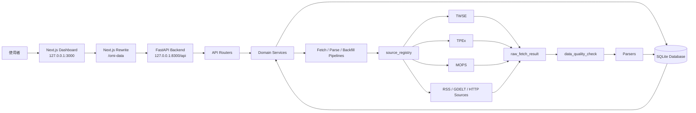
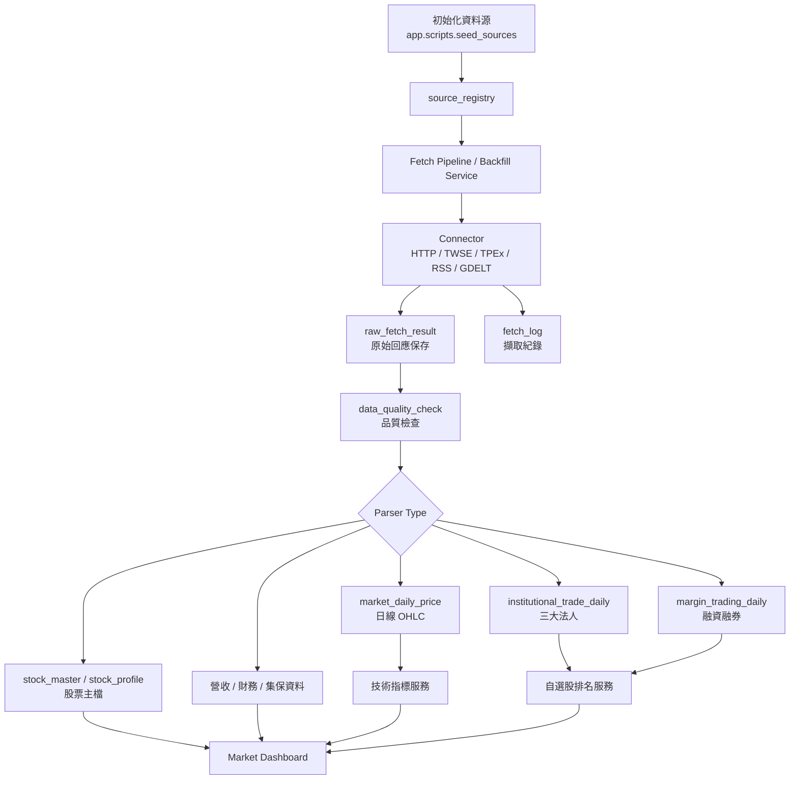
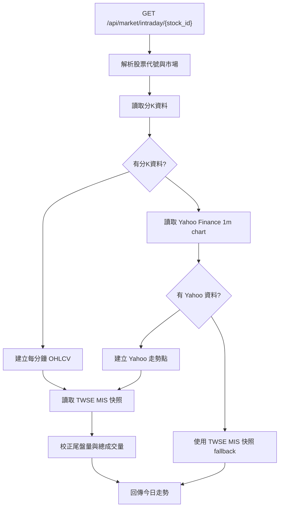
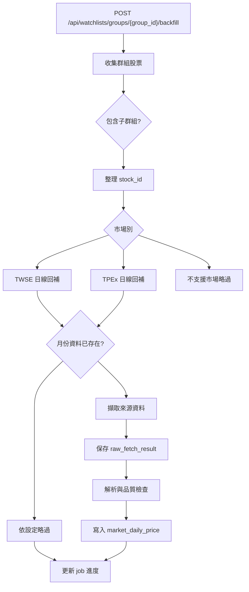

# Open Market Intelligence

Open Market Intelligence 是一套本機市場情報與自選股分析系統，目標是把台股日線、盤中走勢、自選股分組、技術指標、三大法人、融資融券、營收、財務與籌碼資料整合在同一個工作台。系統採用前後端分離架構，後端負責資料擷取、解析、校驗與 API 服務，前端負責市場儀表板、圖表與操作流程。

本專案目前以本機開發與研究流程為主，預設服務如下：

| 服務 | 技術 | 預設位置 |
| --- | --- | --- |
| Backend | FastAPI, SQLAlchemy, Alembic, SQLite | `http://127.0.0.1:8300` |
| Frontend | Next.js, React, TypeScript, Tailwind CSS | `http://127.0.0.1:3000` |

## 系統架構



## 主要功能

- 自選股群組管理，支援多層分組、股票加入、重新命名與刪除。
- 台股市場儀表板，支援正常排序、漲幅、Score 與成交量排序。
- 個股今日走勢、日 K、週 K、月 K 切換。
- K 線圖支援 MA、BOLL、RSI、MACD、KD 與成交量指標。
- 今日走勢支援分K價格、成交量、昨收基準、最高最低標記與漲跌停參考。
- 三大法人、持股比例、集保、營收、盈餘、財務、股利等個股資料區塊。
- TWSE / TPEx 日線資料補齊與自選股分組回補。
- Raw result 保存、品質檢查、解析紀錄與 job 進度追蹤。

## 資料流程



## 盤中走勢資料流程

今日走勢採取分層資料來源。優先使用分K來源取得每分鐘 OHLCV，再以交易所即時快照校正尾盤與總量；若分K來源失敗，才退回 Yahoo Finance 與 TWSE MIS 快照。



## 後端目錄

```text
backend/
  app/
    connectors/      資料來源連線器。
    db/              SQLAlchemy models 與 session。
    jobs/            背景任務狀態與 schema。
    market/          市場資料、日線、盤中、指標、訊號與回補服務。
    parsers/         TWSE、TPEx、MOPS 與其他來源解析器。
    pipelines/       Fetch 與 parse 流程。
    quality/         資料品質檢查。
    routers/         FastAPI routes。
    scripts/         初始化與維運腳本。
    sources/         資料來源註冊表。
    stocks/          股票主檔同步。
    watchlists/      自選股群組、排名、指標與回補。
```

主要 API 區塊：

| 區塊 | Prefix | 用途 |
| --- | --- | --- |
| System | `/api/system` | 健康檢查與系統狀態 |
| Sources | `/api/sources` | 資料來源註冊與管理 |
| Raw Results | `/api/raw-results` | 原始資料保存、解析與清理 |
| Market | `/api/market` | 日線、盤中、回補與市場資料 |
| Indicators | `/api/market/indicators` | 個股日線技術指標 |
| Stocks | `/api/stocks` | 股票主檔 |
| Watchlists | `/api/watchlists` | 自選股群組、清單、排名與回補 |
| Jobs | `/api/jobs` | 背景任務狀態 |
| Reports | `/api/reports` | 報表類資料 |

## 前端目錄

```text
frontend/
  src/
    app/
      page.tsx       Dashboard 入口。
      layout.tsx     全域 layout。
      globals.css    全域樣式。
    components/
      MarketDashboardClient.tsx
      SidebarWatchlistExplorer.tsx
      StockDetailPanel.tsx
      IntradayTrendChart.tsx
      StockKLineChart.tsx
      WatchlistManager.tsx
    lib/
      api.ts
      taiwanMarketTime.ts
    types/
      market.ts
```

## 本機啟動

### 1. 啟動後端

```powershell
cd "C:\Open Market Intelligence"
.\.venv\Scripts\Activate.ps1
cd backend
python -m uvicorn app.main:app --reload --port 8300
```

常用後端網址：

```text
http://127.0.0.1:8300
http://127.0.0.1:8300/docs
http://127.0.0.1:8300/api/system/health
```

### 2. 啟動前端

```powershell
cd "C:\Open Market Intelligence\frontend"
npm run dev
```

前端網址：

```text
http://127.0.0.1:3000
```

## 環境設定

根目錄 `.env.example`：

```env
APP_NAME=Open Market Intelligence
APP_ENV=development
APP_HOST=127.0.0.1
APP_PORT=8300
DATABASE_URL=sqlite:///./data/open_market_intelligence.db
ENABLE_SCHEDULER=false
TIMEZONE=Asia/Taipei
```

前端 `.env.example`：

```env
API_PROXY_TARGET=http://127.0.0.1:8300
API_PROXY_PATH=/omi-data
NEXT_PUBLIC_API_PROXY_PATH=/omi-data
NEXT_PUBLIC_API_BASE_URL=
```

前端預設透過 Next.js rewrite 轉送後端 API：

```text
/omi-data/... -> http://127.0.0.1:8300/api/...
```

## 初始化資料來源

```powershell
cd "C:\Open Market Intelligence"
.\.venv\Scripts\Activate.ps1
cd backend
python -m app.scripts.seed_sources
```

## 資料庫 Migration

本專案使用 Alembic。若本機資料庫已存在，先將目前 schema 標記為最新版本：

```powershell
cd "C:\Open Market Intelligence"
.\.venv\Scripts\Activate.ps1
python -m alembic stamp head
```

套用 migration：

```powershell
cd "C:\Open Market Intelligence"
.\.venv\Scripts\Activate.ps1
python -m alembic upgrade head
```

## 自選股回補流程



常用參數：

| 參數 | 預設 | 說明 |
| --- | --- | --- |
| `start_date` | 呼叫端指定 | 回補起始日 |
| `end_date` | 呼叫端指定 | 回補結束日 |
| `include_children` | `true` | 是否包含子群組 |
| `enabled_only` | `true` | 是否只處理啟用項目 |
| `skip_existing_months` | `true` | 是否跳過已有資料月份 |
| `sleep_seconds` | `0.8` | 遠端請求間隔 |

## 驗證指令

後端語法檢查：

```powershell
cd "C:\Open Market Intelligence"
python -m compileall -q backend\app
```

前端 lint：

```powershell
cd "C:\Open Market Intelligence\frontend"
npm run lint
```

前端 type check：

```powershell
cd "C:\Open Market Intelligence\frontend"
npx tsc --noEmit
```

前端 production build：

```powershell
cd "C:\Open Market Intelligence\frontend"
npm run build
```

## 維運原則

- GET API 保持讀取語義；資料補齊與遠端擷取應使用 POST backfill 或 job 流程。
- 新資料源應先註冊到 `source_registry`，再建立 parser 與品質檢查。
- 解析器應優先使用結構化資料，不以畫面文字或 fragile string parsing 作為主要邏輯。
- 長時間任務應寫入 `job_run`，方便前端追蹤進度與錯誤。
- Raw payload 應保留足夠時間，便於追查 parser 與來源格式變更。
