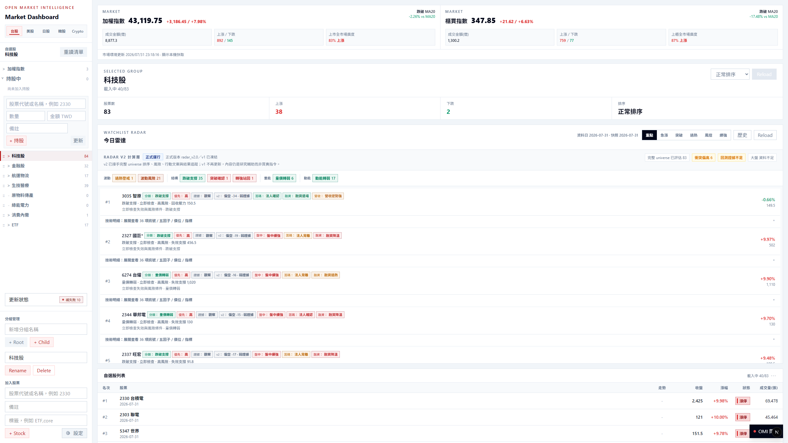
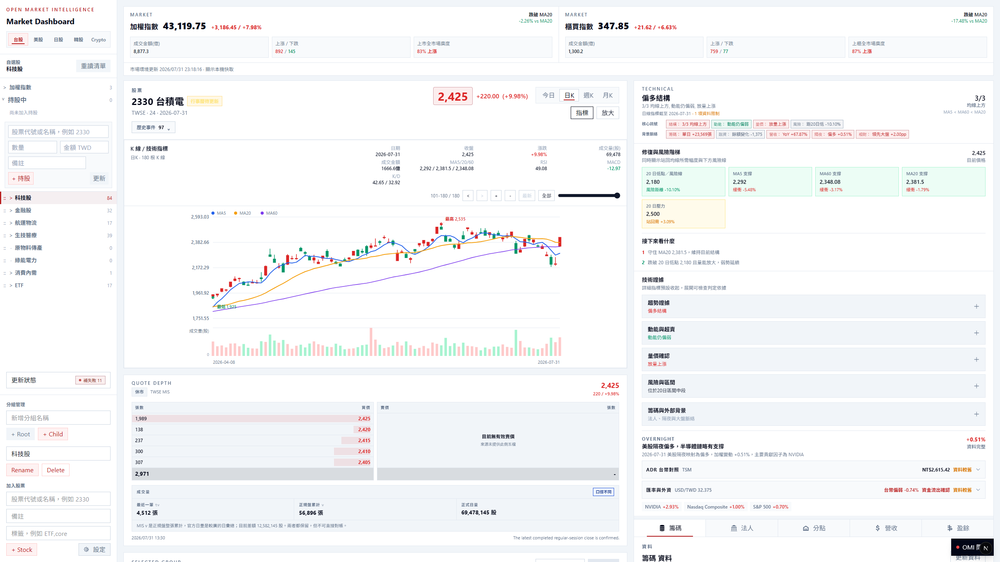
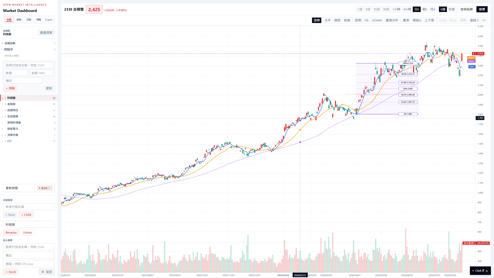
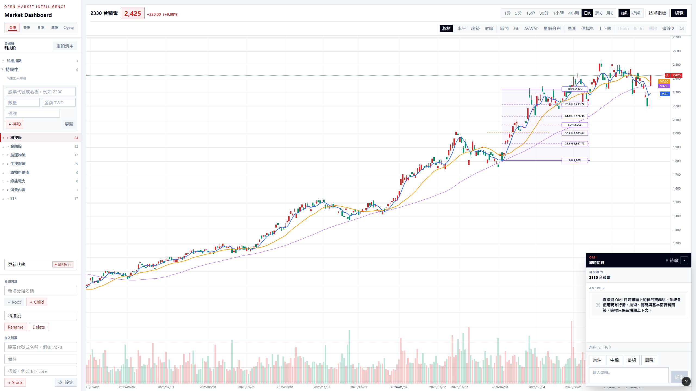
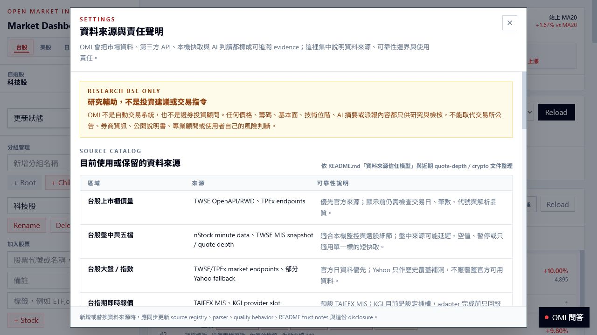
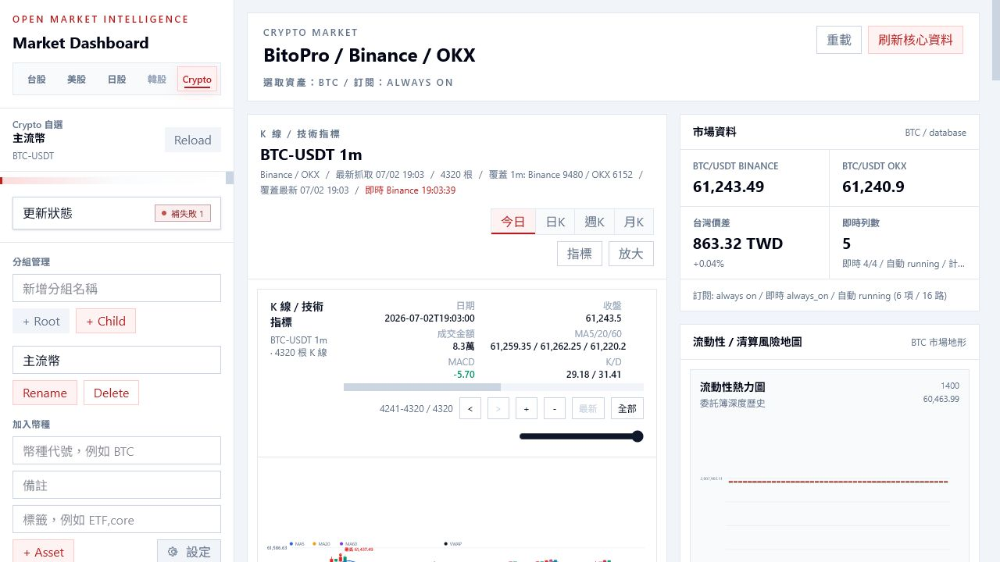

# Open Market Intelligence

  <a href="./README.md">English</a> · <strong>繁體中文</strong> · <a href="./README.ja-JP.md">日本語</a>

  
  
  

Open Market Intelligence（OMI）是一套在本機運作的市場研究工作台，適合想先把一檔股票看懂，再決定下一步的人。價格、圖表、市場廣度、自選股、技術面、公司資料與來源狀態，都能在同一個地方查看。

OMI 以台股為主要參考市場，美股則有完整的研究流程；日股、韓股、港股、期貨、商品與加密貨幣會在資料可用時提供額外的市場背景。

OMI 只協助研究，不會自動下單，也不保證任何投資績效。

畫面來自 OMI 本機實際執行環境；截圖中的價格與市場狀態僅為歷史範例。

## OMI 可以幫你做什麼

| 你想知道的事 | OMI 提供的內容 |
| --- | --- |
| 先看懂整體市場 | 市場廣度、族群、指數、期貨與跨市場背景 |
| 深入研究一家公司 | 價格歷史、技術狀態、基本面、持股、事件與風險背景 |
| 把觀察整理成計畫 | 有證據的情境、進場條件、失效條件與風險提示 |
| 維持聚焦的研究空間 | 自選股、研究群組、Radar 候選標的與本機保存狀態 |
| 知道資料是否完整 | 清楚顯示來源、新鮮度、替代來源、缺漏與部分資料 |

## 實際功能畫面

### 不必在多個工具之間來回切換

個股工作區把圖表、市場結構、公司背景與研究內容放在一起，讓你能檢查一個想法背後的證據，而不是只看單一分數。

### 讀圖，也把真正重要的條件記下來

專業圖表支援多週期、成交量分布、指標、訊號與繪圖工具。它用來幫助驗證假設，不是取代判斷。

### 直接詢問目前畫面上的股票

Decision Dock 會使用目前標的，在同一個工作區呈現證據、可能情境、失效條件、風險與資料限制。

### 不只看大盤漲跌，也看台股內部結構

OMI 把市場廣度、族群、期貨與個股背景放在一起，避免指數很強時，掩蓋了參與度不足的情況。

### 研究美股時，同時保留大盤視角

美股工作區串連主要指數、活躍標的、自選股、交易時段與公司研究。

### 看得見資料從哪裡來

來源揭露本身就是產品功能。OMI 會說明 provider 的責任與限制，不會把每一筆數字都包裝成同樣即時、同樣可靠。

### 用其他市場補足背景

加密貨幣等額外工作區可作為研究背景；實際涵蓋範圍與品質會依市場和 provider 而不同。

想逐一了解主要畫面，可以閱讀[功能導覽（英文）](docs/guides/feature-tour.md)。

## 資料狀態也是答案的一部分

市場資料可能延遲、不完整、暫時無法取得，或改由替代來源提供。OMI 會把這些情況保留下來：

- 缺少的資料不會被偷偷改成零；
- 過期與部分資料會持續標示；
- 不同來源與資料問題不會被壓成一顆籠統的「正常」燈號；
- 研究結果會交代證據、條件、風險與失效方式，不只給一個結論。

## 在 Windows 開始使用

### 使用打包好的版本

Windows 安裝包已包含所需的 Python 與 Node.js runtime。

1. 從 [Releases](https://github.com/lulu930128/open-market-intelligence/releases) 下載 Windows zip。
2. 完整解壓縮整個資料夾，不要直接從 zip 預覽執行。
3. 執行 <code>Start-OMI-Launcher.cmd</code>。
4. 從系統匣選單開啟儀表板。

可寫入的資料與 logs 會放在 <code>%LOCALAPPDATA%\Open Market Intelligence</code>。

### 從原始碼 checkout 啟動

如果 repository 已經設定完成：

~~~powershell
cd "C:\project\Open Market Intelligence"
.\Start-OMI-Launcher.cmd
~~~

第一次安裝原始碼版本、系統需求、動態 port 與疑難排解，請依照[開始使用指南（英文）](docs/guides/getting-started.md)。

## 指南與專案資訊

- [開始使用（英文）](docs/guides/getting-started.md) — 安裝包與原始碼版本
- [功能導覽（英文）](docs/guides/feature-tour.md) — 各主要工作區的用途
- [開發指南（英文）](docs/guides/development.md) — 本機開發、驗證與截圖
- [選配 KGI SuperPy 設定（英文）](docs/guides/kgi-superpy.md) — 即時行情與唯讀持股同步
- [使用支援](SUPPORT.md) · [版本紀錄](CHANGELOG.md) · [參與貢獻](CONTRIBUTING.md)
- [安全回報](SECURITY.md) · [授權](LICENSE) · [第三方聲明](THIRD_PARTY_NOTICES.md)

## 目前限制

- OMI 採本機優先，目前主要針對 Windows 最佳化。
- 台股、美股、日股、韓股、港股、加密貨幣、期貨與商品的涵蓋範圍並不完全相同。
- 部分功能需要選配的 provider 憑證、帳號權限或特定市場服務。
- 來源中斷或 provider 限制可能影響資料的新鮮度與完整性。
- Decision Dock 用來協助研究，不能取代獨立判斷。

## 免責聲明

OMI 僅供研究與資訊整理，不構成投資建議、績效保證或自主交易系統。重要資訊請再向第一手來源核對，並自行評估適合度與風險。

## 授權

本專案採用 [Apache License 2.0](LICENSE)。相關出處與第三方條款請見 [NOTICE](NOTICE) 與 [THIRD_PARTY_NOTICES.md](THIRD_PARTY_NOTICES.md)。
