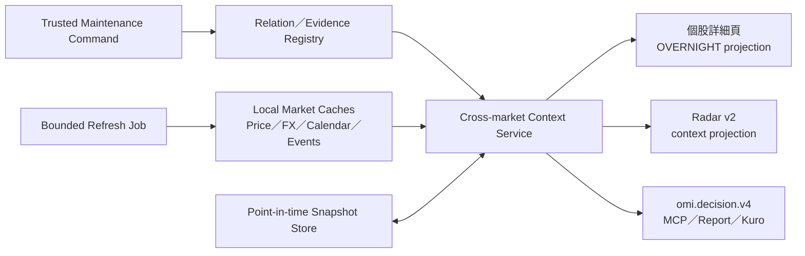

# 跨市場關聯決策脈絡架構

## 1. 架構決策

本專案採用「一份 canonical context、三個 consumer projection」：



共同 service 回傳「資料與方法論事實」；個股頁決定資訊密度，Radar 決定 context 是否與技術方向一致，AI answer composer 決定如何以人話呈現。三者都不得重做 relation selection、parity、residual、coverage 或 freshness。

## 2. 現況接點與邊界

| 表面 | 可沿用接點 | 本專案邊界 |
| --- | --- | --- |
| 個股詳細頁 | `overnight_impact.py`、`AdrParityRead`、`OvernightImpactRead`、`OvernightDataViews.tsx` | 保留 route 與舊欄位；新增 `cross_market_context`，Frontend 只 render |
| Radar v2 | `context_signals`、`context_alignment_score`、point-in-time snapshot、outcome/readiness | 第一階段 display-only；不改 `direction_score`、`priority_score`、bucket、active sort |
| OMI v4 | `cross_market.overnight`、`market.cross_market`、`evidence.capability_status`、`evidence.data` | stock-level 與 market-level 不混用；additive capability，不建立第二份 envelope |
| MCP／Kuro | `omi.ask`／`omi.ask_stream` 與 public contract snapshot | thin adapter；不讀 DB、不解析 UI 文案、不重算市場邏輯 |

重要區分：`market.cross_market` 是全市場海外脈絡；本專案主要建立的是台股個股層級的 `cross_market.context.v1`。兩者可以在回答中並列，但不能把 market breadth 當成個股 relation evidence。

## 3. Package 與 ownership

目標 package：

```text
backend/app/market/cross_market/
├─ __init__.py
├─ types.py                 # InstrumentRef、enum、domain dataclass
├─ relation_store.py        # 有效期、review、evidence 與 version resolution
├─ parity_engine.py         # ADR／ADS／第二上市換算
├─ proxy_signal_engine.py   # raw return、benchmark residual、event relevance
├─ aggregation.py           # bucket、coverage、quality multiplier、去重
├─ snapshots.py             # point-in-time materialization／replay
├─ projection.py            # canonical context 與相容 facade
├─ refresh.py               # bounded refresh plan；不直接綁 HTTP
└─ diagnostics.py           # shadow diff、coverage、evidence health
```

依賴方向：

- Router、AI market context、Radar projection → `cross_market` service。
- `cross_market` engine → relation store、calendar 與既有 market cache reader。
- Provider HTTP → 既有 provider／job owner；engine 不直接發網路請求。
- Frontend、MCP、Kuro → backend API／`omi.decision.v4`；不得 import DB 或 Python domain。

## 4. Instrument identity

`InstrumentRef` 至少包含：

| 欄位 | 說明 |
| --- | --- |
| `market` | `TW`、`US`、`JP`、`KR`、`HK`；市場不是 instrument type |
| `instrument_type` | `stock`、`adr`、`ads`、`etf`、`index`、`fx`、`commodity` |
| `canonical_symbol` | OMI 穩定 identity，例如 `TW:2330`、`US:TSM` |
| `provider_symbol` | provider 查詢 symbol；可隨 adapter 不同而變化 |
| `exchange` | TWSE、TPEX、NYSE、NASDAQ、OTC 等 |
| `currency` | TWD、USD 等 |
| `timezone` | 事件時間與交易日對齊所需 |

Relation 永遠指向 canonical identity；provider symbol 只存在於 source adapter／metadata，避免 provider 更名污染 relation history。

## 5. Relation taxonomy 與治理

### 5.1 計算 bucket

| Bucket | 例子 | 核心計算 |
| --- | --- | --- |
| `direct_equivalent` | 2330 ↔ TSM | ratio + FX + aligned TW reference 的 parity gap |
| `industry_peer` | 2408 ↔ MU | benchmark residual；只能稱代理／同業 |
| `theme_supply_chain` | AI server、memory、semiconductor equipment | relation evidence + event policy；不得只靠名稱猜測 |
| `macro_market` | SOX、NASDAQ、USD/TWD | 市場背景；不得正規化成公司專屬訊號 |

### 5.2 Relation type

第一階段受控 enum：

- `same_equity_dr`
- `secondary_listing`
- `industry_peer`
- `sector_proxy`
- `supply_chain_supplier`
- `supply_chain_customer`
- `customer_demand_proxy`
- `end_market_proxy`
- `theme_proxy`
- `macro_proxy`

每個 type 必須對應固定 bucket、允許的 instrument pair、是否允許 ratio、最低 evidence grade 與可使用的計算方法。未知 type fail closed，不落入 generic proxy。

### 5.3 Evidence 與 review

- Tier A：官方法律權益、ADR ratio、第二上市等；可進正式 direct 計算。
- Tier B：官方文件可驗證的供應鏈／客戶關係；可受事件政策與 freshness 限制後進計算。
- Tier C：產業機制、同業或題材代理；可顯示與進低權重 proxy，但文案必須明示推論性。
- Tier D：候選、弱來源或純統計關聯；只能 shadow／review，不進 production score。

正式 relation 至少需要：`valid_from`、`valid_to`、`verified_at`、`review_status`、`is_active`、`methodology_version` 與一筆 evidence。A／B 級至少一筆 official primary evidence。

LLM 可以提出 `candidate`，但候選與 production registry 分開；核准必須由 trusted maintenance flow 完成，沒有 public CRUD。

### 5.4 初始 seed 策略

- 第一批 production seed 只搬移目前已有 golden 的 2330/TSM、2303/UMC、3711/ASX、8150/IMOS，先證明 DB 與 hardcoded 結果一致。
- CHT、AUOTY 或其他新增 direct mapping 必須重新驗證官方 ratio、有效日期、provider symbol、流動性與 coverage；AUOTY 類 OTC mapping 預設 `limited`，不自動進 composite。
- 2408/MU 先以 Tier C `industry_peer`／DRAM cycle proxy 進 shadow。Evidence statement 必須明說這是同業與景氣代理，不代表已證實供應、客戶或持股關係。
- 不依 stock name、industry label 或共同出現批次建立 relation；後續擴充以受控候選清單逐筆 review。

## 6. Persistence

### 6.1 Phase 1 tables

`cross_market_relation`

- Identity：`id`、source/target market、instrument type、canonical symbol。
- Classification：`relation_type`、`relation_subtype`、`bucket`、`directionality`。
- Weight：`base_weight`、`confidence_tier`、`evidence_grade`。
- Parity：`ratio_numerator`、`ratio_denominator`、`depositary`、`listing_tier`。
- Validity：`valid_from`、`valid_to`、`verified_at`、`review_status`、`is_active`。
- Audit：`created_at`、`updated_at`、`created_by`、`change_reason`、`version`。

`cross_market_relation_evidence`

- `relation_id`、`source_type`、`source_grade`、`source_label`、`source_url`。
- `statement`、`published_at`、`verified_at`、`content_hash`、`is_primary`。
- `review_status`、`supersedes_evidence_id`、audit metadata。

必要 constraints：

- `base_weight` 在 0..1。
- Direct relation ratio 必須為正；非 direct ratio 必須為 NULL。
- 同一 source／target／type 的有效日期不得 overlap。
- A／B active relation 缺 primary evidence 時 service 啟動檢查失敗或該 relation blocked，不任選資料繼續算。

SQLite 無法自然表達的 overlap constraint，由 transaction-level validator、migration test 與 startup diagnostic 共同防守。

### 6.2 Point-in-time signal snapshot

原始規格的 relation registry 不足以支撐 Radar 回放，因此本專案明確增加：

`cross_market_signal_snapshot`

- `snapshot_id`、`target_symbol`、`decision_at`、`target_trade_date`。
- `relation_snapshot_version`、`methodology_version`、`event_policy_version`。
- 每個 input 的 `event_time`、`available_at`、`fetched_at`、provider、freshness。
- Canonical context payload 或穩定 hash／lineage。
- `status`、`decision_usable`、coverage、warnings、missing。

只有 `available_at <= decision_at` 的資料可進 decision snapshot。Relation ratio、evidence 與 event policy 都依 event date 解析當時有效版本，不能拿現行設定回算歷史。

### 6.3 後續 tables

- `cross_market_event_policy`：依 relation、event type、horizon 決定 sign／multiplier。
- `cross_market_relation_statistic`：rolling correlation、beta、stability 與 sample count；只提供 review 建議。

Statistics 不得直接覆寫 relation 或 production weight。

## 7. Canonical contract

內部與 API 共用的主物件為 `cross_market.context.v1`：

```json
{
  "kind": "cross_market_target_context",
  "schema_version": "cross_market.context.v1",
  "target": {
    "market": "TW",
    "instrument_type": "stock",
    "canonical_symbol": "TW:2408"
  },
  "status": "ready",
  "decision_usable": true,
  "as_of": "2026-08-07",
  "decision_at": "2026-08-08T08:30:00+08:00",
  "methodology_version": "cross_market_relation.v1",
  "relation_snapshot_version": "relation_registry:42",
  "snapshot_id": "cmctx:...",
  "summary": {
    "stance": "supportive",
    "score": 23.4,
    "confidence": "medium",
    "title": "美股隔夜偏多，記憶體鏈略有支撐",
    "reason_codes": ["industry_peer_residual_positive"]
  },
  "direct_equivalents": [],
  "signals": [],
  "bucket_scores": {},
  "coverage": {},
  "freshness": {},
  "missing": [],
  "warnings": ["event_context_unresolved"],
  "source_refs": [],
  "evidence_passport": {}
}
```

### 7.1 Status vocabulary

- `ready`：必要 inputs current 且 coverage 達門檻。
- `partial`：部分訊號可用；coverage 或 evidence 不完整。
- `stale`：資料存在但不符合 expected market date／age。
- `limited`：OTC、流動性、provider coverage 或 method 限制；可顯示，預設不進 composite。
- `blocked`：relation/evidence/benchmark invariant 不滿足，禁止計分。
- `not_applicable`：沒有 direct relation 或該 capability 對 target 不適用；不是 error。
- `missing`：必要資料不存在。
- `failed`：provider／calculation 執行失敗，有明確 owner 與 retry 邊界。

`status` 不取代 `freshness.status`；relation governance、source freshness 與 decision usability 各自保留。

### 7.2 Signal contract

每個 `signals[]` 至少包含：

- `signal_id`、`relation_id`、`relation_version`、source／target `InstrumentRef`。
- `bucket`、`relation_type`、`relation_subtype`、`event_context`。
- `calculation.kind`、`raw_return_pct`、`benchmark_return_pct`、`excess_return_pct` 或 `implied_gap_pct`。
- `direction`、`configured_weight`、`quality_multiplier`、`effective_weight`、`normalized_weight`、`contribution`。
- `status`、`decision_usable`、`confidence_tier`、`freshness`、`evidence_refs`、`source_refs`。
- `warnings`、`limitations`、`excluded_reason`。

Direct ADR 的 signal value 是 `implied_gap_pct`；ADR raw return 不再進 industry bucket。Proxy 第一版優先使用 `target return - beta × benchmark return`；beta 不可用時可退為明示的 `simple_sector_residual` 並降為 Tier C，benchmark 缺失時不得偽造 excess return。

### 7.3 Coverage contract

`coverage` 必須回傳：

- `configured_signal_count`、`available_signal_count`、`decision_usable_signal_count`。
- `configured_weight`、`available_weight`、`decision_usable_weight`、`coverage_ratio`。
- `excluded_by_reason`，例如 stale、missing benchmark、evidence blocked、duplicate direct source。

只在同 bucket 的有效 signal 間正規化。缺公司專屬訊號時，不能把剩餘大盤因素放大成公司專屬高信心；coverage 低於門檻時 bucket 必須 partial／blocked。

## 8. Read 與 refresh flow

### 8.1 Read path

- `GET /api/market/cross-market/relations/{stock_id}`：只讀有效 relation 與 evidence summary。
- `GET /api/market/cross-market/context/{stock_id}`：只讀 local cache／snapshot 並建立 bounded projection，不發 provider HTTP。
- `GET /api/market/overnight-impact/{stock_id}`：保留相容 route 與既有欄位；新增 `cross_market_context`。新 OMI consumer 明確使用 no-refresh read path。

既有 overnight route 的預設 bounded refresh 是 legacy 行為；相容期內不直接破壞。Frontend、Radar、AI 與新 external consumer 必須改用 read-only path，待 telemetry 證明無舊 caller 依賴後，另案決定是否變更預設。

### 8.2 Refresh path

`POST /api/market/cross-market/refresh` 或既有 job framework 的等價 tool：

- 目標限定單一 stock 或明確 stock list。
- 先解析 active relations，再依 canonical source symbol 去重。
- 每次預設最多 8 個海外 symbols，設定 hard cap、timeout、retry cap 與 provider budget。
- 寫入既有 market cache 與 provider events；relation registry 不由 refresh 改動。
- 回傳 requested／attempted／succeeded／failed／deferred 與 failure owner。
- Radar scheduler 先批次 refresh，再以固定 `decision_at` materialize snapshots；Radar GET 不 refresh。

## 9. Consumer projections

### 9.1 個股詳細頁

保留截圖中的閱讀層級：技術判斷仍是第一主體；`OVERNIGHT` 是獨立背景區塊。

預設摘要顯示：

- stance、加權變動、資料日期、confidence／freshness。
- direct parity strip（適用時）、FX／外資摘要與最重要 driver。
- compact chips：例如 `記憶體代理 +2.1%`、`SOX +1.3%`，並明示 proxy／direct。

展開後顯示：

- Bucket breakdown、coverage 與被排除原因。
- Relation type、statement、evidence grade／verified date。
- Raw return、benchmark residual、weight 與 contribution。
- Warnings、missing、source health 與 methodology。

錯誤不新增局部 banner；沿用共享「更新狀態」資料狀態流。Frontend 不依股票名稱或產業自行挑 factor。

### 9.2 Radar v2

Radar integration 分兩層：

**Production layer A：display-only**

- Radar universe builder 以 batch 方式讀同一 `decision_at` 的 context snapshots。
- 將 canonical signed context 轉成 Radar-specific `confirm`、`contradict`、`risk` 或 `info`；這個相對判定留在 backend Radar projection。
- 寫入 `context_snapshot.cross_market`、`context_signals[]`、`context_alignment_score`、snapshot ID、coverage 與 limitations。
- UI 顯示「外部順風／逆風／分歧／資料不足」badge，可展開主要 evidence。
- `direction_score`、family scores、technical bucket、`priority_score` 與 sort 完全不變。

**Experimental layer B：ranking shadow**

- 另產生 `context_priority_modifier_shadow` 與 `priority_score_with_context_shadow`。
- Missing、stale、blocked、limited composite 必須使 modifier 為 0。
- Modifier cap、權重與 promotion threshold 先固定在 config/version，再查看 outcome，避免事後挑參數。
- Active ranking 只有通過第 11 節 gate 並由 feature flag 明確升級後才可使用。

跨市場 context 永遠不能直接改寫 `direction_score`。技術看多但外部逆風應是 contradiction/risk，不是把技術趨勢改成看空。

### 9.3 `omi.decision.v4`、MCP 與 Kuro

Stock-level capability：

- `cross_market.relations`：有效 relation、evidence summary、validity 與 review status。
- `cross_market.parity`：direct equivalent 與 parity gap；不適用時為 `not_applicable`。
- `cross_market.overnight`：canonical summary、signals、bucket scores、coverage、freshness、warnings 與 source refs。

既有 `market.cross_market` 保持 market-level capability，不與個股 capability 合併。

Projection 規則：

- readiness 位於 `evidence.capability_status[capability_id]`。
- payload 位於 `evidence.data[capability_id]`。
- summary 保留 stance、date、confidence、top evidence、status 與 data limits。
- compact 保留 top-N signals、bucket scores、coverage、missing／warnings 與 stable IDs。
- full 才提供完整 relation/evidence/weight lineage，並受 field／bytes／cardinality budget 約束。
- `analysis.human_answer` 只能說「支撐、壓力、代理、背景或反證」，不能把 correlation 寫成因果。
- MCP public snapshot additive 更新；adapter 只轉發 v4。Kuro 依 stable enum／reason code 呈現，不解析特定中文句型。

## 10. Compatibility、flags 與 rollback

Feature flags 建議：

- `CROSS_MARKET_RELATION_REGISTRY_ENABLED`
- `CROSS_MARKET_CONTEXT_PROJECTION_ENABLED`
- `CROSS_MARKET_RADAR_DISPLAY_ENABLED`
- `CROSS_MARKET_RADAR_PRIORITY_SHADOW_ENABLED`
- `CROSS_MARKET_RADAR_PRIORITY_ACTIVE_ENABLED`

Rollout：hardcoded baseline → dual-read shadow diff → DB primary／hardcoded fallback → registry-only。舊 mapping 至少保留一個穩定 release；移除前要有 zero-diff 證據與 rollback drill。

關閉新 projection 時：

- 舊 overnight response 仍可回傳。
- Radar context 欄位缺失視同 0，不影響基線。
- `omi.decision.v4` capability 明示 disabled／not available，不回假資料。

## 11. Radar promotion gate

排序影響的驗證方案必須在讀取 outcome 前凍結。初始最低門檻：

- 至少 60 個 eligible 台股交易日、1,000 筆 decision-usable stock snapshots。
- 至少 3 個 purged walk-forward folds，embargo／availability cutoff 與 relation version 可稽核。
- 分別評估 T+1、T+3、T+5；至少兩個 horizon 的主要 ranking metric 正向，且任一 horizon 不得出現預先定義的重大劣化。
- 報告 direct、industry、theme、macro、coverage quartile 與市場 regime 分層，避免 aggregate improvement 掩蓋失效 segment。
- Missing/stale context subset 與 baseline 產出完全相同排序。
- Max drawdown／高風險誤推比例、turnover／ranking churn 與 data availability 為 guardrail。
- Threshold、modifier cap 與 metric 先寫入 versioned validation spec；statistics 只能建議，需人工核准。

未達門檻時維持 display-only；這不阻擋個股頁與對外 evidence 上線。

## 12. Observability

必記 metadata：

- relation／evidence／event policy／methodology version。
- snapshot ID、decision_at、source event time、available_at、fetched_at。
- provider、source health、refresh job ID。
- configured／available／effective／normalized weight、coverage 與 excluded reason。
- consumer projection level、Radar baseline/shadow diff。

Diagnostics 至少提供：

- active relations、evidence stale／missing、validity overlap。
- parity availability、proxy benchmark coverage、snapshot lag。
- legacy/new dual-read diff。
- 各 consumer 的 snapshot/version mismatch。
- Radar display coverage、shadow modifier distribution 與 outcome gate status。

## 13. 主要風險與防線

| 風險 | 後果 | 防線 |
| --- | --- | --- |
| 把代理寫成因果 | 誤導投資研究 | taxonomy、evidence grade、reason code、文案規則 |
| ADR ratio／公司行動失效 | parity 價格錯誤 | validity version、official evidence、annual/event review |
| 同 source 重複計分 | 放大方向 | direct/proxy bucket 去重與 contract test |
| 關聯資料 current、行情 stale | 假裝可決策 | governance freshness 與 market freshness 分離 |
| Radar N+1 refresh | quota／延遲／不同步 | scheduler batch refresh + fixed decision snapshot |
| Consumer 各算一份 | 顯示矛盾 | backend canonical context + stable snapshot ID |
| 用現行 relation 回算歷史 | leakage | valid-at resolution + available-at cutoff |
| 工作樹 migration head 漂移 | Alembic fork | 實作開始前重查 `alembic heads`，依當時 head 建 revision |
| 大改既有 API | Frontend／MCP 中斷 | additive facade、flags、dual-read、rollback |
