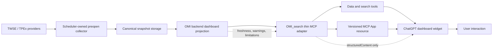

# OMI 台股盤前 ChatGPT MCP App 長專案計畫

## 計畫摘要

本計畫以「backend-owned market truth、thin MCP adapter、presentation-only widget」為核心，分九個 milestone 執行。每個 milestone 都有明確輸出、驗收條件與 stop-and-fix 規則；前一階段的 contract 或資料可信度未通過，不得用 UI 完成度掩蓋問題。

目前已進入 backend implementation；runtime adoption、ChatGPT widget 與 live-session 驗收仍未完成。

## 目標架構



### 不可逆轉的責任方向

- provider 到 canonical truth：只在 OMI backend。
- backend 到 MCP：透過版本化 HTTP contract。
- MCP 到 widget：透過 tools/resources 與 bridge。
- widget 回取資料：呼叫 MCP tools，不直接連 backend。

## 執行規則

- 每個 milestone 開始前先確認 branch、dirty worktree 與相關檔案 owner。
- 實作採 minimal、localized diff，不做無關重構或 dependency upgrade。
- 每階段先完成 targeted tests；失敗時 stop-and-fix，不累積到最後一次處理。
- DB migration、component restart、ChatGPT tunnel、commit、push 與 public submission 都是獨立授權點。
- 真實交易時段驗收是正式完成條件，但不阻塞非時段內的 contract、unit 與 isolated runtime 工作。
- 文件中的 estimate 一律指 provisional research estimate，不是官方數值或交易建議。

## 參考契約

- OMI product docs：`docs/product/`
- OMI backend boundary：`docs/architecture/BackendArchitecture.md`
- MCP Apps server：<https://developers.openai.com/plugins/build/mcp-server>
- MCP Apps UI：<https://developers.openai.com/plugins/build/chatgpt-ui>
- Tool planning：<https://developers.openai.com/plugins/plan/tools>
- Apps SDK reference：<https://developers.openai.com/plugins/reference>
- TWSE TAIEX methodology：<https://twse-regulation.twse.com.tw/TW/law/DAT0201_print.aspx?FLCODE=FL047579>
- TPEx index introduction：<https://wwwov.tpex.org.tw/web/stock/iNdex_info/manual/introduction.php?l=zh-tw>

## Contract-first 決策

### D1：MCP App archetype

採 `interactive-decoupled`：資料工具與 render tool 分離。模型可先取得市場資料再決定是否開啟 UI，widget 也可自行透過 app-visible tools 更新，不必反覆 remount。

### D2：backend dashboard surface

預設採 dedicated、cache-only 的 backend projection，contract 名稱為 `omi.tw_market_dashboard.v1`。若 M0 證明現有 focused AI capability 已能原樣提供精確 schema，才考慮共用；不得由 adapter 從一般自然語言回答中解析市場資料。

### D3：MCP resource

- 候選 URI：`ui://omi/tw-market-dashboard/v1.html`
- MIME：`text/html;profile=mcp-app`
- 新式綁定：`_meta.ui.resourceUri`
- 相容 alias：`openai/outputTemplate`
- result `structuredContent` 提供 model 與 widget；result `_meta` 只放 widget-only 資料。

### D4：read-only 語意

只有在工具不寫資料、不打 provider、不啟動 refresh、不呼叫 LLM 時，才設定 `readOnlyHint=true`。任何隱性 side effect 都必須先移出 read path，不能用 annotation 掩蓋。

### D5：盤前 truth

盤前 indicative observations 可以成為可顯示 fact，但不是 actual trade。所有盤前 breadth、group 與 index estimate 都必須保留 `decision_usable=false`，並在 09:00 由 backend session contract 執行 handoff。

## Milestone 0：整合基線與 contract freeze

### 目的

把現有 repo、runtime topology、資料來源與外部契約查清楚，避免在錯誤的 process、port、route 或資料模型上實作。

### 工作項目

1. 記錄 OMI 與 `OMI_search` 的 branch、HEAD、dirty paths、實際 runtime owner 與 build provenance。
2. 確認 launcher 選出的 backend/frontend port，不假設一定是 8400/3000。
3. 追蹤 dashboard 所需資料的現有 call graph：router → service → cache/DB → provider → scheduler。
4. 確認 scheduler 與 dashboard API 是否位於同一 process。
5. 凍結 `omi.tw_market_dashboard.v1` JSON schema、status enum、freshness enum 與 invariant。
6. 凍結 watchlist group policy、symbol search limits 與 stock detail tool 方案。
7. 凍結 TAIEX/TPEx authoritative methodology、component、shares、divisor 與 corporate-action source。
8. 對現有 `omi.ask`、`omi.read_stock_context` 與 public snapshot 做 compatibility review。
9. 設計 fixture：交易日/非交易日、08:00、08:30、08:55、09:00、provider partial、missing baseline、out-of-order snapshot。

### 產出

- contract decision record。
- before-change evidence 與 affected call-site map。
- fixture/acceptance matrix。
- 明確的 migration decision：`not_required` 或附理由的 migration proposal。

### 驗收條件

- 沒有未決定的 truth owner。
- 每個外部來源、cache 與 persistence owner 都有明確邊界。
- read path 與 refresh path 已能在圖上分離。
- 對 legacy `tw.market.breadth.v2`、regular intraday state、AI answer contract 與現有 MCP tools 的 compatibility 影響已列出。

### 驗證

- read-only repo inspection。
- schema fixture review。
- 既有 targeted tests baseline。
- 不啟動 migration、restart 或外部 refresh。

## Milestone 1：Scheduler-owned 08:30 盤前 collector

### 目的

建立 bounded、可觀察且不依賴 read request 的全市場盤前資料收集。

### 工作項目

1. 將現有 08:55 gate 與 target-date 邏輯抽成 session-aware policy，納入 08:30 preopen。
2. 使用官方交易日/calendar 決定是否執行。
3. 實作 single-flight job、`max_instances=1`、timeout、bounded retry、backoff 與 circuit state。
4. 明確區分 TWSE、TPEx provider result 與 partial failure。
5. 寫入 canonical snapshot storage；若跨 process，使用現有 DB/cache pattern，必要時才提 migration。
6. 保存 provider、trade date、as-of、row count、duration、failure reason 與 source-health event。
7. 09:00 後停止盤前 collector 或切換到既有 regular-session ownership，避免雙重 writer。
8. 保留現有 30 秒 cache 的節奏，widget polling 不得製造更高 provider 壓力。

### 驗收條件

- API read 不會呼叫 provider。
- 同一 trade date/session 不會產生 overlapping fetch。
- 非交易日、08:30 前與 09:00 handoff 行為可預測。
- provider partial/failure 會產生可觀察狀態，不會把舊資料冒充 fresh。
- process restart 後能辨識 snapshot freshness，而不是失去所有 truth。

### Targeted tests

- session boundary tests。
- scheduler overlap/single-flight tests。
- provider timeout/partial/error tests。
- cache-only read negative test：mock provider 必須零呼叫。
- cross-process/persistence test，若 runtime topology 需要。

## Milestone 2：盤前 observation 與 breadth canonicalization

### 目的

建立盤前可用、但不冒充成交的 canonical market facts。

### 工作項目

1. 將 indicative price、reference price、indicative volume、market、board 與 parse status 正規化。
2. 定義 `observed`、`unknown`、`missing_reference`、`provider_omitted`、`malformed` 等狀態。
3. 分別計算 TWSE、TPEx 與 combined breadth。
4. 實作兩個核心 invariant：
   - `advance + decline + unchanged = coverage`
   - `coverage + unknown = universe`
5. null 保持 null；沒有基準價不能當 unchanged。
6. 將 `data_status`、`freshness`、`source_health`、`warnings` 與 `limitations` 投影到 dashboard。
7. 確保 regular-session `has_actual_trade=true` 與 `decision_usable=true` 的既有篩選不被放寬。

### 驗收條件

- fixture 中所有 market/invariant 通過。
- partial market 不會污染另一 market。
- 盤前 observation 一律不是 actual trade，也不是 decision-usable。
- 08:00 尚未收集時顯示 waiting/not_observed，而不是空的正常市場。

### Targeted tests

- breadth accounting property tests。
- null/NaN/malformed/provider omission tests。
- TWSE/TPEx split tests。
- 08:00/08:30/08:55/09:00 session projection tests。
- regular intraday regression。

## Milestone 3：盤前族群與 watchlist projection

### 目的

用同一份 canonical observation 支援市場掃描與個人關注清單，不讓 presentation layer 自行聚合。

### 工作項目

1. 依 canonical group membership 建立盤前族群聚合。
2. 輸出 sample size、coverage、unknown、advance ratio、mean、median、dispersion 與 status。
3. 凍結排名 tie-breaker、minimum sample 與 minimum coverage threshold。
4. 建立 session-specific group projection，不改寫 regular hot-group contract。
5. 依 M0 決定的 group policy 取得 watchlist items。
6. 明確套用 enabled-only、`include_children`、排序與最大筆數。
7. watchlist row 只引用 canonical preopen observation，不自行 fallback 到不相容日期。
8. 缺 observation 的股票保留 row 與 limitation，不靜默 drop。

### 驗收條件

- group 排名在相同輸入下 deterministic。
- coverage 不足的 group 不會以高漲幅小樣本誤導使用者。
- watchlist scope 與 UI 顯示完全一致。
- 缺 quote 股票可見且有原因。

### Targeted tests

- group aggregation/ranking fixtures。
- low-coverage/small-sample tests。
- watchlist group/include-children/order/limit tests。
- missing symbol profile/observation tests。
- regular hot-group regression。

## Milestone 4：TAIEX / TPEx provisional index estimator

### 目的

建立可稽核、coverage-aware 的盤前指數估算，而不是用少數大權值股做不透明猜測。

### 工作項目

1. 驗證 TAIEX 與 TPEx 各自的官方 methodology、component universe 與 base/divisor semantics。
2. 建立或重用成分股、issued shares、corporate action 與 divisor metadata projection。
3. 定義 pure estimator function，使輸入 fixture 可完全重播。
4. 對每一成分股計算 reference market cap 與 indicative delta contribution。
5. 缺 indicative quote 時，delta 可為 0，但權重列入 uncovered；不得 renormalize。
6. 輸出 observed weight、uncovered weight、component count、quote count 與 coverage ratios。
7. corporate action/divisor 不完整時降級成 `partial` 或 `unavailable`。
8. 全部 estimate 標記 provisional、non-official、non-decision-usable。
9. 與 completed-session official index helper 分離測試，避免改壞正式收盤語意。

### 驗收條件

- 相同 fixture 產生 deterministic 結果。
- observed/uncovered weight 可對帳，且總和符合 tolerance。
- missing quote 不會放大已觀察權重。
- 成分、股數、corporate action 或 divisor 過期時不輸出假精確值。
- TAIEX 與 TPEx 不共享錯誤 universe。

### Targeted tests

- pure formula fixtures。
- missing quote/no-renormalization tests。
- stale shares/component/divisor tests。
- corporate-action boundary tests。
- TWSE/TPEx universe isolation tests。
- completed-session index regression。

## Milestone 5：Backend focused dashboard、搜尋與個股 contract

### 目的

提供 MCP adapter 可原樣消費的 bounded contract，避免 adapter 解析通用 AI envelope 或重做 market semantics。

### 工作項目

1. 建立 `omi.tw_market_dashboard.v1` response model 與 dedicated cache-only route/capability。
2. 加入 `snapshot_id`、monotonic `state_version`、trade date、session 與 as-of。
3. 投影 indices、breadth、hot groups、watchlist、freshness、warnings、limitations。
4. response size 設上限；watchlist、groups 與 warnings 有明確 truncation metadata。
5. 建立 bounded TW symbol search，使用本機 stock master，不打外部 provider。
6. 評估現有 `omi.read_stock_context`；必要時新增 focused stock detail projection，包含 backend K 線與 MA。
7. route error 使用 predictable code/status；不回傳 ambiguous HTTP 200 + 假空資料。
8. 補 capability registry、AI/public contract snapshot 所需的 additive 更新。
9. 保留 legacy API/AI/MCP consumers。

### 驗收條件

- JSON schema/fixture round-trip 通過。
- GET/read path provider call count 為 0。
- payload bounded 且 truncation 可見。
- stale/partial/missing/error 能被 client 不歧義地區分。
- 舊 AI decision 與現有 MCP tools regression 通過。

### Targeted tests

- response model/schema tests。
- cache-only negative side-effect tests。
- snapshot/state-version monotonic tests。
- search limit/order/empty/malformed tests。
- stock detail/K 線/MA contract tests。
- AI public-contract snapshot parity tests。

## Milestone 6：OMI_search MCP Apps protocol 與 resource

### 目的

在既有 Python MCP server 上加入標準 MCP Apps 能力，維持 thin adapter 與 session-preserving transport。

### 工作項目

1. initialize response 新增正確的 resources capability。
2. 實作 `resources/list`、`resources/read`，提供版本化 dashboard HTML resource。
3. tool descriptors 加入精確 input/output schema、annotations 與 UI metadata。
4. 建立 `omi.read_tw_market_dashboard` data-only tool。
5. 建立 `omi.open_tw_market_dashboard` render-only tool，唯一綁定 UI resource。
6. 建立 bounded `omi.search_tw_symbols` 與決定後的 focused stock detail tool。
7. `structuredContent` 完整符合 `outputSchema`；widget-only hydration 才放 result `_meta`。
8. resource 回應設定精確 CSP；若 widget 全透過 MCP tools 取資料，預設不開外部 connect domain。
9. 保留現有七個 public tools 的 compatibility 與 `allow_llm=false`、`allow_write=false` policy。
10. 重新產生 source/dist public-contract snapshots，並驗證 parity。

### 驗收條件

- `initialize → resources/list → resources/read → tools/list → tools/call` 在同一 `Mcp-Session-Id` 中成功。
- UI MIME、resource URI、CSP 與 tool metadata 正確。
- descriptor annotations 與實際 side effect 一致。
- adapter 無 DB import、provider call 或市場計算。
- 現有 public tools 不發生 breaking change。

### Targeted tests

- `python -B -m unittest discover -s tests`
- Python syntax/compile check。
- initialize capability tests。
- resources list/read tests。
- tool schema/result validation tests。
- HTTP session preservation tests。
- public-contract snapshot parity。

## Milestone 7：React/TypeScript ChatGPT dashboard widget

### 目的

建立能在 ChatGPT 宿主內長期使用的高密度市場工作台，而不是展示型 landing page。

### 工作項目

1. 在 `ui/tw-market-dashboard/` 建立獨立 bundle 與可重現 build scripts。
2. 實作 bridge-first initialization、initial tool result 與 tool-result notification adoption。
3. 第一屏呈現 session、as-of、freshness、indices、breadth、warnings。
4. 實作 hot groups、固定高度 watchlist、股票搜尋與選取。
5. 個股詳情呈現 backend K 線與 MA，不在前端重算。
6. 實作 loading、empty、partial、stale、missing、provider failure、not-observed UI。
7. 實作 single-flight polling、AbortController、hidden pause、backoff+jitter。
8. 使用 `state_version`/`as_of` 防止 out-of-order overwrite。
9. unmount 清除 timer/request/listener。
10. 驗證 narrow viewport、文字溢出、keyboard navigation、focus 與 contrast。
11. `window.openai` 只做 compatibility adapter，不成為唯一 API。

### 驗收條件

- widget 無 direct backend/provider network call。
- 30 秒以上 polling 不會重疊，也不會在 hidden 狀態持續高頻執行。
- last-good snapshot 與 stale/error 同時可見。
- 搜尋、切換個股、watchlist scroll、圖表與狀態 handoff 可操作。
- CSP 下無未宣告資源或 network error。
- narrow ChatGPT panel 不溢出、不遮擋。

### Targeted tests

- `npm run lint`
- TypeScript no-emit typecheck。
- widget production build。
- schema validation tests。
- polling/fake-timer/out-of-order/unmount tests。
- component interaction tests。
- 必要時 isolated browser screenshot；不把 browser/e2e 當每次局部修改的預設。

## Milestone 8：整合、正式採用與 live-session 驗收

### 目的

證明 source change 已被實際 runtime 與 ChatGPT 使用，不以 health、build 或 PID replacement 單獨宣稱完成。

### 工作項目

1. 在 OMI repo 執行最小足夠的 backend regression 與 safe validation。
2. 在 `OMI_search` 執行完整 adapter tests、build/snapshot parity 與 protocol smoke。
3. 使用 isolated ports/runtime 驗證 contract/version/resource，不碰正式 component。
4. 取得使用者授權後，透過 MCP Control Center 只 restart `omi_search` owned component。
5. 驗證 owner/path、listener/PID、health、build/contract version 與代表性 tools/resources outward behavior。
6. 透過既有安全 tunnel 加入 ChatGPT Developer Mode，驗證 widget render 與互動。
7. 在真實交易日收集 08:00、08:30、08:55、09:00 evidence。
8. 對各時間點記錄 session、trade date、as-of、breadth invariants、index coverage、warnings、polling 與 opening handoff。
9. 更新 README、runbook、limitations、rollback 與 Progress.md。

### 正式驗收矩陣

| 時間點 | 預期狀態 | 必驗證項目 |
| --- | --- | --- |
| 08:00 | waiting / today_pending | 不得顯示昨日資料為今日盤前；`not_observed` 可見 |
| 08:30 | preopen | collector 啟動、TWSE/TPEx coverage、unknown、widget 首次更新 |
| 08:55 | near-open | 與既有 live gate 收斂、無雙重 fetch、estimate coverage 可見 |
| 09:00 | regular handoff | indicative 與 actual trade 語意切換正確、無舊 snapshot 回寫 |

### 驗收條件

- safe validation 與 targeted regression 通過。
- MCP protocol 以 retained session 成功。
- 正式 runtime 證明 source/dist/build/contract 已採用。
- ChatGPT Developer Mode widget 實際可用。
- 四個真實時段全部有 evidence；沒觀察到的列保持 `not_observed`，專案不得標 complete。

## Milestone 9：Dashboard 互動、資訊架構與視覺改版

### M9.0 改版基線與契約凍結

- 範圍：附檔問題盤點、產品文件、widget source、desktop/390px preview、dirty paths。
- 驗收：確認不重寫架構；凍結熱門族群、自選群組、個股研究、資料限制與移除委託空殼的邊界。
- 驗證：read-only code inspection、desktop/detail/mobile screenshot、task docs UTF-8 與 `git diff --check`。

### M9.1 Backend additive dashboard scope contract

- 範圍：`tw_market_dashboard.py`、Pydantic schema、targeted tests、generated MCP schema snapshot。
- 實作：
  - `watchlist.groups` 提供 active group metadata。
  - hot groups 分離 stable `group_key` 與人類可讀 `label`。
  - 重用 `normalize_tw_industry_label()`，未知數字 code 顯示 `產業代碼 XX`。
- 驗收：原有欄位與 v1 contract 相容；explicit/default selection 與 groups 一致；不新增 provider IO。
- 驗證：backend compile、`backend/tests/test_tw_market_dashboard.py`、schema snapshot parity。

### M9.2 Widget selection、scope 與 async state hardening

- 範圍：`state.ts`、`state.test.ts`、`App.tsx`。
- 實作：
  - `DashboardScope` 與 scope-aware adoption。
  - initial load、group change、polling 共用 request args。
  - request generation／abort 防止舊群組與舊個股 response 覆蓋新 selection。
  - `selectedStockId`、`detailError`、`searchError`、`pollError` 分離。
  - loading、error、retry、empty state 與正確 button semantics。
- 驗收：A → B → C、detail failure、poll failure 與 retry 都保持目前 selection。
- 驗證：widget tests、typecheck、isolated preview interactions。

### M9.3 桌機與行動版資訊架構

- 範圍：`App.tsx` semantic structure 與 responsive layout。
- 實作：
  - 第一層是 session/freshness/as-of；第二層是 index/breadth market pulse。
  - 熱門族群改為獨立市場雷達，不再與 watchlist selector 混用。
  - 桌機以自選清單＋個股研究為主工作區。
  - 行動版以市場／自選／個股三個工作視圖切換，避免無限堆疊。
  - 移除 disabled 委託草稿空殼。
- 驗收：常用操作第一屏可達；沒有重複 selection 控制；390px 無水平溢出。
- 驗證：desktop、390px、480px browser smoke 與 DOM accessibility check。

### M9.4 安靜研究工作台視覺系統

- 範圍：`styles.css`，不新增 UI dependency。
- 實作：
  - 對齊 OMI 主站 dark surface、border、text、market up/down、warning token。
  - UI font 與 numeric mono font 分工；提高中文與 metadata 最小尺寸。
  - 單一 interaction blue；yellow 只給 warning；market red/green 只給行情。
  - 補 hover、active、focus-visible、skeleton、inline error 與 reduced-motion。
- 驗收：Status／Action／Price 三種顏色語意可辨；長時間觀看不刺眼；資訊密度仍適合研究工作台。
- 驗證：browser screenshot、computed layout/overflow、keyboard focus smoke。

### M9.5 技術驗證與使用者 UI 驗收交接

- 範圍：backend、MCP schema、widget build、preview fixture、Progress.md。
- 驗收：technical validation 全數通過；未執行未授權 restart／commit／push；提供 ChatGPT host 驗收步驟。
- 驗證：targeted backend tests、adapter tests、widget typecheck/test/build、isolated browser smoke。

### M9 Stop-and-fix rules

- 若 additive schema 讓舊 dashboard payload validation 失敗，先修正 compatibility 再繼續 UI。
- 若群組或個股舊 response 可覆蓋目前 selection，停止視覺工作並先修 async ordering。
- 若 UI 隱藏 stale/partial/missing 或讓 warning 看似正常狀態，停止並恢復 truthful presentation。
- 若外部 `OMI_search` 寫入會覆蓋非本任務 hunk，停止同步並回報差異。
- 若 390px 出現水平溢出或核心研究區只能經過委託／placeholder 才能到達，停止並修正 layout。

### M9 Decisions

- 2026-08-15：保留 React／TypeScript／vanilla CSS 與現有 MCP bridge，不進行框架遷移。
- 2026-08-15：移除 disabled 委託空殼；研究工作台不為未定義的交易執行能力預留同等主視覺權重。
- 2026-08-15：視覺改版必須跟隨 state/contract 修正，不接受只調色而保留錯誤互動模型。
- 2026-08-15：使用者負責最後 ChatGPT host 主觀驗收；Codex 仍完成 isolated browser 技術 smoke。

## Milestone 10：保留原始版面的 M9 修正

### M10.0 驗收差異凍結

- 使用改版前逐檔備份與使用者三張截圖比對 M9 差異。
- 驗收：明確列出必須恢復的區塊、必須保留的 state 修正及禁止變更的 layout。

### M10.1 原始 layout 與 M9 state 合併

- 以 M9 前 `App.tsx` 作 JSX baseline，恢復市場雷達、原 workbench、個股工作台與 `OrderShell`。
- 僅移植 `DashboardScope`、polling request、late-response guard、selected stock、loading/error 與 retry。
- 驗收：原功能區與順序不缺失；M9 async regression tests 仍通過。

### M10.2 真實自選樹 selector

- 使用 backend `watchlist.groups`；selector 支援 77 個 active groups 與 parent indentation。
- Preview 使用目前 read-only SQLite 驗證的 12 個 root names／ids，不使用示意群組。
- 驗收：預設 `ETF／市場指標`，切換後 items 與 selection id 一致，polling 不洗回預設。

### M10.3 局部視覺與按鈕內容

- 恢復原 CSS layout selectors，只保留 OMI dark token、UI／mono 字型分工、低飽和色、focus／hover。
- 將主要操作按鈕改為清楚繁中文案；不可藉此刪除控制或改變 side effect。
- 驗收：layout geometry 與 M9 前一致，視覺變更只屬 theme／typography／button presentation。

### M10.4 驗證與交接

- Widget typecheck、state tests、production build、adapter regression。
- Desktop／390px browser：所有區塊存在、無水平溢出、群組／選股／K 線／OrderShell smoke。
- 不執行 component restart；由使用者先驗證 preview。

### M10 Stop-and-fix rules

- 若 `OrderShell`、technical evidence、footer 或任何 M9 前功能區消失，停止並恢復 baseline。
- 若 selector 使用 fixture-only 群組名稱而非 backend group metadata，停止交付。
- 若為了改色而改動 backend market semantics 或 MCP tool surface，立即回退該 hunk。
- 若實際啟用任何 order/broker/write side effect，立即停止；本階段只恢復既有 disabled shell。

### M10 Decisions

- 2026-08-15：使用者明確否決 M9 layout deletion；M9 的「移除 disabled 委託空殼」決策撤銷。
- 2026-08-15：保留 M9 contract/state correctness 修正，但以改版前 JSX/layout 為視覺 baseline。
- 2026-08-15：自選群組以現有 SQLite active tree 為真相來源；preview 必須反映真實根分類。

## Milestone 11：自選股 Tree Explorer 正式後端跟隨

### M11.0 Contract 與現況凍結

- 確認 backend 已回傳完整 flat group metadata，adapter 已機械轉送 `watchlist_group_id`、`include_watchlist_children`、`watchlist_limit`、`group_limit`。
- 對照正式 OMI `SidebarWatchlistExplorer` 的 read-only 核心互動，不搬入寫入／拖放功能。
- 驗收：frontend 不需要新 tool 或 DB access；group count 欄位明確延後為 backend additive contract。

### M11.1 Pure tree／scope state

- 在 widget `state.ts` 建立 typed `buildWatchlistTree()`、stable sort、orphan/cycle protection 與 path helper。
- Dashboard request 固定 direct-group scope 與 Top 10 hot groups；snapshot adoption 拒絕 aggregated descendants。
- 驗收：tree、request、same-time scope、late response 與 include-children regression tests 通過。

### M11.2 Read-only Tree Explorer

- 以遞迴 `treeitem`／`group` UI 取代 `<select>`，加入 `expandedGroupIds`、toggle、selection、optional backend count 與獨立 scroll。
- 切換期間隱藏舊群組 items，selection 成功後才顯示 direct items；空父群組提示展開子群組。
- 驗收：root／child／grandchild 展開收合與快速選擇正確，不影響股票 detail。

### M11.3 Preview 與驗證

- Preview fixture 改為 direct-group items、至少兩層 hierarchy、Top 10 hot groups 與 `selection.include_children=false`。
- 執行 widget typecheck/test/build、adapter regression、desktop／390px browser smoke。
- 驗收：無水平溢出、兩個 bounded scroll、Tree selection／polling／stock detail／OrderShell 均正確。

### M11.4 深層群組瀏覽可見性

- Tree 維持 bounded scroll，避免展開 77 群組把個股研究與 `OrderShell` 推離，但必須提供常駐高對比 scrollbar、群組總數與明確上下分段控制。
- 展開 root 時自動把該 root 帶到 Tree 可視頂端；選取後段 child 時保持 selection 可見並載入 direct items。
- 驗收：390px 可從科技前段走到 AI／散熱／電源等後段群組，並可走到底部 root；桌面雙欄、個股研究與 disabled `OrderShell` 不回歸。

### M11.5 群組遞迴與股票終端葉節點

- 不把任何 child group 視為股票葉節點；所有 backend group metadata 都以相同遞迴元件處理，直到任意深度的群組。
- 展開群組時透過既有 `omi.read_tw_market_dashboard` 讀取該群組的 direct items，固定 `include_watchlist_children=false`，並以 per-group single-flight、cache、error 與 truncated 狀態隔離請求。
- 股票只在 direct item response 中成為終端 `treeitem`；選取股票沿用既有 detail read path，不能移除或取代群組下方的 direct-items、個股工作台與 disabled `OrderShell`。
- 驗收：群組可繼續展開群組；股票葉節點有正確 ARIA depth／selection，點擊後 detail identity 同步；390px 與桌面均無水平溢出。

### M11 Stop-and-fix rules

- 若 frontend 需要從 DB 或自行計算 subtree truth，停止並改為 backend additive contract。
- 若父群組 selection 仍混入 descendants，停止 UI 工作並先修 request/adoption contract。
- 若快速切換時舊 items 會短暫出現在新群組下，停止並修 scope isolation。
- 若任何 group node 因為目前沒有已載入 child 就被當成股票或不可再展開，停止並修正 group/item type boundary。
- 若 Tree 改動刪除市場雷達、個股工作台、technical evidence 或 OrderShell，立即恢復 M10 baseline。

### M11 Decisions

- 2026-08-15：本階段只做 frontend formalization；group counts 等 backend additive metadata 另列後續 milestone。
- 2026-08-15：Tree hierarchy 可由 frontend 機械投影 `parent_id`，但 selection/item semantics 仍由 backend response 擁有。
- 2026-08-15：正式 frontend 的管理能力不搬入 MCP widget；只沿用 read-only expand／collapse／select pattern。

## Milestone 12：ChatGPT Mobile V2 正式工作區

### M12.0 Contract／host／prototype 凍結

- 以 OpenAI 官方 fullscreen、composer overlay、`requestDisplayMode` 與 host viewport context 為 presentation 邊界。
- 使用者提供的 HTML 與計畫只作視覺與驗收參考；數值、tree、chart 與狀態仍由現有 tool contract 提供。
- 驗收：記錄現有 App/CSS SHA-256、dirty-worktree 範圍、M11.5 tree/detail flow 與 desktop baseline。

### M12.1 Compact market header

- 新增行動版 compact index／breadth projection，只機械格式化 backend 欄位；桌機原 index／breadth panels 不變。
- 行動版 truth strip 與 warning 使用單列／漸進揭露，保留 cache-only、state version、stale／partial／missing。
- 驗收：market summary 約 100–125px，不顯示 backend 未提供的成交金額或示意數值。

### M12.2 Watchlist Tree／K-line workspace

- 820px 以下使用約 34:66 的固定高度 grid；左欄只呈現 M11.5 Tree，右欄只呈現 selected stock focused detail。
- Tree 保持 lazy direct-stock reads、per-group cache／single-flight／error／truncated 與 bounded inner scroll。
- 右欄使用 actual OHLC candle SVG 與 backend MA series；手機隱藏完整 technical cards，但保留 detail limitations 的 compact disclosure。
- 驗收：360／390／430／560／768px 無水平溢出，tree leaf click 後 stock identity、OHLC 與 chart 同步。

### M12.3 Bottom actions／desktop preservation

- 「全螢幕」呼叫既有 `bridge.requestFullscreen("manual")`；「下單介面」只 toggle disabled `OrderShell`。
- 移除正式畫面的 fullscreen diagnostic panel；bridge initialization／auto fullscreen 邏輯不變。
- 桌機保留 Radar、direct-items list、technical evidence、OrderShell 與 footer。
- 驗收：行動版只有兩個主要 CTA，composer safe-space 充分；所有 order controls 仍 disabled，無 order/broker tool call。

### M12.4 Validation／runtime adoption

- 執行 widget TypeScript typecheck、unit tests、production build 與 `git diff --no-index --check`。
- 以 preview fixture 驗證 360／390／430／560／768 與 1280 desktop，檢查 `scrollWidth === clientWidth`、Radar visibility、Tree leaf、chart、order disabled state。
- 只有 source／bundle／browser 全部通過後，才透過 MCP Control Center 只重啟 `omi_search`，再做 retained-session `resources/read` hash 與 representative tool smoke。

### M12 Stop-and-fix rules

- 若手機 summary 需要前端創造或重算 backend 未提供的 market fact，停止並改回 truthful field projection。
- 若 mobile CSS 讓 desktop Radar、technical evidence 或 OrderShell 消失，停止並恢復 desktop baseline。
- 若 Tree 被攤平、stock leaf 不再來自 direct-group response，停止並回到 M11.5 boundary。
- 若 chart 使用 prototype 假線、watchlist price 取代 detail OHLC 或 stale/error 被隱藏，停止並修正資料來源。
- 若 CTA 或 chart 被 ChatGPT composer 覆蓋，增加 safe-area／bottom scroll space 後再驗收。

### M12 Decisions

- 2026-08-16：Mobile V2 仍是同一個 React widget 的 responsive presentation，不建立第二套 mobile app 或資料 state。
- 2026-08-16：以 live viewport `<=820px` 啟用 mobile layout，涵蓋 ChatGPT mobile fullscreen 已觀察的 768px CSS viewport。
- 2026-08-16：成交金額與 detail 漲跌幅目前不在 focused contract；第一版不在 frontend 推算或假造，後續若必要再做 backend additive contract。

## 驗證總表

### OMI backend

```powershell
cd "C:\project\Open Market Intelligence"
.\.venv\Scripts\python.exe -m compileall backend\app
.\scripts\run-safe-validation.ps1 -Profile backend
```

實作時應優先加跑各 milestone 的 targeted pytest，而不是每次只跑全套。

### OMI_search

```powershell
cd "C:\GPT_MCPtool\OMI_search"
python -B -m unittest discover -s tests
```

另需執行 repo 既有 public-contract snapshot 產生與 parity 驗證命令；M0 先確認實際 script 名稱與 interpreter。

### MCP protocol smoke

1. `initialize`
2. 保留 `Mcp-Session-Id`
3. `resources/list`
4. `resources/read`
5. `tools/list`
6. `tools/call`：dashboard data
7. `tools/call`：search/detail
8. `tools/call`：render tool

每一步都必須使用同一 session，並驗證 JSON-RPC error、schema 與 outward content。

### Widget

依 M7 建立的實際 scripts 執行：

- lint
- TypeScript no-emit typecheck
- production build
- polling/state/component tests
- ChatGPT host smoke

## 風險登錄

| 風險 | 影響 | 緩解方式 | Stop gate |
| --- | --- | --- | --- |
| read path 仍會 provider fetch | ChatGPT polling 放大流量與 quota | scheduler-owned snapshot、provider-call negative test | 是 |
| scheduler/API 不同 process 卻用 memory cache | dashboard 長期讀不到或讀到不一致資料 | M0 查 runtime topology；使用 canonical cross-process storage | 是 |
| 盤前 unknown 被算 unchanged | breadth 與 group 被系統性美化 | invariant、reason enum、property tests | 是 |
| 指數成分/股數/divisor 過期 | estimate 產生假精確度 | as-of metadata、coverage threshold、fail closed | 是 |
| corporate action 未處理 | 開盤前估值嚴重偏差 | authoritative event/divisor check | 是 |
| widget polling request 重疊 | stale overwrite、host lag | single-flight、AbortController、monotonic version | 是 |
| tool annotation 不實 | ChatGPT host 誤判風險與可快取性 | descriptor vs side-effect contract tests | 是 |
| CSP/resource URI 錯誤 | widget 白屏 | versioned resource、exact MIME/CSP、resources smoke | 是 |
| 正式 runtime 未採用新 build | source tests 過但使用者仍看到舊功能 | component-scoped restart + build/contract/outward proof | 是 |
| 真實盤前無法當天驗證 | 時段 bug 未被發現 | `not_observed` gate，排定下一交易日補證據 | 否，但不能 complete |
| dirty worktree 衝突 | 覆蓋使用者工作 | hunk-level inspection、localized diff、不 revert | 是 |

## Rollback 策略

- Backend capability 採 additive route/model；rollback 時移除新 scheduler registration 與新 route，不改 legacy breadth/AI contract。
- Collector 必須有 feature/config gate，出現 provider 壓力或語意錯誤時可停用而不影響 regular session。
- MCP 新 tools/resources 採 additive registration；舊七個 public tools 保持可用。
- Widget resource 使用版本化 URI；可把 render tool 暫時指回上一版 resource，不覆蓋舊 bundle。
- 若有 DB migration，必須在實作前另列 backup、transaction、integrity check 與 rollback script；本計畫目前不預設 migration。
- 正式 runtime rollback 透過 MCP Control Center owned component lifecycle，不 broad-kill process。

## 執行順序與授權閘門

1. M0 可直接進行 read-only exploration、contract docs 與 tests baseline。
2. M1 至 M7 可在各自 repo 做局部實作與 isolated validation，但每個 milestone 先確認 dirty paths。
3. 如 M0 判定需要 DB migration，先停下取得使用者明確授權。
4. M8 的正式 component restart、Developer Mode tunnel、commit、push 與發布分別取得明確授權。
5. 真實盤前驗收可在下一個可用交易日執行；等待期間不得提前標記專案完成。

## 下一個可執行工作包

第一個實作回合已完成 M0 決策與 backend contract 的初版。後續進入 M6/M7 前，仍需保留以下已凍結產出：

- backend 與 MCP 的 precise call-site map。
- `omi.tw_market_dashboard.v1` schema draft 與 fixtures。
- runtime topology / storage decision。
- watchlist scope decision。
- official index inputs/source decision。
- compatibility/test baseline。

決策詳見 `ContractDecision.md`；正式指數成分與 divisor 證據仍是 M4 的阻擋條件，不得用 proxy 標記完成。
