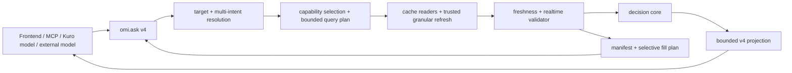

# OMI 統一決策出口

狀態：`omi.decision.v4` 是唯一 public request/response contract。
`omi.decision.v3` 與 `omi.ai.ask.v2` 只保留在 backend 私有 builder 與測試
seam，不再由 HTTP、SSE、MCP 或 OpenAPI 接受/宣告。

## 架構原則

OMI backend 是 target resolution、capability registry、資料 freshness、
bounded refresh、tool orchestration、AI reasoning、decision readiness 與
outward projection 的唯一 owner。Frontend、MCP、Kuro 模型與其他 consumer
都使用同一份 contract；consumer 只選擇所需資料與輸出用途，不重建市場語意。

Kuro 是一般模型 consumer。OMI 回傳結構化市場 evidence 與 decision；Kuro 端
負責可朗讀稿、persona、語氣、斷句、呈現與 TTS。OMI 不提供 Kuro、桌寵或語音
專用 response shape。

「單一出口」是單一業務語意 contract，不是把所有 API 或所有資料塞進一個巨大
response：

| 平面 | 對外入口 | 用途 |
| --- | --- | --- |
| Decision plane | `POST /api/ai/ask`、`POST /api/ai/ask/stream`、MCP `omi.ask` | 問答、選取資料、決策、限制與續補 |
| Data plane | `/api/market/*` 與 market services | 圖表、表格、資料探索及 backend AI tools |
| Operations plane | `/api/system/*`、jobs、scheduler、settings | runtime、provider health 與維運 |



HTTP body、SSE `final` 與 MCP result 必須保留相同 envelope 語意。Transport 可以
不同，但 `ok`、`request_status`、target、readiness、freshness、limitations、
fill plan 與 error 不得分叉。

## Request v4

```json
{
  "contract_version": "omi.decision.v4",
  "question": "2330 的趨勢與最新報價，可以怎麼規劃？",
  "target": {
    "type": "tw_stock",
    "id": "2330",
    "market": "TW"
  },
  "intents": ["analysis", "data_freshness"],
  "mode": "brief",
  "output": "decision_with_evidence",
  "realtime_policy": "prefer_live",
  "selection": {
    "include": [
      "quote.snapshot",
      "technical.structure"
    ],
    "optional": ["intraday.bars"],
    "exclude": [],
    "fields": {
      "quote.snapshot": [
        "price",
        "change_pct",
        "quote_time",
        "fetched_at",
        "provider"
      ]
    },
    "limits": {
      "intraday.bars": 60
    },
    "max_response_bytes": 65536
  },
  "allow_llm": false,
  "allow_write": false,
  "allow_external_fetch": true,
  "tool_budget": {
    "max_calls": 4,
    "max_external_fetches": 2,
    "max_total_seconds": 25
  }
}
```

### 資料選擇

- `output`：`evidence_only`、`decision` 或 `decision_with_evidence`。這是資料
  用途，不是 consumer profile。
- `realtime_policy`：
  - `cache_only`：不得為即時性呼叫外部 provider。
  - `prefer_live`：可在 trust 與 budget 允許時補 live；失敗時保留可用 cache，
    但必須揭露 stale/delayed。
  - `require_live`：選定的即時 capability 未達 live 時，明確標記 policy 未滿足。
- `selection.include` / `required`：必要 capabilities。
- `selection.optional`：可用時包含，不足時不阻塞整個要求。
- `selection.exclude`：明確排除；`target.identity` 與 `data.freshness` 仍由
  backend 保留為最小 trust metadata。
- `selection.fields`：只能選 capability registry allowlist 中的欄位。
- `selection.limits`：每個 capability 的 bounded row/item limit。
- `selection.max_response_bytes`：outward response hard budget；backend 仍會套用
  server-side 上下限。

Consumer 不得指定 SQL、內部 Python function、任意 provider URL 或無界 backfill。
`/api/ai/tools` 是 public request schema 與 capability catalog 的真相來源，
並包含 registry version 與 capability metadata。Repo MCP
`tools/list` 從此 endpoint 取得 schema，只添加 adapter-local
`include_raw`；backend 無法連線時才使用相容 fallback schema。

舊 `requested_domains`、`excluded_domains`、`market_data_params` 與
`payload_level` 仍可使用，backend 會將它們正規化到 v4 selection。

## Response v4

v4 的固定 sections 是 status、answer、decision、limitations、execution、
continuation 與 error；evidence 使用明確的 bounded projection：

```json
{
  "kind": "omi_decision",
  "contract_version": "omi.decision.v4",
  "ok": true,
  "request_status": "completed",
  "target": {},
  "status": {
    "readiness": {
      "response_ready": true,
      "facts_ready": true,
      "analysis_ready": true,
      "answer_ready": true,
      "decision_ready": true,
      "decision_blocked": false
    }
  },
  "answer": {},
  "decision": {},
  "evidence": {
    "passport": {
      "source_trust": {},
      "upstream_source_trust": {},
      "decision_readiness": {}
    },
    "freshness": {},
    "freshness_by_domain": {},
    "freshness_by_capability": {},
    "slots": {},
    "manifest": {
      "version": "omi.data.manifest.v1",
      "capabilities": []
    },
    "quality": {
      "version": "omi.data.quality.v1",
      "status": "ready",
      "trust_level": "high",
      "trust_scope": "decision_readiness",
      "capabilities": {},
      "fusion": {
        "status": "ready",
        "issues": []
      }
    },
    "realtime": {},
    "data": {
      "quote.snapshot": {},
      "technical.structure": {}
    },
    "source_refs": []
  },
  "limitations": {
    "missing": [],
    "warnings": [],
    "provider_failures": [],
    "supplemental_context_gaps": {
      "scope": "unselected_capabilities",
      "affects_selected_quality": false,
      "missing": [],
      "warnings": []
    }
  },
  "execution": {
    "selection": {
      "version": "omi.capability.selection.v2"
    },
    "capability_catalog_version": "omi.capability.registry.v3",
    "query_plan": {},
    "tool_plan": {},
    "tool_runs": [],
    "refresh_reconciliation": {
      "version": "omi.refresh.reconciliation.v1",
      "attempted": false,
      "capabilities": {},
      "remaining_action_ids": []
    }
  },
  "continuation": {
    "fill_plan": {
      "version": "omi.fill.plan.v1",
      "plan_id": "",
      "actions": [],
      "deferred_actions": [],
      "partition": {
        "version": "omi.fill.partition.v1",
        "selected_capabilities": [],
        "already_satisfied": [],
        "actions": [],
        "jobs": [],
        "deferred": [],
        "unfillable": [],
        "not_applicable": [],
        "complete": true
      }
    }
  },
  "error": {},
  "compatibility": {
    "public_contract": "omi.decision.v4",
    "legacy_contracts_accepted": false
  },
  "projection": {
    "version": "omi.response.projection.v1",
    "truncated": false,
    "trimmed_fields": [],
    "trimmed_lists": {},
    "omitted_capabilities": []
  }
}
```

v4 不再把 legacy `result` 複製到 `evidence.result`。未選取 capability 不會出現在
`evidence.data`；超過 byte budget 時，以 omission metadata、limitations 或
continuation 表達，不靜默回傳完整大包。

### 欄位責任

- `status`：request outcome 與 readiness 的唯一 canonical 判定。
- `answer`：backend 的 consumer-neutral 摘要；不等同特定呈現稿。
- `decision`：情境、進場/等待/失效條件、反證、風險、價位與部位結構。
- `evidence.manifest`：每個選定 capability 的 required、status、
  `decision_usable`、realtime、欄位、limit 與 payload 是否包含。
- `evidence.freshness_by_capability`：單一 capability 的 dataset、latest、
  expected、release/cooldown 與 refresh 建議。Quality authority 優先使用此層；
  `freshness_by_domain` 只做總覽與缺少細粒度資料時的 fallback。
  對已進入 Market Data Foundation 的資料，這一層以 canonical `DatasetHealth`
  與 `ResolvedEvidenceHealth` 為 truth owner；provider/source health 只保留獨立
  diagnostic。缺少 source-health row 代表 provider diagnostic unknown，不得把已
  healthy/current 的 canonical dataset 改判為 missing。
- `evidence.quality`：availability、freshness、completeness、release phase、
  temporal alignment、unit、continuity、facts usability 與 decision usability
  的唯一 canonical 結論；manifest、slots、passport 與 readiness 都引用此層。
  Payload存在不等於coverage complete；`is_full_market=false`的
  `market.sample_ranking`固定為`coverage_status=sample_only`，不得由generic
  payload truthiness升級成complete或decision usable。
- `evidence.passport.source_trust`：依本次 selected capabilities 的 canonical
  quality 聚合，`trust_scope=selected_capabilities`；不得被未選取的基本面或跨市場
  context 缺口降級。producer 原始 passport trust 保留在
  `evidence.passport.upstream_source_trust`，供診斷使用。
- `evidence.realtime`：即時能力的 session-aware 判定。
- `evidence.data`：只包含選定且通過 field/limit projection 的資料。
- `limitations`：selected capability 的 missing、realtime policy 未滿足、warning
  與 provider failure。未選取的基本面／跨市場缺口只放
  `supplemental_context_gaps`，並標示 `affects_selected_quality=false`。
- `execution`：selection、tool、trust、budget、diagnostics、cancellation 與
  `refresh_reconciliation`。後者區分 tool call 成功、payload 是否實際進入
  evidence、quality 是否仍受限，以及剩餘 fill action。
- `continuation.fill_plan`：精準補資料 actions；不是全市場 refresh。
  正常 release window 或 no-new-data cooldown 期間不建立立即 action，而以
  `deferred_actions` 揭露 `release_status` 與 `next_eligible_refresh_at`。其中
  `partition` 將每個 selected capability 恰好分到 `already_satisfied`、`actions`、
  `jobs`、`deferred`、`unfillable` 或 `not_applicable` 一組；compact projection
  也必須保留這份 backend-owned 分類。
- `error`：structured business error。Consumer 不得只看 HTTP status。

## Capability 與補資料

Registry 目前涵蓋：

- 共用：target identity、quote snapshot、intraday bars、daily OHLCV、
  technical structure、source health、data freshness。
- 台股：三大法人、融資券、券商分點、股權分散、營收、財報、跨市場 context、
  market breadth。
- 美股：quote/intraday、daily price、technical indicators／structure、SEC company facts；technical quality會保留raw price basis、corporate-action coverage、warm-up與decision-usability限制。US Index Daily沿用同一Canonical OHLCV與Shared Technical Engine，但volume與company corporate actions明示`not_applicable`；不得套用equity shares／corporate-action completeness規則，也不得以`0`取代不適用值。

美股current-market projection中的`previous_close`、`change`與`change_pct`必須以exact expected completed-session的resolved Daily作為唯一reference。Quote provider payload內的previous close只能保留在diagnostic evidence；Daily缺失時outward值維持`null`並揭露`CANONICAL_US_DAILY_PREVIOUS_CLOSE_MISSING`，HTTP、AI、MCP與Frontend不得改用Quote或Intraday history自行補值。
- Crypto：ticker/quote、OHLCV、order book、derivatives。

Generic 台股 quote intent 只預設要求 `quote.snapshot`；`quote.session_close` 只有
在 explicit selection 或問題明確要求今日／當日／盤後 completed-session close 時
加入。Session close 不得成為所有 quote 問題的隱性 blocking dependency。

`CapabilitySpec.paths` 是 outward capability projection 的唯一 executable path
owner。`capability_projection_registry` 的 advertised projector 必須由這組 paths
派生；shadow producer（例如 advanced technical shadow payload）不得另建一套可
advertise 的 production path vocabulary。

缺資料或 stale 時，backend 只為該 capability 建立一個 deterministic
`action_id`。Action 說明 target、operation、fields、limit、預估 calls、
timeout、是否寫 cache、是否需 external fetch，以及可重新呼叫 `omi.ask` 的
`invoke.arguments`。

Consumer 若要執行其中一項，必須回傳同一 `plan_id` 與選定
`selected_action_ids`：

```json
{
  "contract_version": "omi.decision.v4",
  "target": {"type": "crypto_asset", "id": "BTCUSDT", "market": "CRYPTO"},
  "selection": {
    "include": ["crypto.order_book"],
    "limits": {"crypto.order_book": 20}
  },
  "allow_external_fetch": true,
  "continuation": {
    "plan_id": "plan_...",
    "plan_action_ids": ["fill_..."],
    "selected_action_ids": ["fill_..."]
  }
}
```

Backend 會驗證 `plan_id`、完整 `plan_action_ids`、selected subset，並重新依
target、selection 與 registry 驗證 selected action ID；未知、跨 target 或非
executable action 會被拒絕。TW、US 與 crypto 都使用 capability 級規劃；
單一缺口不得觸發全資料、全市場或所有 provider 刷新。Action 中的 `operation`
是 backend-owned operation，不表示 consumer 可以直接呼叫內部 agentic tool。
`continuation.selected_action_ids` 最多 8 個；runtime、OpenAPI、backend tool schema
與 MCP schema 使用相同限制。

`allow_external_fetch=true` 或 standalone adapter 的
`refresh_if_missing=true` 代表允許主規劃器在 budget 內嘗試 bounded refresh，
不是「同一次請求自動執行所有 fill action」的保證。Consumer 應以
`execution.refresh_reconciliation` 判斷實際 attempts 與 outcomes，再以
`continuation.fill_plan` 判斷仍可補哪些能力。成功 tool call 若沒有可投影
payload，仍保留 fill action；成功且 payload 已進 evidence 時，不重複建立同一
action。

Background `ai.tool_refresh` 由 `GET /api/ai/refresh-status/{job_id}` 與 MCP
`omi.read_refresh_status` 提供 redacted operational contract。它只公開 operation、
produced capabilities、bounded progress/result summary、evidence rebuild 狀態與
cache-only `resume`。`operation_status=completed` 不等於 evidence 已更新；caller
必須在 `evidence_status=rebuild_required|partial_rebuild_required` 時以 `resume`
重建 evidence。未知 job、非 AI refresh job 與不可公開 job 使用相同 predictable
404，避免 job enumeration 或 request payload 洩漏。

台股法人、融資券與股權分散分別使用
`institutional_trade_daily`、`margin_trading_daily` 與
`shareholding_distribution_weekly` freshness；單一 weekly stale/pending
不得污染同一 chips domain 的其他 capability。TDCC weekly observation 以
可見的保守 release window 推進 expected date；無新資料的 refresh 會留下
bounded cooldown，而不是立即重複抓取。

## Realtime contract

`current` 不等於 `live`。即時判定同時考慮：

- 帶 timezone 的 provider event time。
- backend received/fetched time。
- provider/source 與 quote semantics。
- 市場 session、regular/extended/closed 或 crypto continuous。
- age、delay window 與 stale threshold。

Canonical states：

- `live`
- `delayed`
- `stale`
- `latest_completed_session`
- `final_snapshot`
- `unavailable`

台股/美股休市時，最新已完成 session 可以用於分析，但不會冒充 live，也不會因
`require_live` 自動排出無意義的休市刷新。Crypto 24/7 必須同時通過 event time
與 received/fetched time；舊 timestamp 不會因 provider 標記 `current` 而升級。

每個 realtime assessment 至少提供 state、status class、policy 是否滿足、
decision usable、refresh 是否建議/可行與 reason。未滿足 `require_live` 會進入
`limitations.missing` 與 `warnings`。

## Trust、付費 API 與 side effects

- `caller_profile` 只供識別與 logging，不構成信任。
- `allow_external_fetch`、`allow_llm`、`allow_write` 是 caller intent，
  最終權限由 server-side trust policy 決定。
- 外部 refresh 必須受 capability target、provider policy、call count、timeout、
  response limit、cache write 與 telemetry 約束。
- LLM analysis/report 需要 `allow_llm=true`；報告/記憶寫入另需
  `allow_write=true`。
- Provider/LLM 的 timeout、rate limit、credential failure 與 fallback 必須出現在
  `tool_runs`、`provider_failures`、`warnings` 或 `error`。
- 允許付費 API 不表示可以無界消耗；實際付費 smoke 仍需明確 cost budget。

## Transport semantics

### HTTP

HTTP 2xx 只表示 request 已成功傳輸與解析。Business outcome 讀：
`ok`、`request_status`、`status.readiness`、`limitations` 與 `error`。

### SSE

`final` 是完整 canonical envelope；`done` 只描述 stream transport completion，
不得取代 `final`。

### MCP

`omi.ask` 與 `omi.ask_stream` 是 thin adapter。Structured business rejection
仍是成功傳輸的 MCP result，`isError=false`；只有 protocol、transport、
serialization 或 adapter internal failure 使用 `isError=true`。

`include_raw` 是已棄用但仍可傳入的 transport flag；v4 下不得投影或重組
canonical envelope。Payload 大小只能由 backend selection 與 byte budget
控制。

`projection.truncated=true` 時，`trimmed_fields`、`trimmed_lists` 或
`omitted_capabilities` 至少一項必須非空。`trimmed_lists` 記錄 available 與
returned 數量；warning 只描述實際發生的裁切，不會在
`omitted_capabilities=[]` 時要求 consumer 查看不存在的 capability omission。

Brief 模式的 byte budget 先裁切 execution diagnostics，再把 selected evidence
降為 capability-aware summary；`daily.ohlcv`／`intraday.bars` 保留計數與最新一
筆、券商分點保留 Top 3、技術面保留 selected analysis 與關鍵價位。摘要 payload
以 `projection_level=summary` 標示，核心 evidence 只有在摘要化後仍無法滿足 hard
budget 時才會進入 `omitted_capabilities`。

`diagnostics.source_health` 使用逐級降級：完整 entries → summary 加 20 筆問題 →
summary 加 5 筆問題 → summary only。其 summary 明確分離
`total_entry_count`／`returned_entry_count` 與
`total_problem_count`／`returned_problem_count`；snapshot freshness 依
`checked_at` 計算，1 小時內為 current、1 至 24 小時為 stale、超過 24 小時為
expired。

Rejected target 使用精簡 v4 envelope：requested target 會標
`identity_status=unresolved`，manifest 只保留 blocked 的
`target.identity`，不建立 quality 大包或無效 fill actions，也不啟動 tool。

## Public v4 邊界

- 所有 in-repo 與外部 consumer 使用 `omi.decision.v4`。
- 明確傳入 `omi.decision.v3` 或 `omi.ai.ask.v2` 會在 public request validation
  階段拒絕，不會靜默轉換。
- v4 目前由既有 decision pipeline 經 backend-owned v4 canonicalizer 投影；
  這是 private implementation detail，consumer 不得依賴 predecessor 或
  source contract metadata。
- Public `omi.decision.v4` 不得隨意 breaking；改變既有 consumer contract 必須有明確 impact、版本或 migration window、cutover 與 removal gate。Backend private predecessor／builder 不屬於 public API，不因曾有 caller 就自動永久相容。任何暫留 seam 都必須有明確 owner、reason、scope、consumer、sunset condition、removal gate、negative test 與必要 architecture debt，且不得擴張成新的 caller contract。
- Private seam 的最後已記錄狀態由 [`CurrentImplementationState.md`](CurrentImplementationState.md) 導航；source inventory 由 tests／architecture debt 提供，不在本文件固定列舉。

Temporal evidence 必須遵守 [`MarketTemporalContract.md`](MarketTemporalContract.md)：Market Session、item finalization、authority、release、reconciliation 與 freshness 分別輸出。`official_final` 若存在只能是保留 constituent fields 的 derived label，不是混合 session／release 的 primitive enum。

## 程式所有權

| 責任 | 位置 |
| --- | --- |
| Capability registry、selection、manifest、fill plan | `backend/app/ai/capability_contract.py` |
| Canonical data quality 與 fusion gate | `backend/app/ai/data_quality_contract.py` |
| Realtime validator | `backend/app/ai/realtime_contract.py` |
| v4 envelope 與 payload budget | `backend/app/ai/decision_envelope_v4.py` |
| 私有 predecessor builder 與 readiness seam | `backend/app/ai/decision_envelope.py` |
| Request policy / schema | `backend/app/ai/ask_policy.py`、`backend/app/ai/schemas.py` |
| Scope、multi-intent、query plan | `backend/app/ai/scope_resolution.py`、`backend/app/ai/query_plan.py` |
| Granular planning / execution | `backend/app/ai/agentic_planning.py`、`backend/app/ai/agentic_execution.py` |
| HTTP/SSE | `backend/app/routers/ai.py`、`backend/app/ai/streaming.py` |
| Public schema catalog | `backend/app/ai/tool_catalog.py` |
| Repo MCP adapter | `agents/omi_mcp_server/server.py` |
| OMI Dock consumer | `frontend/src/components/OmiAskDock.tsx` |

## 驗證要求

- Contract：v4 normal、partial、clarification、rejected、timeout、fallback，
  並驗證 public v2/v3 rejection。
- Selection：unknown/incompatible capability、field allowlist、limits、byte budget。
- Fill：TW/US/crypto 單一 capability、單 target、單 provider/operation、
  continuation revalidation。
- Realtime：TW closed、US regular/extended/closed、crypto continuous、
  delayed/stale/provider failure。
- Semantics：multi-intent target 保留、headline/stance 一致、readiness 不過度宣稱。
- Transport：HTTP/SSE final parity；MCP schema、valid call、business error、
  transport error。
- Consumer：Frontend lint/typecheck、MCP tests，以及外部 consumer contract tests。
- Runtime：launcher selected PID/port、`/api/ai/tools`、TW/US/crypto bounded calls、
  payload bytes/latency；付費 LLM 只做一次明確有 cost bound 的 smoke。
