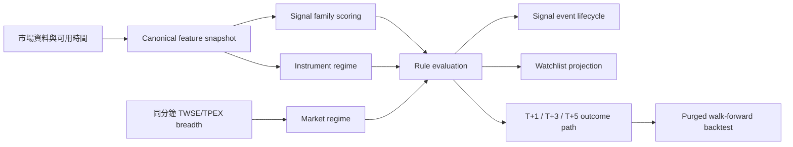

# Watchlist Radar v2

## 目的

Radar v2 把「訊號計算」、「自選群組呈現」與「事後驗證」拆成可重現、可比較、可回退的 backend contract。它是研究決策輔助，不是漲跌預測或自動下單系統。

初始版本固定以 `radar_v2.0-shadow` 平行計算；既有 `radar_v1.0` 仍負責排序與主要 action。正式切換必須以有 coverage gate 的 walk-forward 證據為依據，不能只看單一 hit rate。

## 資料與計算流程

- `radar_feature_snapshot`：以 stock、signal time、feature version/config hash 建立 group-independent identity。
- `radar_feature_snapshot` 的時間拆成 `effective_at`、`source_available_at`、
  `observed_at`；日期型日線訊號固定以台北時間 13:30 收盤為 effective time。
  Provider 沒提供 availability time 時，保守使用 `observed_at`，不得倒推成歷史收盤即已知。
- `radar_rule_evaluation`：保存固定 rule/config 下的方向、證據、衝突、風險、信心與 regime。
- `radar_rule_evaluation.decision_at`：保存該次判斷實際可使用 evidence 的 cutoff。
- `radar_signal_event`：保存 onset、active、unobserved、exit lifecycle；缺資料或未進入當日
  universe 不得被當成訊號退出。
- `radar_universe_observation`：保存完整 bounded calculation universe 中每檔股票的
  evaluated、no_data、error、absent 狀態，作為 coverage 分母。
- `radar_evaluation_event_link` / `radar_outcome_event_link`：保存 evaluation/outcome 與多個
  同時 active event 的 many-to-many 關聯。
- `radar_watchlist_projection`：只保存 group/rank/mode 等呈現投影，不複製 canonical evaluation。
- `radar_outcome_path`：同一 evaluation 可保存 T+1、T+3、T+5。
- `radar_backtest_run`：保存 universe、coverage、split、排除原因、統計與 config。
- `radar_rule_config`：保存可重現的 versioned config。

Schema 由 additive Alembic revision `20260729_0041` 建立，`20260729_0043` 補上
point-in-time、完整 universe 與多事件關聯；兩者都不修改 v1 tables。

## Signal Family 與分數語意

Signal 被明確分成：

- `event`：突破、跌破、交叉等時間點事件。
- `state`：站上均線、偏多排列等持續狀態。
- `modifier`：波動、過熱、資料品質等不直接代表方向的條件。

Family 固定為 trend、structure、momentum、volume、location、volatility。家族內使用飽和函數，避免同義訊號重複堆分；家族內與跨家族矛盾都保存 conflict score。

Signal contribution 的 `strength` 不再一律視為 1。可量測訊號使用 ATR 正規化價差、
RSI/MFI/ROC、KD、量比、布林帶寬等固定公式；無法量測時使用 0.5 並留下 limitation。
Freshness 來自 feature data-quality，timeframe conflict 只在有跨週期 evidence 時套用，
否則保留「未觀測」限制。

輸出語意分離：

- `direction_score`：方向，不代表可信度。
- `evidence_score` / `evidence_grade`：固定絕對門檻，不依 Watchlist 當批排名。
- `conflict_score`：同家族與跨家族反證。
- `risk_score`：失效與流動性風險，不混入方向。
- `confidence_score`：由 evidence 經 conflict、資料品質與 regime clarity 折減。
- `context_alignment_score`：外部 context 的獨立 signed 欄位，不偷偷改寫技術方向。

## Regime

- `instrument_regime`：`trend_up`、`trend_down`、`range`、`compression`、`transition`、`insufficient`；高波動是 overlay。
- `market_regime`：`risk_on`、`risk_off`、`broad_up`、`broad_down`、`mixed`、`transition`、`insufficient`。
- Market regime 只使用同一分鐘的 TWSE/TPEX breadth。缺任一市場、非 `full_market` 或非 `ready` 時，不宣稱完整市場狀態。
- Regime-adjusted family multiplier 是 versioned experimental config；shadow 階段不接管 v1 排序。

## Outcome v2

Outcome v2 同時保存：

- signal reference price 與 T+1 open entry proxy。
- close return、MFE、MAE，以及以 snapshot ATR 正規化的 `close_R`、`MFE_R`、`MAE_R`。
- `intraday_triggered`、`close_confirmed`、`adverse_triggered`、`reversed`、`whipsaw`、`invalidated`。
- T+1、T+3、T+5 的 path 與可評估狀態。
- corporate-action quality 與資料 limitation。
- overheat 使用對稱的上／下擴張與收盤方向狀態，不再套用方向為 0 時不可達的
  continuation/reversal 規則。

`entry proxy` 不是成交模擬。Daily OHLC 無法判定盤中有利與不利極值先後，這項限制必須保留在 outcome contract。

目前台股 corporate-action provider 只能完整確認除息。即使沒有除息事件，也只能標為
`partial_coverage`，不能宣稱所有除權、減資、分割、合併事件都已檢查清楚。

## 回測邊界

- Universe、價格與 feature 都必須是 point-in-time 可得；分母來自
  `radar_universe_observation`，不是只計算已成功產生 outcome 的 rows。
- Backtest 必須驗證 `source_available_at <= decision_at` 且
  `effective_at <= decision_at`，而且 decision 必須落在同一台股交易日；不能把 persistence time
  或事後補算資料當成 signal-time evidence。
- Split 使用 purged walk-forward 與 embargo，避免 horizon overlap leakage。
- Promotion metrics 僅聚合每個 walk-forward split 的 test 區間；全期間 metrics 只能標為
  diagnostic，不得拿來通過 gate。
- 統計以 event cluster/evaluation 為 identity，不能因同一股票出現在多個 Watchlist group
  或同一 event 持續多日而重複計樣本。
- Coverage、樣本數、排除原因、confidence interval 與 baseline availability 必須同時輸出。
- Point-in-time market/sector baseline 尚未配置時，baseline 必須回傳 unavailable；
  預設 promotion gate 會 blocked，不得以無 baseline 的結果宣稱 v2 優於基準。
- 本機資料不足時只能回報 bounded local research，不得宣稱全市場有效。

## Runtime、API 與回退

- Read-only GET：`GET /api/watchlists/groups/{group_id}/radar`
  - 預設回傳 `radar_v2.0` active projection。
  - `version=v1` 只讀最後一份既有 `radar_v1.0` persisted snapshot，
    不做 live compute、不附加 shadow，也不受 current-date freshness gate 隱藏。
  - GET 不建立 persistence row。
- v1 write freeze：舊 `POST .../radar/snapshots` 與
  `POST .../radar/outcomes/evaluate` 固定回 `410 RADAR_V1_FROZEN`。
- v2 explicit write：`POST .../radar/v2/evaluate` 由 service 擁有 transaction，
  評估完整 bounded calculation universe 並 reconcile pending v2 outcome。
- Scheduler：只寫入 `radar_v2.0` active scope 並評估 v2 pending outcome；
  不再新增 v1 snapshot/outcome 或 `radar_v2.0-shadow` run。
- `radar_v2.0-shadow` 歷史與 explicit research endpoint 保留，
  但不是正式 frontend 或 scheduler 的執行路徑。

Frontend 只呈現 backend 的 version、score、regime、quality、tag 與 limitation，不重算 Radar 邏輯。

## 正式切換條件

`active_version` 從 v1 切到 v2 前，至少需要：

1. migration、v1 golden contract、API 相容性與 scheduler regression 全部通過。
2. T+1/T+3/T+5 outcome 累積到預先定義的 coverage/sample gate。
3. purged walk-forward 顯示穩定且具 confidence interval 的增量價值。
4. 不同 regime、signal family、方向與資料品質分層沒有不可接受的退化。
5. shadow comparison 與 rollback 演練通過。
6. 使用者明確核准 active-version 切換。

## 2026-07-31 Active Contract

台股 Radar 的 operational default 已切換為 `radar_v2.0`。這是產品路由與責任
歸屬的切換，不代表績效推廣門檻已通過。

### 公開與回退契約

- `GET /api/watchlists/groups/{group_id}/radar` 預設回傳 `radar_v2.0`。
- `GET /api/watchlists/groups/{group_id}/radar?version=v1` 保留
  `radar_v1.0` rollback。
- `radar_engine.mode=active` 表示 v2 擁有公開排序、bucket、urgency、
  direction、action 與 reason。
- `radar_v2_summary.readiness.validation_status` 獨立呈現
  `verified`、`blocked` 或 `unverified`；不得從 operational active 推論績效已驗證。

### 計算與持久化

- 輸入範圍是受 `calculation_limit` 約束的完整 calculation universe。
- v2 自行做 mode filter、priority 排序與 Top-N；v1 Top-N 不再是 v2 候選集。
- active feature、evaluation、event、universe observation 與 projection
  使用 `technical_v2.0` / `radar_v2.0` identity；既有
  `technical_v2.0-shadow` / `radar_v2.0-shadow` 歷史不改寫。
- `watchlist_radar_snapshot_run` 是 versioned Radar scope metadata，
  會保存空結果 scope；v2 item 真相仍由 canonical evaluation 與
  `radar_watchlist_projection` 提供。
- scheduler 只持久化 v2 active 並 reconcile pending outcome。
  主 coverage 由 v2 active scope 與逾期 pending outcome 決定；
  `legacy_v1_coverage` 固定回報 `status=frozen` 與 `write_enabled=false`。

### Read / outcome / backtest

- `GET .../radar/v2/snapshots/history`：v2 snapshot scope history。
- `GET .../radar/v2/outcomes/latest` 與 `.../history`：依 T+N outcome
  contract 讀取，GET 不寫入。
- `POST .../radar/v2/evaluate`：明確、bounded 的 active persistence 與
  pending reconciliation。
- `POST .../radar/v2/backtests`：明確執行 purged walk-forward backtest。
- `GET .../radar/v2/backtests/latest`：讀取同一 watchlist group/mode
  scope 的最新證據。

v1 code、schema 與歷史資料目前不刪除；移除 v1 必須等 rollback 觀察期、
consumer migration 與回測/outcome coverage 都完成後另立任務。

## 2026-08-01 v2 正式版與 v1 凍結

- 台股 Radar frontend 的主畫面、latest outcome、history 與 detail 只呼叫 v2 contract。
- frontend 不重算 v2 `summary_state`；直接呈現 backend 的 return、MFE、MAE、
  outcome quality 與 limitations。
- `radar_v1.0` 的 rule/config hash 保持不變；lifecycle metadata 另行標記
  `frozen_at=2026-08-01`，避免「凍結」本身改寫歷史算法 identity。
- 凍結不刪除既有 v1 rows、不重建 DB、不做 destructive migration。
- v1 唯讀入口只用於歷史查核與 rollback evidence，不再代表可恢復執行的 active engine。
