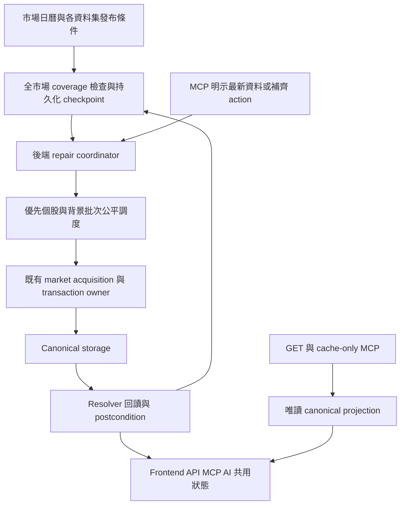

# 實作計畫

本文件描述 planned design，不代表功能已存在。依 [任務規格](Prompt.md) 執行。

## 整體流程



## 調度與持久化設計

- 優先擴充既有 `market_data/eod_coverage.py`、`jobs/eod_coverage.py`、JobRun 與市場 acquisition owner；不要建立獨立 TW、US、MCP 三套 repair queue。
- Daily venue bulk、逐股歷史 bars、申報／事件資料維持各自 acquisition unit。coordinator 只管需求、預算、順序與進度，不搬走 dataset semantics。
- Durable work identity 至少包含 InstrumentKey／venue bulk target、dataset、expected date 或 period、session scope、interval 與修訂需求；實際 schema 由 M0 比對現有 model 後定案。
- 合併相同 work identity 的背景與 MCP request，保存 request-to-job 關聯；提高 priority 不複製 provider 工作。venue bulk 涵蓋指定股票時提升整個必要批次並回讀該股，不改成逐股重打 bulk API。
- 工作狀態與資料狀態分離：提案工作狀態為 pending、running、retry_wait、succeeded、failed、blocked、cancelled；資料仍使用 canonical freshness／coverage／availability axes。批次正常耗盡預算不算 provider failure，也不代表整輪 completed。
- claim／lease／heartbeat／逾時回收必須跨 worker 安全。以短 DB transaction claim，provider IO 在交易外，持久化與 postcondition 由既有 owner 完成；crash 後重跑須 idempotent。
- 每市場／provider／dataset 設定 calls、symbols、runtime、concurrency、retry、bytes／storage horizon 上限；同 provider 的 MCP、背景、即時工作共享配額，不能各自算一份。
- MCP foreground 在下一個可用 work boundary 優先；不強殺已開始的 provider request。foreground request 有 TTL、去重、每 caller／target 上限，不能透過反覆點名永久壟斷。
- 建議可調初始策略：存在 backlog 時，至少每 5 次可調度 dispatch 有 1 次給背景，TW／US 輪轉；同 lane 使用 aging。此比例是待驗證提案，不是 current config。成本不同時按預估 calls／runtime 做加權，不能用任務數掩蓋配額壟斷。
- retry 遵守 Retry-After、指數退避與 jitter；永久性不支援／權限問題不得緊密重試。schema 變更、回應 malformed、429、timeout 分別記錄。
- 每個 trade date 保留 checkpoint。新交易日優先但不覆蓋舊日未完成紀錄；retention 到期的資料需可辨識 unrecoverable，而不是被新日覆蓋後消失。
- 以 source revision 驅動 cache invalidation／read-model 更新；repair 完成後不能繼續展示舊 partial，也不能因 cache 清空觸發隱性 IO。

## MCP 行為契約

| 使用情境 | 後端行為 | 對外結果 |
| --- | --- | --- |
| `cache_only` 指定股票 | 唯讀現況與 repair availability，不 enqueue、不提升 priority | 日期、缺口、可用 action |
| 明示要求該股最新資料／補齊 | 驗證 identity 與 action authorization，計算適用且已到期的缺口，合併並提升同一工作 | request／job identity、已滿足與待補 datasets、原因與進度 |
| 已有 background job | 合併需求，調整下一批優先順序 | 回傳既有工作關聯，避免重複抓取 |
| 已經全部最新 | 不呼叫 provider；依 revision policy 判定是否有必要再驗證 | current，並說明 expected／observed |
| 尚未發布或 provider cooldown | 不繞過時間與配額限制 | pending release／blocked／retry time |
| 等待超過 transport budget | 任務繼續 bounded 執行，回傳目前 partial 與追蹤資訊 | 非假成功，也非無界等待 |
| ticker 不唯一、多股請求 | 要求精確 InstrumentKey 或有界 target list；先解析身份 | 不猜交易所，不擴成全市場高優先 |

實作前核對現有 action、continuation、tool annotations 與 schema，優先沿用既有對外名稱。若新增入口／mode，必須 additive 且明示 side effect；不得默改現有 read-only tool 的行為。MCP「指定個股就優先」由明示最新資料工作流實現，純 read 保留既有安全契約。

## M0：基準、能力與容量確認

範圍：正式 runtime identity、migration、JobRun、dataset registry、instrument universe、現有 repair／action owner。

- 重讀本機 TSM 09/10、09/11 與 5347 09/11 的 canonical、resolver、API／MCP；保存 source／provider／trade date／時間／缺口，不能把上一輪 DB 觀察當作即時結論。
- 查明所有 production datasets 的 expectedness、release、eligibility、repair owner、修訂政策、quota、歷史可重建性，盤點 scheduler-owned／external-owner／unsupported acquisition seam。
- 用 source contract 與正式 provider 文件確認能力；需要 live probe 時另行取得 bounded external IO 授權，禁止直接開始全市場試跑。
- 計算 universe × 每股 bars × sessions × 實測 bytes/row、index、lineage、raw retention 的容量；估計 requests、provider rate、失敗率與 drain time。確認增量掃描與索引可避免大表／全 raw payload 重掃。
- 產出可達 SLO：release 後多久開始、每批上限、正常日追齊時限、前景 dispatch 延遲與最大背景等待。包含程式必須運行的時數與停機 backlog 條件。

驗收：每個範圍都有真實 owner 與可行 acquisition route；無法全市場追齊的資料集列出差距與資源方案，不能降格成只做 watchlist 後稱完成。

## M1：完整度與對外真實性

範圍：`us_market/market_truth.py`、`service.py`、`historical_intraday.py`、AI quality／capability contract、TW canonical bar projection。

- 一般今日讀取與明示 historical date 共用 coverage owner；傳遞 expected／observed／missing／gap／first／last／finalization。
- 修正連續前綴被當成 complete 的路徑。驗證 resolver 候選品質與 cache revision，完整且 eligible 的候選不可被未解釋地忽略。
- 不拼接多 provider bars 製造虛假完整；任何融合須既有正式 lineage／resolution policy 支持。

驗收：182／204 點前綴、尾段缺失、內部缺口均 partial；正常日與 early close 依 calendar 驗證；跨週末、DST、停牌／無交易與 malformed／duplicate／off-grid 正確；historical complete 仍不宣稱 live／decision usable。

## M2：共用有界工作協調與 MCP 優先入口

範圍：jobs、market_data control、JobRun／checkpoint model、migration（必要時）、AI action execution、thin MCP adapter。

- 先以既有 Daily repair 接入去重、priority、fairness、retry、resume、budget 與 request 關聯，再供 intraday／其他 datasets 重用。
- 釐清目前 EOD worker「部分批次有進度但全市場 postcondition 未滿足」的 job status，避免將正常 continuation 當成來源失敗退避。
- consumer 只消費後端計畫；MCP 明示最新資料 action 可提高指定股所有適用到期資料的 priority，按 dependencies 執行；查詢未要求的資料不阻塞本次可用答案。

驗收：相同需求合併、兩 worker 競爭、重啟 lease 回收、priority aging、foreground flood、跨市場公平、取消單一 subscriber 不誤取消共享工作；cache-only 全程零 IO／enqueue／priority mutation。

## M3：台美股全市場 Daily 盤後閉環

範圍：現有 EOD coverage／scheduler、TW official daily venue owner、US full-market EOD lifecycle。

- TW 保留 venue bulk，US 使用 durable shards／cursor；依 dataset release 啟動，startup catch-up 續跑。
- 每批修復後重新讀取 canonical 與 selected evidence；checkpoint 保留未解原因與進度，不靠 JobRun success 推斷資料成功。
- 全量 universe 檢查用有界快照／分頁，不縮成 active viewer 清單；衍生週／月 K 由 canonical daily owner 更新。

驗收：TWSE／TPEX／US 全 universe 均可追蹤；單一 symbol failure 不阻塞全市場；release 前不提早宣稱 official；MCP 指定後下一個可調度批次優先且背景持續前進。

## M4：全市場分鐘線盤後追齊

範圍：US historical platform、TW intraday platform／target plan、盤後 coordinator；保留即時 materializer 既有範圍。

- TW close-tail 改用 canonical `production_session_close` target ownership；這只修正即時重點池，不能當成全市場盤後完成。
- 另由全市場 checkpoint 分批產生 completed-session demand，US 重用 dated historical refresh 與 mandatory reread；TW 先完成 provider 歷史／收盤後可用性驗證再接入。
- 檢查全部股票的分鐘線缺口；只有能力與容量證明足夠才開啟全市場 acquisition。不可重建者保留缺口與能力限制，必要的新 provider 整合另立有界 slice。
- 明確 latest-session 優先、補歷史 horizon、retention 與 correction reread；extended hours 獨立實作／驗收，不借用 regular complete。

驗收：未曾開頁的股票也進入批次；指定股補齊後 Today／historical／MCP 一致；沒有 acquisition 支援的資料仍不能標完成；持久化 replay 不重複、不跨來源覆寫。

## M5：擴展全部已支援且適用資料集

範圍：從 registry 導出的其他 dataset lifecycle owner 與外部 owner contract。

- 逐類接入籌碼、財務、申報、持股、公司事件及其他實際存在能力；沿用原 owner，不在 Markdown 複製完整 inventory。
- 依正式發布／period／revision 驗證新鮮度；同 issuer 或 venue 可批次共用 acquisition，保留每股適用性。
- 外部 owner 無 refresh API 或本機 provider entitlement 不足時明示限制；不建立偷偷繞過 owner 的 fallback。
- 技術與研究結果依 input revision 更新，避免同批多股重複昂貴計算。

驗收：每個納入資料集都通過 release 前後、valid empty、not applicable、修訂、provider failure 與個股優先測試；第一階段行情通過不能關閉本 milestone。

## M6：使用者可見進度與一致性

範圍：既有更新狀態、個股資料準備度、圖表與 OMI outward projection。

- 顯示股票／dataset expected 與 observed 日期、coverage、最後一筆、最後成功、最近嘗試失敗、retry time、job state 與缺口。
- 全市場依 TW／US、dataset、trade date 顯示進度；總進度分母不因 blocked／skip 靜默減少。
- 顯示 MCP 指定股已優先／執行中／受限的事實，不編造 queue rank 或 completion ETA；只有後端能估算時才提供帶不確定性的 ETA。

驗收：正式 API、MCP、Frontend 同 target／date／revision 語意一致；browser 可見 partial、queued、成功與失敗，無溢出／無限 skeleton。

## M7：分級上線與正式驗收

- 開關依市場與資料集分開：先 coverage audit，再小批 repair，再擴大 batches；read path 永遠不變成 acquisition。
- 正式證據須包含 launcher root、interpreter、PID／port、loaded source、migration、provider receipt、canonical reread、resolver 與 consumer。
- 台美股各兩個連續 completed sessions；另測停止／啟動續跑、跨日、quota 限制與優先股插隊。early close／DST／節假日先 offline，未遇正式交易窗口不能稱 live 驗收。
- 只可關閉新增背景 acquisition 或調低 bounds；保留正確 coverage、既有資料與 checkpoint。schema 回退須明訂相容策略，不以刪 DB 回退。
- 任一必需 dataset 仍有不可解能力缺口、正常負載 drain time 持續超過 SLO，總目標維持 partial，不宣稱全面完成。

## 驗證入口與停止條件

只改文件的階段執行 UTF-8 讀回、連結／結構檢查與 `git diff --check`；實作階段依各 slice 執行以下相關驗證。

未來實作依 slice 使用既有 wrapper，示例（新測試於對應 milestone 加入，不假稱已存在）：

```powershell
.\scripts\run-safe-validation.ps1 -Profile backend -BackendPytestArgs @('backend/tests/test_us_historical_intraday.py','backend/tests/test_ai_capability_contract.py')
.\scripts\run-safe-validation.ps1 -Profile backend -BackendPytestArgs @('backend/tests/test_eod_coverage.py','backend/tests/test_eod_coverage_scheduler.py','backend/tests/test_us_intraday_materializer.py')
.\scripts\run-safe-validation.ps1 -Profile frontend
```

涉及 contract／跨 owner 變更須執行 architecture guard 與相關 regression；涉及 UI 再做有界 browser proof。全市場 external refresh、migration、runtime restart 與正式 provider quota 驗收，需在實作授權與明確範圍下進行。

若出現 read side effect、資料遺失、跨 provider 偽造完整、identity 錯配、無界重試／配額、測試失敗、cache projection 不一致，先停該 slice 並修正，不能以擴大抓取掩蓋。
