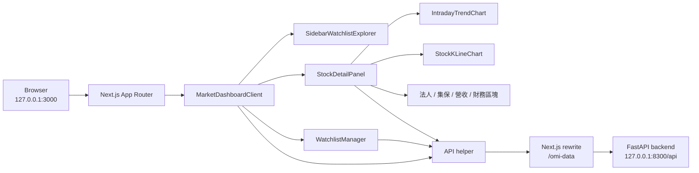
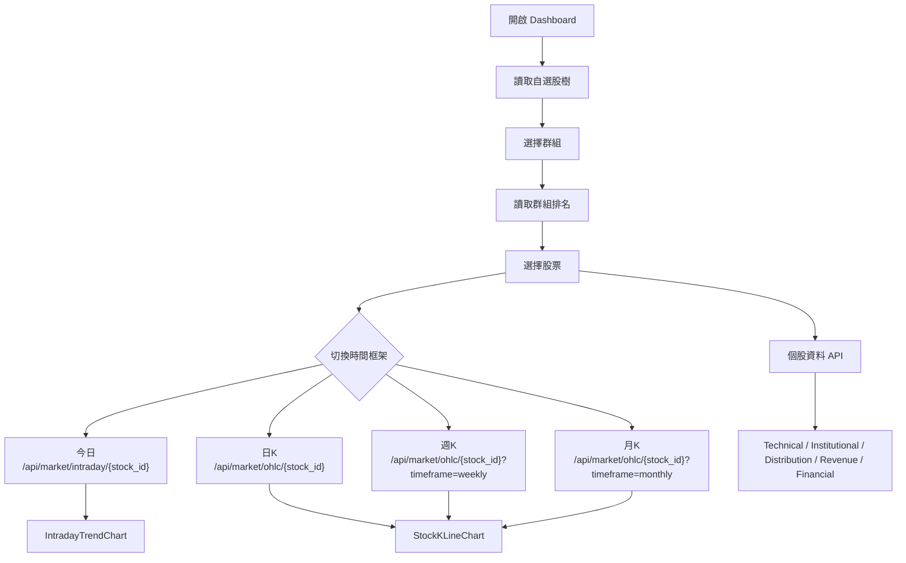

# Open Market Intelligence Frontend

此目錄為 Open Market Intelligence 的前端儀表板，負責呈現自選股群組、個股明細、今日走勢、K 線圖、排名表、三大法人、集保、營收、財務與自選股管理功能。前端透過 Next.js rewrite 與本機 FastAPI 後端通訊。

## 技術棧

| 類別 | 技術 |
| --- | --- |
| Framework | Next.js 16 App Router |
| UI | React 19 |
| Language | TypeScript |
| Styling | Tailwind CSS |
| Quality | ESLint, TypeScript compiler |

## 前端架構



## 資料流



## 目錄結構

```text
frontend/
  src/
    app/
      layout.tsx
      page.tsx
      globals.css
    components/
      IntradayTrendChart.tsx
      MarketDashboardClient.tsx
      SidebarWatchlistExplorer.tsx
      StockDetailPanel.tsx
      StockKLineChart.tsx
      WatchlistManager.tsx
    lib/
      api.ts
      taiwanMarketTime.ts
    types/
      market.ts
  next.config.ts
  package.json
```

## 首次安裝

前端需要 Node.js 20.9 以上與 npm 10 以上。

```powershell
cd "C:\Open Market Intelligence\frontend"
if (-not (Test-Path .env.local)) { Copy-Item .env.example .env.local }
npm ci
```

後端第一次安裝、資料庫 migration 與資料來源初始化請先依照根目錄 `README.md` 執行。

## 本機啟動

先啟動後端：

```powershell
cd "C:\Open Market Intelligence"
.\.venv\Scripts\Activate.ps1
cd backend
python -m uvicorn app.main:app --reload --port 8300
```

再啟動前端：

```powershell
cd "C:\Open Market Intelligence\frontend"
npm run dev
```

開啟：

```text
http://127.0.0.1:3000
```

## 環境設定

`.env.local` 預設值：

```env
API_PROXY_TARGET=http://127.0.0.1:8300
API_PROXY_PATH=/omi-data
NEXT_PUBLIC_API_PROXY_PATH=/omi-data
NEXT_PUBLIC_API_BASE_URL=
```

API rewrite：

```text
/omi-data/... -> http://127.0.0.1:8300/api/...
```

## 常用指令

```powershell
npm run dev
npm run lint
npx tsc --noEmit
npm run build
npm run test:e2e
```

## 主要元件責任

| Component | 職責 |
| --- | --- |
| `MarketDashboardClient.tsx` | Dashboard 狀態、自選股群組、排名與股票選取 |
| `SidebarWatchlistExplorer.tsx` | 左側自選股樹與群組操作 |
| `StockDetailPanel.tsx` | 個股資料載入、分頁與明細區塊 |
| `IntradayTrendChart.tsx` | 今日走勢、成交量、昨收線、最高最低與 hover 狀態 |
| `StockKLineChart.tsx` | 日 K、週 K、月 K 與技術指標 |
| `LightweightKLineChart.tsx` | 專業模式 K 線 engine、指標 series、畫線互動與 projection orchestration |
| `components/chart/*` | 專業圖表純 UI layer，例如 header、選取畫線摘要卡、靜態 indicator overlay |
| `OmiAskDock.tsx` | OMI 即時問答 portal UI、signals、回答渲染 |
| `hooks/useOmiAskStream.ts` | OMI SSE fetch、abort、request stale guard 與 buffer parsing |
| `WatchlistManager.tsx` | 自選股與群組維護操作 |

## 圖表資料約定

- 今日走勢接收 `time`、`price`、`volume`、`open`、`high`、`low`。
- K 線圖接收 OHLC rows 與可選的 indicator payload。
- 後端 API 的成交量以「股」為單位，前端顯示時依畫面需求轉換為「張」。
- 台股盤中時間座標集中於 `src/lib/taiwanMarketTime.ts`。
- 圖表容器應保持固定比例與穩定尺寸，避免 hover、標籤或資料刷新造成版面跳動。

## 驗證

前端變更推送前建議執行：

```powershell
cd "C:\Open Market Intelligence\frontend"
npm run lint
npx tsc --noEmit
npm run test:e2e
```

正式版建置檢查：

```powershell
cd "C:\Open Market Intelligence\frontend"
npm run build
```
